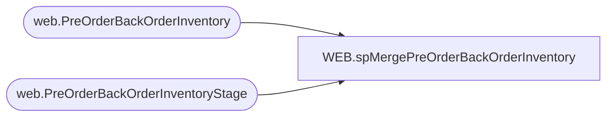

# WEB.spMergePreOrderBackOrderInventory

**Database:** IntegrationStaging  
**Server:** STL-SSIS-P-01  

## Architecture Diagram



## Table Dependencies

| Referenced Table |
|---|
| web.PreOrderBackOrderInventory |
| web.PreOrderBackOrderInventoryStage |

## Stored Procedure Code

```sql
create proc web.spMergePreOrderBackOrderInventory

--==========================================================
--	Dan Tweedie	2020-03-15	Created proc
--==========================================================

as 

set nocount on

merge into web.PreOrderBackOrderInventory as target
using web.PreOrderBackOrderInventoryStage as source 
on 
	(
		target.SKU=source.SKU
	)
when not matched by target
then insert
	(
		SKU,
		NonInstockQty,
		InStockDate,
		InventoryType,
		InsertDate
	)
values
	(
		source.SKU,
		source.NonInstockQty,
		source.InStockDate,
		source.InventoryType,
		getdate()
	)
when matched and
	(
		isnull(target.NonInstockQty,0)<>isnull(source.NonInstockQty,0)
		or
		isnull(target.InStockDate,'3030-12-31')<>isnull(source.InStockDate,'3030-12-31')
		or
		isnull(target.InventoryType,'x')<>isnull(source.InventoryType,'x')
	)
then update
	set
		target.NonInstockQty=source.NonInstockQty,
		target.InStockDate=source.InStockDate,
		target.InventoryType=source.InventoryType,
		target.UpdateDate=getdate()
when not matched by source
then delete
;
```

