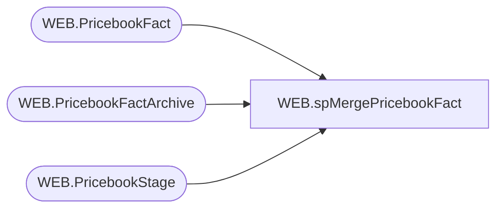

# WEB.spMergePricebookFact

**Database:** IntegrationStaging  
**Server:** STL-SSIS-P-01  

## Architecture Diagram



## Table Dependencies

| Referenced Table |
|---|
| WEB.PricebookFact |
| WEB.PricebookFactArchive |
| WEB.PricebookStage |

## Stored Procedure Code

```sql
CREATE proc [WEB].[spMergePricebookFact]

as

-------------------------------------------------------------------------
-- spMergePricebookFact - Merges from WEB.PricebookStage to WEB.PricebookFact
--						  
-- 05-30-2017 - Dan Tweedie - Created Proc
-- 07-06-2022 - Tim Callahan - Updated Proc to handle new Exported field. 
-------------------------------------------------------------------------

set nocount on

delete from WEB.PricebookFactArchive
where datediff(dd, ArchiveDate, getdate()) > 30

update WEB.PricebookFactArchive
set CurrentBatch = 0

update WEB.PricebookFact
set CheckDate = getdate()

Merge into WEB.PricebookFact as target
Using WEB.PricebookStage as source
On (
		target.style_code = source.style_code
	and target.Catalog = source.Catalog
	)
When Matched 
	AND 
		(
			 isnull(target.CurrentPrice,99999) <> isnull(source.CurrentPrice,99999)
			 OR
			 isnull(target.OriginalPrice,99999) <> isnull(source.OriginalPrice,99999)
			 OR
			 isnull(target.SalePrice,99999) <> isnull(source.SalePrice,99999)
		 )
	Then 
		Update 
			Set target.CurrentPrice = source.CurrentPrice,
				target.OriginalPrice = source.OriginalPrice,
				target.SalePrice = source.SalePrice,
				target.UpdateDate = getdate(),
				target.CheckDate = getdate()
				,target.Exported = null -- Not sure about this yet
				,target.ExportDate= null -- Not sure about this yet
When Not Matched By Target 
	Then 
		Insert (style_code, CurrentPrice, OriginalPrice, SalePrice, Catalog, InsertDate, CheckDate)
		Values (source.style_code, source.CurrentPrice, source.OriginalPrice, source.SalePrice, source.Catalog, getdate(), getdate())
When Not Matched By Source
	Then
		Delete

OUTPUT 
	deleted.style_code, 
	deleted.CurrentPrice, 
	deleted.OriginalPrice, 
	deleted.SalePrice, 
	deleted.Catalog, 
	deleted.InsertDate, 
	deleted.UpdateDate, 
	deleted.CheckDate,
	getdate(),
	$action,
	1
into WEB.PricebookFactArchive	
;
```

