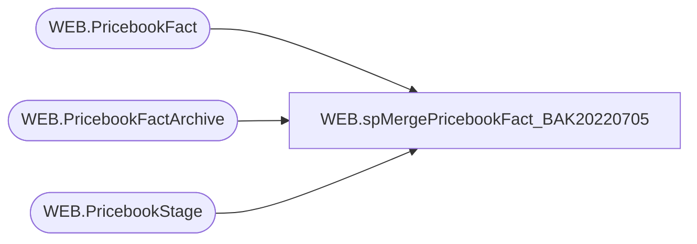

# WEB.spMergePricebookFact_BAK20220705

**Database:** IntegrationStaging  
**Server:** STL-SSIS-P-01  

## Architecture Diagram



## Table Dependencies

| Referenced Table |
|---|
| WEB.PricebookFact |
| WEB.PricebookFactArchive |
| WEB.PricebookStage |

## Stored Procedure Code

```sql
CREATE proc [WEB].[spMergePricebookFact_BAK20220705]

as

-------------------------------------------------------------------------
-- spMergePricebookFact - Merges from WEB.PricebookStage to WEB.PricebookFact
--						  
-- 05-30-2017 - Dan Tweedie - Created Proc
-------------------------------------------------------------------------

set nocount on

delete from WEB.PricebookFactArchive
where datediff(dd, ArchiveDate, getdate()) > 30

update WEB.PricebookFactArchive
set CurrentBatch = 0

update WEB.PricebookFact
set CheckDate = getdate()

Merge into WEB.PricebookFact as target
Using WEB.PricebookStage as source
On (
		target.style_code = source.style_code
	and target.Catalog = source.Catalog
	)
When Matched 
	AND 
		(
			 isnull(target.CurrentPrice,99999) <> isnull(source.CurrentPrice,99999)
			 OR
			 isnull(target.OriginalPrice,99999) <> isnull(source.OriginalPrice,99999)
			 OR
			 isnull(target.SalePrice,99999) <> isnull(source.SalePrice,99999)
		 )
	Then 
		Update 
			Set target.CurrentPrice = source.CurrentPrice,
				target.OriginalPrice = source.OriginalPrice,
				target.SalePrice = source.SalePrice,
				target.UpdateDate = getdate(),
				target.CheckDate = getdate()
When Not Matched By Target 
	Then 
		Insert (style_code, CurrentPrice, OriginalPrice, SalePrice, Catalog, InsertDate, CheckDate)
		Values (source.style_code, source.CurrentPrice, source.OriginalPrice, source.SalePrice, source.Catalog, getdate(), getdate())
When Not Matched By Source
	Then
		Delete

OUTPUT 
	deleted.*,
	getdate(),
	$action,
	1
into WEB.PricebookFactArchive	
;

----Dan Tweedie - I neeed to revisit this because it seems that not all SalePrice 'deletes' are being detected/pushed to SalesForce
--This statement should ensure that pricebookArchive records are flagged to be pushed if they have no sale price, and the fact table also has no sale
with MaxDate as
	(
		select style_code, max(ArchiveDate) ArchiveDate
		from web.PricebookFactArchive
		where SalePrice is NOT NULL
		and datediff(dd, ArchiveDate, getdate()) <= 3
		group by style_code
	)
update a
set a.CurrentBatch = 1
from web.PricebookFactArchive a 
join MaxDate md on a.style_code = md.style_code and a.ArchiveDate = md.ArchiveDate
where a.SalePrice is not NULL
and a.style_code in (select style_code from web.PricebookFact where SalePrice is NULL)
```

