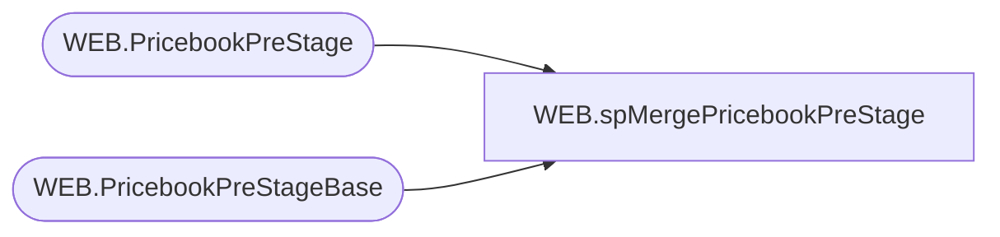

# WEB.spMergePricebookPreStage

**Database:** IntegrationStaging  
**Server:** STL-SSIS-P-01  

## Architecture Diagram



## Table Dependencies

| Referenced Table |
|---|
| WEB.PricebookPreStage |
| WEB.PricebookPreStageBase |

## Stored Procedure Code

```sql
CREATE proc [WEB].[spMergePricebookPreStage] 

as


-- =====================================================================================================
-- Name: WEB.spMergePricebookPreStage 
--
-- Description:	Merges from WEB.PricebookPreStage to WEB.PricebookPreStageBase
--
--
-- Revision History
--		Name:			Date:			Comments:
--		Lizzy Timm		2025-10-14		Created proc.	
-- =====================================================================================================


set nocount on
IF (SELECT COUNT(*) FROM WEB.PricebookPreStage) > 50
BEGIN
	Merge into WEB.PricebookPreStageBase as target 
	Using WEB.PricebookPreStage as source -- Note that Fabric populates Fabric into this table
	On (
			target.BaseID = source.BaseID
				AND target.stylecode = source.stylecode
				AND target.Jurisdiction = source.Jurisdiction
				AND target.AVAILB = source.AVAILB
		)
	when matched 
		and (
				ISNULL(source.CurrentPrice,0) <> ISNULL(target.CurrentPrice,0)
				OR ISNULL(source.OriginalPrice,0) <> ISNULL(target.OriginalPrice,0)
				OR ISNULL(source.StartDate,'3030-12-31') <> ISNULL(target.StartDate,'3030-12-31')
			)
		then 
			UPDATE
				SET
					target.CurrentPrice = source.CurrentPrice
					, target.OriginalPrice = source.OriginalPrice
					, target.StartDate = source.StartDate
					, target.UpdateDate = getdate()
	When Not Matched By Target 
		Then 
			Insert (
						BaseID
						, stylecode
						, CurrentPrice
						, OriginalPrice
						, Jurisdiction
						, AVAILB
						, StartDate
						, InsertDate
									
					)
			Values (	
						source.BaseID
						, source.stylecode
						, source.CurrentPrice
						, source.OriginalPrice
						, source.Jurisdiction
						, source.AVAILB
						, source.StartDate
						,getdate()
					)
	WHEN NOT MATCHED BY source
		THEN
			DELETE
	;
  END
```

