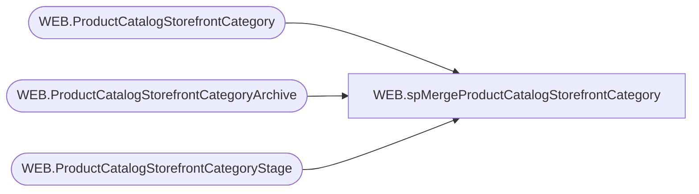

# WEB.spMergeProductCatalogStorefrontCategory

**Database:** IntegrationStaging  
**Server:** STL-SSIS-P-01  

## Architecture Diagram



## Table Dependencies

| Referenced Table |
|---|
| WEB.ProductCatalogStorefrontCategory |
| WEB.ProductCatalogStorefrontCategoryArchive |
| WEB.ProductCatalogStorefrontCategoryStage |

## Stored Procedure Code

```sql
CREATE proc [WEB].[spMergeProductCatalogStorefrontCategory] 
@LoadType varchar(5)

as 

-------------------------------------------------------------------------
-- spMergeProductCatalogStorefrontCategory - Merges from WEB.ProductCatalogStorefrontCategoryStage to WEB.ProductCatalogStorefrontCategory
--
-- 2017-07-05- Dan Tweedie - Created Proc
-------------------------------------------------------------------------

set nocount on

DELETE from WEB.ProductCatalogStorefrontCategoryArchive
where datediff(dd, ArchiveDate, getdate()) > 30

update WEB.ProductCatalogStorefrontCategoryArchive
set CurrentBatch = 0

update WEB.ProductCatalogStorefrontCategory
	set SendData = 0
	--fix the merge so it only deletes as needed to trigger delete mode, otherwise do an update...
merge WEB.ProductCatalogStorefrontCategory as target
using WEB.ProductCatalogStorefrontCategoryStage as source 
on target.CategoryID = source.CategoryID
	--and	isnull(target.Parent,'xxx') = isnull(source.Parent,'xxx')
	--and isnull(target.DisplayName,'xxx') = isnull(source.DisplayName,'xxx')
	--and isnull(target.CategoryLevel, 99999) = isnull(source.CategoryLevel,99999)
	--and isnull(target.OnlineStart, '9999-12-31') = isnull(source.OnlineStart, '9999-12-31')
	--and isnull(target.OnlineEnd, '9999-12-31') = isnull(source.OnlineEnd, '9999-12-31')
	--and isnull(target.OnlineFlag,9) = isnull(source.OnlineFlag,9)
	and isnull(target.Position,99.9) = isnull(source.Position,99.9)
	--and isnull(target.ShowInMenu,'xxx') = isnull(source.ShoWinMenu,'xxx')
when matched 
	and (
				isnull(target.Parent,'xxx') <> isnull(source.Parent,'xxx')
			or isnull(target.DisplayName,'xxx') <> isnull(source.DisplayName,'xxx')
			or isnull(target.CategoryLevel, 99999) <> isnull(source.CategoryLevel,99999)
			or isnull(target.OnlineStart, '9999-12-31') <> isnull(source.OnlineStart, '9999-12-31')
			or isnull(target.OnlineEnd, '9999-12-31') <> isnull(source.OnlineEnd, '9999-12-31')
			or isnull(target.OnlineFlag,9) <> isnull(source.OnlineFlag,9)
			--or isnull(target.Position,99.9) <> isnull(source.Position,99.9)
			or isnull(target.ShowInMenu,'xxx') <> isnull(source.ShoWinMenu,'xxx')
		)
	then update
		set target.Parent = source.Parent,
			target.DisplayName = source.DisplayName,
			target.CategoryLevel = source.CategoryLevel,
			target.OnlineStart = source.OnlineStart,
			target.OnlineEnd = source.OnlineEnd,
			target.OnlineFlag = source.OnlineFlag,
			--target.Position = source.Position,
			target.ShowInMenu = source.ShoWinMenu,
			target.UpdateDate	=	getdate(),
			target.SendData = 1
when not matched by target
	then 
		insert (
					CategoryID,
					Parent,
					DisplayName,
					CategoryLevel,
					OnlineStart,
					OnlineEnd,
					OnlineFlag,
					Position,
					ShowInMenu,
					InsertDate,
					SendData
				)
		values (
					source.CategoryID,
					source.Parent,
					source.DisplayName,
					source.CategoryLevel,
					source.OnlineStart,
					source.OnlineEnd,
					source.OnlineFlag,
					source.Position,
					source.ShowInMenu,
					getdate(),
					1
				)
when not matched by source 
	then
		delete

OUTPUT 
	deleted.*,
	getdate(),
	$action,
	1
into WEB.ProductCatalogStorefrontCategoryArchive
		
;

if @LoadType = 'FULL'
	update WEB.ProductCatalogStorefrontCategory
	set SendData = 1


WEB,spMergeProductCategoryMap,CREATE proc [WEB].[spMergeProductCategoryMap]
@LoadType varchar(5)

as 
-------------------------------------------------------------------------
-- spMergeProductCategoryMap - Merges from WEB.ProductCategoryMapStage to WEB.ProductCategoryMap
--
-- 2017-06-30 - Dan Tweedie - Created Proc
-------------------------------------------------------------------------

set nocount on

Delete from WEB.ProductCategoryMapArchive
where datediff(dd, ArchiveDate, getdate()) > 30

update WEB.ProductCategoryMapArchive
set CurrentBatch = 0

update WEB.ProductCategoryMap
	set SendData = 0 

Merge into WEB.ProductCategoryMap as target
using WEB.ProductCategoryMapStage as source
On (
		target.Style = source.Style
		AND
		target.CategoryID = source.CategoryID
	)
When Not Matched By Target 
	Then 
		Insert (
				Style,
				CategoryID,
				InsertDate,
				SendData
				)
		Values (
					source.Style,
					source.CategoryID,
					getdate(),
					1
				)
When Not Matched By Source
	Then
		Delete

OUTPUT 
	deleted.*,
	getdate(),
	$action,
	1
into WEB.ProductCategoryMapArchive
;

if @LoadType = 'FULL'
update WEB.ProductCategoryMap
set SendData = 1
```

