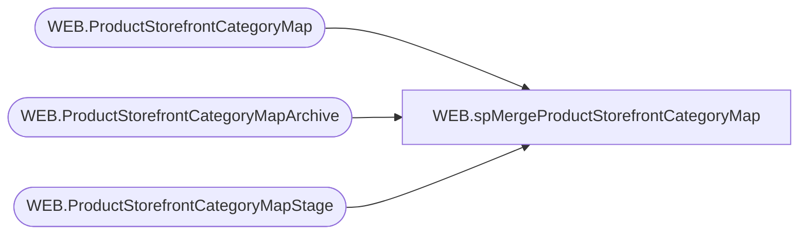

# WEB.spMergeProductStorefrontCategoryMap

**Database:** IntegrationStaging  
**Server:** STL-SSIS-P-01  

## Architecture Diagram



## Table Dependencies

| Referenced Table |
|---|
| WEB.ProductStorefrontCategoryMap |
| WEB.ProductStorefrontCategoryMapArchive |
| WEB.ProductStorefrontCategoryMapStage |

## Stored Procedure Code

```sql
CREATE proc [WEB].[spMergeProductStorefrontCategoryMap]
@LoadType varchar(5)

as 
-------------------------------------------------------------------------
-- spMergeProductStorefrontCategoryMap - Merges from WEB.ProductStorefrontCategoryMapStage to WEB.ProductStorefrontCategoryMap
--
-- 2017-06-30 - Dan Tweedie - Created Proc
-------------------------------------------------------------------------

set nocount on

DELETE from WEB.ProductStorefrontCategoryMapArchive
where datediff(dd, ArchiveDate, getdate()) > 30

update WEB.ProductStorefrontCategoryMapArchive
set CurrentBatch = 0

update WEB.ProductStorefrontCategoryMap
	set SendData = 0 

Merge into WEB.ProductStorefrontCategoryMap as target
using WEB.ProductStorefrontCategoryMapStage as source
On
	(
		target.Style = source.Style
		and
		isnull(target.CategoryID, 'xxx') = isnull(source.CategoryID, 'xxx')
		and
		isnull(target.PrimaryCategory,999) = isnull(source.PrimaryCategory, 999)
	)
When Not Matched By Target 
	Then 
		Insert (
				Style,
				CategoryID,
				PrimaryCategory,
				InsertDate,
				SendData
				)
		Values (
					source.Style,
					source.CategoryID,
					source.PrimaryCategory,
					getdate(),
					1
				)
When Not Matched By Source
	Then
		Delete

OUTPUT 
	deleted.*,
	getdate(),
	$action,
	1
into WEB.ProductStorefrontCategoryMapArchive		
;

if @LoadType = 'FULL'
update WEB.ProductStorefrontCategoryMap
set SendData = 1


WEB,spMergeStoreInventoryBuffers,create proc WEB.spMergeStoreInventoryBuffers 

as 

set nocount on

merge into WEB.StoreInventoryBuffers as target
using WEB.StoreInventoryBuffersStage as source
on 
	(
		isnull(target.StoreNumber,'x')=isnull(source.StoreNumber,'x')
		AND
		isnull(target.Department,'x')=isnull(source.Department,'x')
		AND
		isnull(target.ItemNumber,'x')=isnull(source.ItemNumber,'x')
		AND
		isnull(target.BufferQty,0)=isnull(source.BufferQty,0)
	)
When not matched by target 
	then insert
		(
			StoreNumber,
			Department,
			ItemNumber,
			BufferQty,
			InsertDate
		)
	values
		(
			source.StoreNumber,
			source.Department,
			source.ItemNumber,
			source.BufferQty,
			getdate()
		)
when not matched by source
	then delete


;
```

