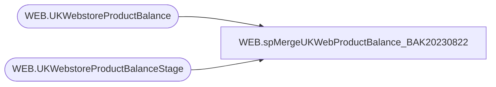

# WEB.spMergeUKWebProductBalance_BAK20230822

**Database:** IntegrationStaging  
**Server:** STL-SSIS-P-01  

## Architecture Diagram



## Table Dependencies

| Referenced Table |
|---|
| WEB.UKWebstoreProductBalance |
| WEB.UKWebstoreProductBalanceStage |

## Stored Procedure Code

```sql
CREATE proc [WEB].[spMergeUKWebProductBalance_BAK20230822]
as


set nocount on
merge into [WEB].[UKWebstoreProductBalance] as target
Using [WEB].[UKWebstoreProductBalanceStage] as source

on 
	( 
		target.StyleCode=source.StyleCode
		and
		target.InventoryDate=cast(source.Date as datetime)
	)
when NOT MATCHED by Target 
	then 
		Insert 
			(
			InventoryDate,
			StyleCode,
			ARRQuantity,
			AVLQuantity,
			TRAQuantity,
			ORDQuantity,
			PCKQuantity,
			AWPQuantity,
			ALLQuantity,
			ADVQuantity,
			HLDQuantity,
			InsertDate
			) 
		Values 
			(
				cast(source.Date as date),
				source.[StyleCode],
				source.[ARRQuantity] ,
				source.[AVLQuantity] ,
				source.[TRAQuantity] ,
				source.[ORDQuantity] ,
				source.[PCKQuantity] ,
				source.[AWPQuantity] ,
				source.[ALLQuantity] ,
				source.[ADVQuantity] ,
				source.[HLDQuantity] , 
				getdate()
			) 
		;

WEB,spMergeWebOrderQtyToEnterpriseSelling,CREATE proc [WEB].[spMergeWebOrderQtyToEnterpriseSelling] 

as 

set nocount on


merge into web.WebOrderQtyToEnterpriseSelling as target 
using web.WebOrderQtyStage as source
on 
	(
		target.Site=source.site
		and
		target.SKU=source.SKU
		and
		target.FileName=source.FileName
	)
When not matched by target
then INSERT	
	(
		Site,
		SKU,
		OrderQty,
		FileName,
		InsertDate
	)
values
	(
		source.Site,
		source.SKU,
		source.OrderQty,
		source.FileName,
		getdate()
	)
;

--INSERT WEB.WebToESProcessControl
--select ID, 'SFCC'
--from web.WebOrderQtyToEnterpriseSelling 
--where TransmitDate is NULL 
WEB,spMergeWMShippedCartons,CREATE proc [WEB].[spMergeWMShippedCartons]

as 

------------------------------------------------------------------------------------
--	Dan Tweedie	2018-11-01	Created proc
------------------------------------------------------------------------------------


set nocount on


merge into WEB.WMShippedCartons as target
using 
	(
		select
			OrderType,
			ShipTo,
			CartonNumber,
			Style,
			SKUDescription,
			sum(Qty) as Qty,
			cast(ShipDateTime as date) as ShipDate,
			WebOrderNumber,
			PartyID,
			PartyType,
			PartyDate,
			ShipMethod,
			TrackingNumber
		from WEB.WMShippedCartonsStage 
		group by 
			OrderType,
			ShipTo,
			CartonNumber,
			Style,
			SKUDescription,
			cast(ShipDateTime as date),
			WebOrderNumber,
			PartyID,
			PartyType,
			PartyDate,
			ShipMethod,
			TrackingNumber
	) as source 
on (
		target.CartonNumber = source.CartonNumber
		AND
		target.Style = source.Style
	)
when not matched by target
	then Insert 
		(
			OrderType,
			ShipTo,
			CartonNumber,
			Style,
			SKUDescription,
			Qty,
			ShipDate,
			WebOrderNumber,
			PartyID,
			PartyType,
			PartyDate,
			ShipMethod,
			TrackingNumber,
			InsertDate
		)
	values
		(
			source.OrderType,
			source.ShipTo,
			source.CartonNumber,
			source.Style,
			source.SKUDescription,
			source.Qty,
			source.ShipDate,
			source.WebOrderNumber,
			source.PartyID,
			source.PartyType,
			source.PartyDate,
			source.ShipMethod,
			source.TrackingNumber,
			getdate()
		)
;

WEB,spOutputGirlScoutWebToStorePipelineTransferData,CREATE proc [WEB].[spOutputGirlScoutWebToStorePipelineTransferData] 

as
-------------------------------------------------------------------------------------------------------------------------------------------------------
-- Dan Tweedie	2018-11-01	Created proc to output Transfer data formatted for Aptos Pipeline, uses a cursor, but is very small so uses no resources
								--Will be executed from SSIS to go into pipeline file
-------------------------------------------------------------------------------------------------------------------------------------------------------


set nocount on


IF (Object_ID('tempdb..#a') IS NOT NULL) DROP TABLE #a
select  
	right(('0000' + cast('0013' as varchar)), 4) + right(('0000' + cast(isnull(ShipTo,'0000') as varchar)), 4) + convert(varchar, getdate(), 112) + cast(datepart(hh, getdate()) as varchar) + cast(datepart(mm, getdate()) as varchar) as document_number,
	CartonNumber as carton_label,
    right(('0000' + cast('0013' as varchar)), 4) as from_location_code, -- hard coded
    right(('0000' + cast(isnull(ShipTo,'0000') as varchar)), 4) as to_location_code, 
    CONVERT(varchar,ShipDate,101) as date_shipped,
    'CORR' as reason_code, --NEED TO CONFIRM THIS
    'GirlScoutWebToStore' as Grouping_Label, -- NEED TO CONFIRM THIS
    right(('000000000000' + Style), 12) as upc,
	Qty as send_units,
	'xx' as importfile ---NEED TO CONFIRM THIS
into #a
from WEB.WMShippedCartons 
where Transmitted is NULL

insert WEB.PartyWebOrderTransferLog
select * from #a where carton_label not in (select carton_label from WEB.PartyWebOrderTransferLog where carton_label is not null)

declare
		@document varchar(20),
		@from varchar(4),
		@to varchar(4),
		@date varchar(12),
		@reason varchar(5),
		@grouping varchar(20),
		@carton varchar(20),
		@upc varchar(20),
		@send_units int,
		@counter1 int,
		@counter2 int,
		@total1 int,
		@total2 int
		

select @total1 = count(distinct document_number) from #a
declare header cursor for
		select  distinct
				document_number,
				from_location_code,
				to_location_code,
				date_shipped,
				reason_code,
				grouping_label
		from #a

open header
set @counter1 = 1
while @counter1 <= @total1
	begin
		fetch next from header into @document,@from,@to,@date,@reason,@grouping
		print 'H' + '	'	+ 'A' +	'	'+ @document + '	' + '	' + '	' + @from + '	' + '	' + @to + '	' + '	' + '	' + '	' + '	' + @date + '	' + '	' + '	' + '	' + '	' + '	' + @reason + '	' + '	'+ '	' + '	' + @grouping + '	' + '	' + '	' + 'T'
			select @total2 = count(distinct carton_label + upc) from #a where document_number = @document
			declare detail cursor for
			select distinct
					document_number,
					carton_label,
					upc,
					sum(send_units)
			from #a 
			where document_number = @document
			group by document_number, carton_label, upc order by upc
			open detail
			set @counter2 = 1
			while @counter2 <= @total2
				begin
					fetch next from detail into @document,@carton,@upc,@send_units
					print 'D' + '	' + 'A' + '	' + @document + '	' + @carton + '	' + @upc + '	' + '	' + '	' + '	' + '	' + '	' + convert(varchar, @send_units)
					set @counter2 = @counter2 + 1
				end
			close detail
			deallocate detail		
		set @counter1 = @counter1 + 1
	end
close header
deallocate header	


WEB,spOutputInventoryXML,create proc WEB.spOutputInventoryXML

as

-- =====================================================================================================
-- Name:  WEB.spOutputInventoryXML
--
-- Description:	Outputs inventory XML to push to Deck OMS
--				 
-- Revision History
--		Name:			Date:			Comments:
--		Dan Tweedie		2017-08-11		Created proc
-- =====================================================================================================

declare 
	@RowsToSend int

Select 
	@RowsToSend = count(*)
from WEB.InventoryFact
where SendData = 1 

if @RowsToSend > 0

	begin

		exec WEB.spOutputXMLFile
		 @Query = 'select XMLData from IntegrationStaging.WEB.vwInventoryXML', 
		 @FileLocation = '\\STL-SSIS-P-01\IntegrationStaging\WEB\Outbound\Inventory\', 
		 @FileName = 'ProductInventory.xml'

	end
```

