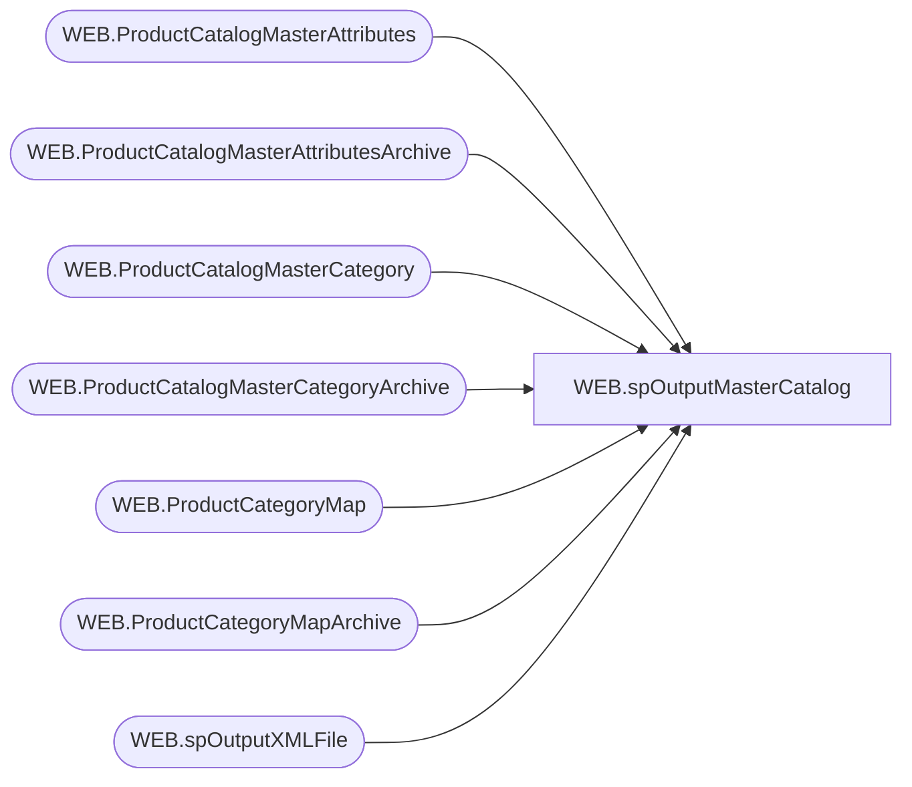

# WEB.spOutputMasterCatalog

**Database:** IntegrationStaging  
**Server:** STL-SSIS-P-01  

## Architecture Diagram



## Table Dependencies

| Referenced Table |
|---|
| WEB.ProductCatalogMasterAttributes |
| WEB.ProductCatalogMasterAttributesArchive |
| WEB.ProductCatalogMasterCategory |
| WEB.ProductCatalogMasterCategoryArchive |
| WEB.ProductCategoryMap |
| WEB.ProductCategoryMapArchive |
| WEB.spOutputXMLFile |

## Stored Procedure Code

```sql
CREATE proc [WEB].[spOutputMasterCatalog]
@LoadType varchar(5)

as

set nocount on

-- =====================================================================================================
-- Name:  WEB.spOutputMasterCatalog
--
-- Description:	Outputs master catalog XML file for ecommerce integration, runs WEB.spOutputXMLFile (reusable proc for generating xml files)
--				 
-- Revision History
--		Name:			Date:			Comments:
--		Dan Tweedie		2017-06-15		Created proc
-- =====================================================================================================


declare 
	@dateString varchar(20),
	@file varchar(100),
	@view varchar(50),
	@sql varchar(100),
	@RowsToSend int

Select @RowsToSend =
	case 
		when @LoadType = 'FULL' 
		then 1
		else sum(x.RowsToSend) 
	end
from 
	(
		select count(*) RowsToSend
		from WEB.ProductCatalogMasterCategory
		where SendData = 1
		and CategoryID <> 'root'
		UNION
		select count(*) RowsToSend
		from WEB.ProductCatalogMasterCategoryArchive
		where ChangeType = 'DELETE'
		and CurrentBatch = 1
		and CategoryID <> 'root'
		UNION
		select count(*) RowsToSend
		from WEB.ProductCatalogMasterAttributes
		where SendData = 1
		UNION
		select count(*) RowsToSend
		from WEB.ProductCatalogMasterAttributesArchive
		where ChangeType = 'DELETE'
		AND CurrentBatch = 1
		UNION
		select count(*)
		from WEB.ProductCategoryMap
		where SendData = 1
		UNION
		select count(*)
		from WEB.ProductCategoryMapArchive
		where ChangeType = 'DELETE' 
		and CurrentBatch = 1
	) x


if @RowsToSend > 0
begin
	select 
		@dateString = replace(replace(replace(replace(convert(varchar, getdate(), 121), '-', ''), ':', ''), '.', ''),' ', ''),
		@LoadType = lower(@LoadType),
		@file = @datestring + '_catalog_buildabear-master_' + @LoadType + '.xml',
		@view = case when @LoadType = 'delta' 
						then 'vwProductCatalogMasterDeltaXML'
						else 'vwProductCatalogMasterFullXML'
				end,
		@sql = 'select XMLData from IntegrationStaging.WEB.' + @view

	exec WEB.spOutputXMLFile 
	@Query = @sql, 
	@FileLocation = '\\STL-SSIS-P-01\IntegrationStaging\WEB\Outbound\ProductCatalogMaster\', 
	@FileName = @file
end
```

