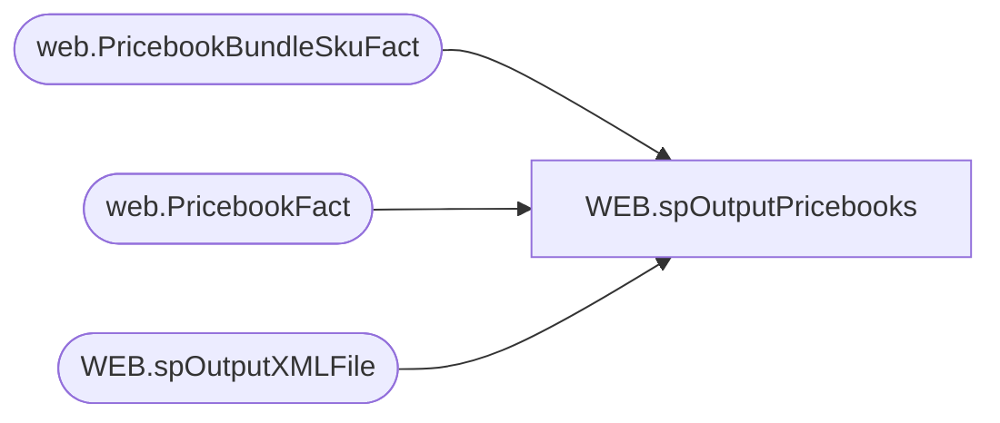

# WEB.spOutputPricebooks

**Database:** IntegrationStaging  
**Server:** STL-SSIS-P-01  

## Architecture Diagram



## Table Dependencies

| Referenced Table |
|---|
| web.PricebookBundleSkuFact |
| web.PricebookFact |
| WEB.spOutputXMLFile |

## Stored Procedure Code

```sql
CREATE proc [WEB].[spOutputPricebooks]
 @FileNameDate datetime = NULL

as

set nocount on

-- =====================================================================================================
-- Name:  WEB.spOutputPricebooks
--
-- Description:	Outputs master catalog XML file for ecommerce integration, runs WEB.spOutputXMLFile (reusable proc for generating xml files)
--				 
-- Revision History
--		Name:			Date:			Comments:
--		Dan Tweedie		2017-06-15		Created proc
--		Tim Callahan	2024-08-06		Altered Row Count Check Logic as related to JIRA BIB685
-- =====================================================================================================


declare 
	@dateString varchar(20),
	@file varchar(100)

select @dateString = case when @FileNameDate is NULL 
							then replace(replace(replace(replace(convert(varchar, getdate(), 121), '-', ''), ':', ''), '.', ''),' ', '')
							else replace(replace(replace(replace(convert(varchar, @FileNameDate, 121), '-', ''), ':', ''), '.', ''),' ', '')
					end

select @file = @datestring + '_pricebooks_usd.xml'

if 
--original Row Count Check
/*
(
	select count (*)
	from web.PricebookFact
	where (exported is null and ExportDate is null )
	and (CurrentPrice <> 0.00 and isnull(SalePrice,0.01) <> 0.00)
	and Catalog = 'US' 
) 

--End Original Row Count Check 
*/

-- Bundle Sku Row Count Check Begin
(
select sum (Rowcounts)
from 
	(
	select count (*) as RowCounts
	from web.PricebookFact
	where (exported is null and ExportDate is null )
	and (CurrentPrice <> 0.00 and isnull(SalePrice,0.01) <> 0.00)
	and Catalog = 'US' 
	union 
	select count (*) as Rowcounts 
	from web.PricebookBundleSkuFact 
	where (exported is null and ExportDate is null )
	and BundleSkuCatalog = 'US' 
	)  x
)
-- Bundle Sku Row Count Check End 

> 0 
Begin 


	exec WEB.spOutputXMLFile
	 @Query = 'select XMLData from IntegrationStaging.WEB.vwPricebooksUSXML', 
	 @FileLocation = '\\STL-SSIS-P-01\IntegrationStaging\WEB\Outbound\Pricebook\', 
	 @FileName = @file
End 


if
--original Row Count Check 
/*
(
select count (*)
from web.PricebookFact
where (exported is null and ExportDate is null )
and (CurrentPrice <> 0.00 and isnull(SalePrice,0.01) <> 0.00)
and Catalog = 'UK' 
)

--End Original Row Count Check 
*/

-- Bundle Sku Row Count Check Begin
(
select sum (Rowcounts)
from 
	(
	select count (*) as RowCounts
	from web.PricebookFact
	where (exported is null and ExportDate is null )
	and (CurrentPrice <> 0.00 and isnull(SalePrice,0.01) <> 0.00)
	and Catalog = 'UK' 
	union 
	select count (*) as Rowcounts 
	from web.PricebookBundleSkuFact 
	where (exported is null and ExportDate is null )
	and BundleSkuCatalog = 'UK' 
	)  x
)
-- Bundle Sku Row Count Check End 

> 0 

Begin 

 select @file = @datestring + '_pricebooks_gbp.xml'

	 exec WEB.spOutputXMLFile
	 @Query = 'select XMLData from IntegrationStaging.WEB.vwPricebooksUKXML', 
	 @FileLocation = '\\STL-SSIS-P-01\IntegrationStaging\WEB\Outbound\Pricebook\', 
	 @FileName = @file

End
```

