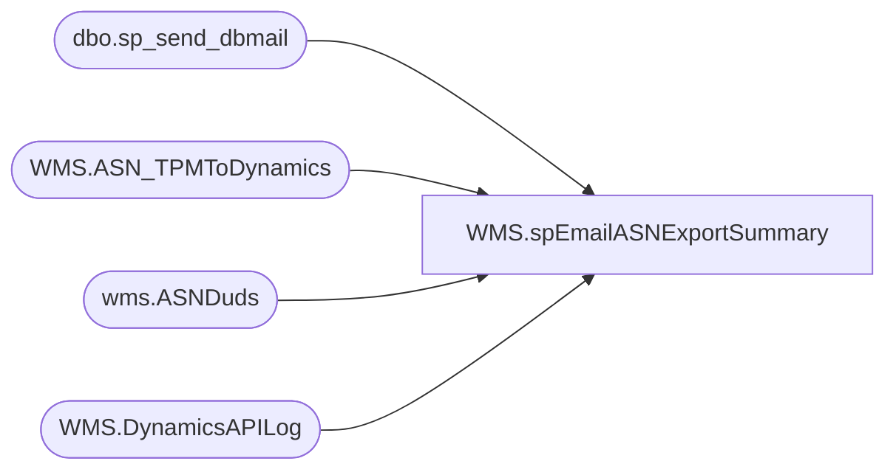

# WMS.spEmailASNExportSummary

**Database:** IntegrationStaging  
**Server:** STL-SSIS-P-01  

## Architecture Diagram



## Table Dependencies

| Referenced Table |
|---|
| dbo.sp_send_dbmail |
| WMS.ASN_TPMToDynamics |
| wms.ASNDuds |
| WMS.DynamicsAPILog |

## Stored Procedure Code

```sql
CREATE proc [WMS].[spEmailASNExportSummary]
@BatchID nvarchar(100)

as


--====================================================================================================
--	Dan Tweedie	2019-08-20	Created proc to send summary after each ASN export from TPM to Dynamics
--====================================================================================================
IF (Object_ID('tempdb..#ASN') IS NOT null) DROP TABLE #ASN
select distinct 
	e.Shipment as TPMShipment,
	max(e.sentTo365) ExportDate,
	case 
		when substring(api.ResponseBody, charindex('successfully assigned to ASN', api.ResponseBody, 1)+29, 13) like 'LOAD%' 
			then substring(api.ResponseBody, charindex('successfully assigned to ASN', api.ResponseBody, 1)+29, 13)
		else NULL
	end as DynamicsASNLoad,
	case 
		when api.ResponseBody like '%hasErrors":true%' 
			then 'Yes'
		else 'NO'
	end as HasError,
	replace(substring(isnull(api.ResponseBody,api.ExceptionError), charindex('errorMessage', isnull(api.ResponseBody,api.ExceptionError),1), 1000), 'errorMessage', 'ResponseMessage') APIResponseMessage,
	isnull(api.ResponseBody,api.ExceptionError) as ResponseBody,
	api.BatchID
into #ASN
from WMS.ASN_TPMToDynamics e with (nolock)
left join  WMS.DynamicsAPILog api with (nolock)
	on api.IntegrationName='WMS_ASNCreate'
	and e.BatchID=api.BatchID
	and e.Shipment=api.TPMShipmentNumber
--where e.Shipment='SH0000033762'
where e.BatchID = @BatchID
group by 
	e.Shipment,
	--e.sentTo365,
	case 
		when substring(api.ResponseBody, charindex('successfully assigned to ASN', api.ResponseBody, 1)+29, 13) like 'LOAD%' 
			then substring(api.ResponseBody, charindex('successfully assigned to ASN', api.ResponseBody, 1)+29, 13)
		else NULL
	end,
	case 
		when api.ResponseBody like '%hasErrors":true%' 
			then 'Yes'
		else 'NO'
	end,
	isnull(api.ResponseBody,api.ExceptionError),
	api.BatchID


if (select count(*) from #ASN) > 0 

begin 
	declare 
	@text nvarchar(max)

	set @text = 
		'<font face =arial size = 2><B>ASN Export Summary - TPM to Dynamics</B><br><br></font>' +
			'<table border="1">' +
				'<tr><th><font face =arial size = 2>TPMShipment</font></th>' +
					'<th><font face =arial size = 2>ExportDate</font></th>' +
					'<th><font face =arial size = 2>DynamicsASNLoad</font></th>' +
					'<th><font face =arial size = 2>HasError</font></th>' +
					'<th><font face =arial size = 2>APIResponseMessage</font></th>' + 
					'<th><font face =arial size = 2>ResponseBody</font></th>' + 
					'<th><font face =arial size = 2>BatchID</font></th></tr>' +
		'<font face =arial size = 2>' +
			CAST ( ( SELECT td = TPMShipment,'',
							td = ExportDate, '',
							td = isnull(DynamicsASNLoad,''), '',
							td = HasError, '',
							td = isnull(APIResponseMessage,''), '',
							td = isnull(ResponseBody,''), '',
							td = BatchID, ''
					  from #ASN
					  order by TPMShipment
					  FOR XML PATH('tr'), TYPE 
					) AS NVARCHAR(MAX) ) +
			'</font></table></font></p></p>
			<br>
			<font face =arial size = 1><B>This report was run from stl-ssis-p-01.IntegrationStaging.WMS.spEmailASNExportSummary vis SSIS WMS_ASNCreate.</B></font>
			<br>
			<br>
		<font face =arial size = 1><i>The information in this message may be privileged, “confidential” and protected from disclosure and/or intended only for the addressee(s) named above.  If the reader of this message is not the intended recipient, or an employee or agent responsible for delivering this message to the intended recipient, you are hereby notified that any dissemination, distribution or copying of the communication is strictly prohibited.  If you have received this communication in error, please notify us immediately by replying to the message and deleting it from your computer.  Thank you beary much.</i></font>'

		exec msdb.dbo.sp_send_dbmail
		@profile_name = 'biadmin',
		@recipients = 'santiagob@buildabear.com;DorisM@buildabear.com',
		@body = @text,
		@subject = 'ASN Export Summary - TPM to Dynamics',
		@body_format = 'HTML'
end

---
if (select count(*) from #ASN where (hasError = 'yes' or ResponseBody is NULL) and datediff(dd, ExportDate, getdate())<=3 ) > 0 

begin 
	declare 
	@text2 nvarchar(max)

	set @text2 = 
		'<font face =arial size = 2><B>ASN Export Summary - TPM to Dynamics</B><br><br></font>' +
			'<table border="1">' +
				'<tr><th><font face =arial size = 2>TPMShipment</font></th>' +
					'<th><font face =arial size = 2>ExportDate</font></th>' +
					'<th><font face =arial size = 2>DynamicsASNLoad</font></th>' +
					'<th><font face =arial size = 2>HasError</font></th>' +
					'<th><font face =arial size = 2>APIResponseMessage</font></th>' + 
					'<th><font face =arial size = 2>ResponseBody</font></th>' + 
					'<th><font face =arial size = 2>BatchID</font></th></tr>' +
		'<font face =arial size = 2>' +
			CAST ( ( SELECT td = TPMShipment,'',
							td = ExportDate, '',
							td = isnull(DynamicsASNLoad,'n/a'), '',
							td = HasError, '',
							td = isnull(APIResponseMessage,''), '',
							td = isnull(ResponseBody,''), '',
							td = BatchID, ''
					  from #ASN
					  where (hasError = 'yes' or ResponseBody is NULL)
					  and datediff(dd, ExportDate, getdate()) <= 3
					  order by TPMShipment
					  FOR XML PATH('tr'), TYPE 
					) AS NVARCHAR(MAX) ) +
			'</font></table></font></p></p>
			<br>
			<font face =arial size = 1><B>This report was run from stl-ssis-p-01.IntegrationStaging.WMS.spEmailASNExportSummary vis SSIS WMS_ASNCreate.</B></font>
			<br>
			<br>
		<font face =arial size = 1><i>The information in this message may be privileged, “confidential” and protected from disclosure and/or intended only for the addressee(s) named above.  If the reader of this message is not the intended recipient, or an employee or agent responsible for delivering this message to the intended recipient, you are hereby notified that any dissemination, distribution or copying of the communication is strictly prohibited.  If you have received this communication in error, please notify us immediately by replying to the message and deleting it from your computer.  Thank you beary much.</i></font>'

		exec msdb.dbo.sp_send_dbmail
		@profile_name = 'biadmin',
		@recipients = 'elizabethw@buildabear.com;santiagob@buildabear.com;DorisM@buildabear.com',
		@body = @text2,
		@subject = 'TPM ASNs not in Dynamics',
		@body_format = 'HTML'
end


if 
	datepart(hh, getdate()) = 23 and datepart(mm, getdate()) >= 30
	and
	(select count(*) from wms.ASNDuds) > 0

begin
	
	declare 
	@DudsText nvarchar(max)

	set @DudsText = 
		'<font face =arial size = 2><B>ASN Export Duds - UnMapped ASN PO Lines</B><br><br></font>' +
			'<table border="1">' +
				'<tr><th><font face =arial size = 2>PO Number</font></th>' +
					'<th><font face =arial size = 2>Line Number</font></th>' +
					'<th><font face =arial size = 2>Item Number</font></th>' +
					'<th><font face =arial size = 2>Qty</font></th>' +
					'<th><font face =arial size = 2>Shipment</font></th>' + 
					'<th><font face =arial size = 2>MinLPN</font></th>' + 
					'<th><font face =arial size = 2>MaxLPN</font></th></tr>' +
		'<font face =arial size = 2>' +
			CAST ( ( SELECT td = PO_nbr,'',
							td = PO_Shipment_Line_Nbr, '',
							td = ItemID, '',
							td = sum(Qty), '',
							td = Shipment, '',
							td = min(lpn), '',
							td = max(lpn), ''
					  from wms.ASNDuds
					  group by po_nbr, po_shipment_line_nbr, itemID, shipment
					  order by PO_nbr, PO_Shipment_Line_Nbr
					  FOR XML PATH('tr'), TYPE 
					) AS NVARCHAR(MAX) ) +
			'</font></table></font></p></p>
			<br>
			<font face =arial size = 1><B>This report was run from stl-ssis-p-01.IntegrationStaging.WMS.spEmailASNExportSummary vis SSIS WMS_ASNCreate.</B></font>
			<br>
			<br>
		<font face =arial size = 1><i>The information in this message may be privileged, “confidential” and protected from disclosure and/or intended only for the addressee(s) named above.  If the reader of this message is not the intended recipient, or an employee or agent responsible for delivering this message to the intended recipient, you are hereby notified that any dissemination, distribution or copying of the communication is strictly prohibited.  If you have received this communication in error, please notify us immediately by replying to the message and deleting it from your computer.  Thank you beary much.</i></font>'

		exec msdb.dbo.sp_send_dbmail
		@profile_name = 'biadmin',
		@recipients = 'santiagob@buildabear.com;DorisM@buildabear.com',
		@body = @DudsText,
		@subject = 'TPM ASN Lines Not Mapped - Not In Dynamics',
		@body_format = 'HTML'

end
```

