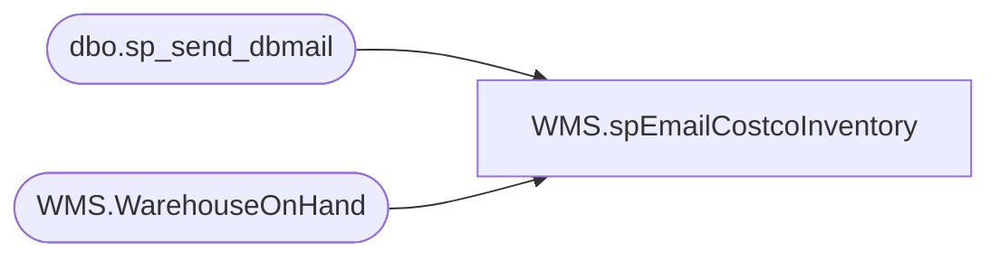

# WMS.spEmailCostcoInventory

**Database:** IntegrationStaging  
**Server:** STL-SSIS-P-01  

## Architecture Diagram



## Table Dependencies

| Referenced Table |
|---|
| dbo.sp_send_dbmail |
| WMS.WarehouseOnHand |

## Stored Procedure Code

```sql
CREATE proc [WMS].[spEmailCostcoInventory]
as

-- =====================================================================================================
-- Name: spEmailCostcoInventory
--
-- Description:	Gathers 980 Inventory for CostCo Gift Cards, send e-mail with available on hand. 
-- Divides total units by 4 as CostCo sells the Gift Cards in 4 packs, so 25 units = 100 Gift Cards 
-- Input:	NA
--
--
--
-- Revision History
--		Name:			Date:			Comments:
--		Tim Callahan	04/28/2020		Created proc which was based off original proc spWMSelectCostCoGiftCardInventory 
--										Removed most of original proc and tweaked for use with D365-WMS data 
-- =====================================================================================================
set nocount on 


--Capture Available 980 inventory
IF (Object_ID('tempdb..#CostCoAvail_invn') IS NOT NULL) DROP TABLE #CostCoAvail_invn
create table #CostCoAvail_invn
(--sku_id varchar(10),
style varchar(6),
sku_desc varchar(40),
avail_qty int)

insert #CostCoAvail_invn
select
cast(ItemNumber as varchar(6)) as style,
ProductName as sku_desc,
sum(ONHANDQUANTITY/4) as Quantity
from IntegrationStaging.WMS.WarehouseOnHand
where 1=1
and InventoryWarehouseID in ('9980')
and isnumeric(left(ItemNumber,1)) = 1
and ItemNumber = '021912'
group by cast(ItemNumber as varchar(6)), ProductName

-- Send Inventory Levels 
Begin 

Declare @BODY3 nvarchar(max);		

set @BODY3 = '<font face =arial size = 2>' + 
		'The quantity available is as of roughly 11:00 AM CST on Friday.'+
		'<br>'+
		'Any POs received after that time on Friday morning may not have been taken into account.'+
		'<br>'+
		'<br>'+
		'Please Find The Current Packs Available:' +
		'<br>'+		
		'<br>'+
		'<br>'+
			'<table border="1">' +
			'<tr><th>DESCRIPTION</th><th>AVAILABLE QTY</th></tr>' +
			CAST ( ( SELECT	td = cc.sku_desc, '',
							td = sum(cc.avail_qty), ''
					  from #CostCoAvail_invn CC
					  group by cc.sku_desc
					  FOR XML PATH('tr'), TYPE 
			) AS NVARCHAR(MAX) ) +
			'</font></table></font></p></p>
			<br>
			<br>
			<br>
			<font face =arial size = 1.5>This email has been generated from bedrockdb02.me_01.dbo.spWMSelectCostCoGiftCardInventory</font>
			<br>
			<br>
		<font face =arial size = 1><i>The information in this message may be privileged, “confidential” and protected from disclosure and/or intended only for the addressee(s) named above.  If the reader of this message is not the intended recipient, or an empl
oyee or agent responsible for delivering this message to the intended recipient, you are hereby notified that any dissemination, distribution or copying of the communication is strictly prohibited.  If you have received this communication in error, please
 notify us immediately by replying to the message and deleting it from your computer.</i></font>'

	

	EXEC sp_send_dbmail
		@recipients = 'BrysonA@buildabear.com;swells@costco.com;sstainer@costco.com', -- Replaced malbrecht@costco.com with sstainer@costco.com per Service Request 27031; 12/13/2019 LT
		@copy_recipients = 'MerchAdmin@buildabear.com',
		--@recipients = 'TimC@Buildabear.com',
		@subject = 'Build-A-Bear Gift Cards - Packs Available at BAB Warehouse',
		@body = @BODY3,
		@profile_name = 'BIAdmin',
		@body_format= HTML


	End
```

