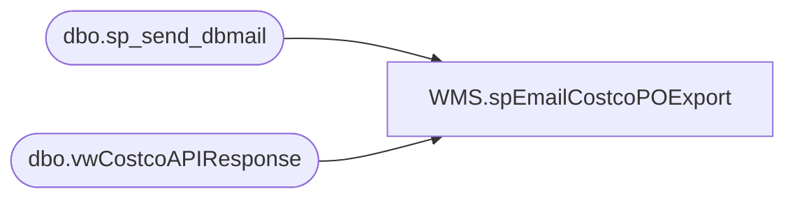

# WMS.spEmailCostcoPOExport

**Database:** IntegrationStaging  
**Server:** STL-SSIS-P-01  

## Architecture Diagram



## Table Dependencies

| Referenced Table |
|---|
| dbo.sp_send_dbmail |
| dbo.vwCostcoAPIResponse |

## Stored Procedure Code

```sql
CREATE proc [WMS].[spEmailCostcoPOExport] 
@BatchID nvarchar(100)

as 

set nocount on

IF (Object_ID('tempdb..#Costco') IS NOT null) DROP TABLE #Costco
select 
	CostcoOrderNumber,	
	hasError,	
	SalesOrderNumber,	
	APIError
into #Costco
from vwCostcoAPIResponse
where BatchID = @BatchID
order by CostcoOrderNumber

if (select count(*) from #Costco ) > 0

begin

declare 
	@text nvarchar(max)

	set @text = 
		'<font face =arial size = 2><B>Costco POs Exported To Dynamics</B><br><br></font>' +
			'<table border="1">' +
				'<tr><th><font face =arial size = 2>Costco PO Number</font></th>' +
					'<th><font face =arial size = 2>Dynamimcs Order Number</font></th>' +
					'<th><font face =arial size = 2>hasError</font></th>' +
					'<th><font face =arial size = 2>API Error</font></th></tr>' +
		'<font face =arial size = 2>' +
			CAST ( ( SELECT td = CostcoOrderNumber,'',
							td = SalesOrderNumber, '',
							td = hasError,'',
							td = APIError, ''
					  from #Costco
					  order by CostcoOrderNumber
					  FOR XML PATH('tr'), TYPE 
					) AS NVARCHAR(MAX) ) +
			'</font></table></font></p></p>
			<br>
			<font face =arial size = 1><B>This report was run from stl-ssis-t-01.IntegrationStaging.WMS.spEmailCostcoPOToDynamics vis SSIS WMS_CostcoPurchaseOrdersToDynamics.</B></font>
			<br>
			<br>
		<font face =arial size = 1><i>The information in this message may be privileged, “confidential” and protected from disclosure and/or intended only for the addressee(s) named above.  If the reader of this message is not the intended recipient, or an employee or agent responsible for delivering this message to the intended recipient, you are hereby notified that any dissemination, distribution or copying of the communication is strictly prohibited.  If you have received this communication in error, please notify us immediately by replying to the message and deleting it from your computer.  Thank you beary much.</i></font>'

		exec msdb.dbo.sp_send_dbmail
		@profile_name = 'biadmin',
		@recipients = 'dant@buildabear.com;brysona@buildabear.com;OhioOutbound@buildabear.com;OhioInbound@buildabear.com',
		@body = @text,
		@subject = 'Costco POs Exported To Dynamics',
		@body_format = 'HTML'


end
```

