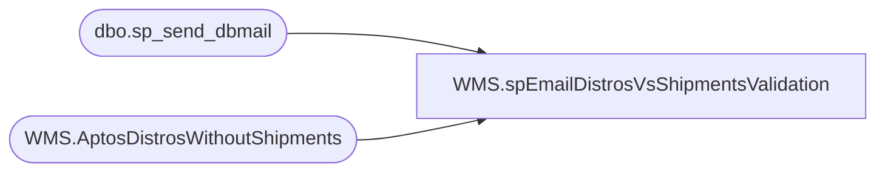

# WMS.spEmailDistrosVsShipmentsValidation

**Database:** IntegrationStaging  
**Server:** STL-SSIS-P-01  

## Architecture Diagram



## Table Dependencies

| Referenced Table |
|---|
| dbo.sp_send_dbmail |
| WMS.AptosDistrosWithoutShipments |

## Stored Procedure Code

```sql
CREATE proc [WMS].[spEmailDistrosVsShipmentsValidation] 

as 

--================================================================================================================================
--	Dan Tweedie	2019-08-30	Created proc to send email for staged data representing Aptos Distros for Dynamics without Shipments
--================================================================================================================================

set nocount on 

IF (Object_ID('tempdb..#data') IS NOT null) DROP TABLE #data;
select *
into #data
from WMS.AptosDistrosWithoutShipments

select * from #data

if (select count(*) from #data) > 0

begin

declare 
	@text nvarchar(max)

	set @text = 
		'<font face =arial size = 2><B>Aptos / Dynamics Distros vs Shipments Validation</B><br><br></font>' +
			'<table border="1">' +
				'<tr><th><font face =arial size = 2>Shipment</font></th>' +
					'<th><font face =arial size = 2>Distro</font></th>' +
					'<th><font face =arial size = 2>ToLocation</font></th>' +
					'<th><font face =arial size = 2>ItemNumber</font></th>' +
					'<th><font face =arial size = 2>DistroShipmentStageDate</font></th>' + 
					'<th><font face =arial size = 2>DynamicsOrder</font></th>' + 
					'<th><font face =arial size = 2>DynamicsShipmentLogged</font></th>' +
					'<th><font face =arial size = 2>AptosShipmentLogged</font></th></tr>' +
		'<font face =arial size = 2>' +
			CAST ( ( SELECT 
							td = BABAptosShipmentNumber, '',
							td = BABAptosDistroNumber, '',
							td = ToWarehouse, '',
							td = ItemNumber, '',
							td = isnull(DistroShipmentStageDate, ''), '',
							td = isnull(DynamicsOrder, 'not found'), '',
							td = DynamicsShipmentLogged, '',
							td = AptosShipmentLogged, ''
					  from #data
					  FOR XML PATH('tr'), TYPE 
					) AS NVARCHAR(MAX) ) +
			'</font></table></font></p></p>
			<br>
			<font face =arial size = 1><B>This report was run from stl-ssis-P-01.IntegrationStaging.WMS.spEmailDistrosVsShipmentsValidation  vis SSIS WMS.spEmailDistrosVsShipmentsValidation.</B></font>
			<br>
			<br>
		<font face =arial size = 1><i>The information in this message may be privileged, “confidential” and protected from disclosure and/or intended only for the addressee(s) named above.  If the reader of this message is not the intended recipient, or an employee or agent responsible for delivering this message to the intended recipient, you are hereby notified that any dissemination, distribution or copying of the communication is strictly prohibited.  If you have received this communication in error, please notify us immediately by replying to the message and deleting it from your computer.  Thank you beary much.</i></font>'

		exec msdb.dbo.sp_send_dbmail
		@profile_name = 'biadmin',
		@recipients = 'elizabethw@buildabear.com;lizzyt@buildabear.com',
		@body = @text,
		@subject = 'Aptos Distros vs Shipments Validation',
		@body_format = 'HTML'


end
```

