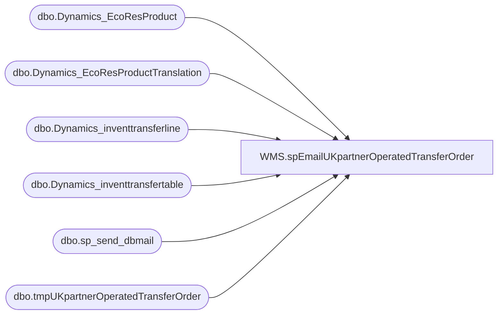

# WMS.spEmailUKpartnerOperatedTransferOrder

**Database:** IntegrationStaging  
**Server:** STL-SSIS-P-01  

## Architecture Diagram



## Table Dependencies

| Referenced Table |
|---|
| dbo.Dynamics_EcoResProduct |
| dbo.Dynamics_EcoResProductTranslation |
| dbo.Dynamics_inventtransferline |
| dbo.Dynamics_inventtransfertable |
| dbo.sp_send_dbmail |
| dbo.tmpUKpartnerOperatedTransferOrder |

## Stored Procedure Code

```sql
CREATE proc [WMS].[spEmailUKpartnerOperatedTransferOrder]  @store varchar(4)

as 


set nocount on


IF (Object_ID('IntegrationStaging..tmpUKpartnerOperatedTransferOrder') IS NOT NULL) DROP TABLE tmpUKpartnerOperatedTransferOrder;


select itt.TransferID as 'OrderNumber', itt.InventLocationIdTo as 'StoreNumber', 
	--itt.DlvModeId as 'ModeOfDelivery'
	case when itt.DlvModeId  = 1 then 'Regular Truck'
		when itt.DlvModeId  = 11 then 'First Truck'
		when itt.DlvModeId  = 12 then '6th Delivery' 
		when itt.DlvModeId  = 13 then '7th Delivery'
		when itt.DlvModeId  = 2 then 'Store Count'
		when itt.DlvModeId  = 3 then '2nd Delivery'
		when itt.DlvModeId  = 4 then 'Pool Point Emergency'
		when itt.DlvModeId  = 5 then 'Pool Point Normal'
		when itt.DlvModeId  = 51 then 'Next Day Priority' 
		when itt.DlvModeId  = 52 then 'Next Day'
		when itt.DlvModeId  = 53 then '2-Day Shipping'
		when itt.DlvModeId  = 54 then 'Ground Shipping' 
		when itt.DlvModeId  = 55 then 'Saturday Arrival'
		when itt.DlvModeId  = 56 then 'Add-On Regular Truck' 
		when itt.DlvModeId  = 57 then 'Courier Delivery'
		when itt.DlvModeId  = 6 then 'Pool Point Replenish'
		when itt.DlvModeId  = 61 then 'WH to WH Shipment'
		when itt.DlvModeId  = 62 then 'Initial Priority Air'
		when itt.DlvModeId  = 63 then 'Intal Economy' 
		when itt.DlvModeId  = 64 then 'Intal Container'
		when itt.DlvModeId  = 66 then 'International Ground'
		when itt.DlvModeId  = 7 then '3rd Delivery'
		when itt.DlvModeId  = 8 then '4th Delivery'
		when itt.DlvModeId  = 9 then '5th Delivery'
		when itt.DlvModeId  = 90 then 'Ohio WH Transfer'
		when itt.DlvModeId  = 'Air C-Air' then 'Air Cargo-Air'
		when itt.DlvModeId  = 'BestServe' then 'Best Service'
		when itt.DlvModeId  = 'Cust' then 'Customer Pickup'
		when itt.DlvModeId  = 'FedEx' then 'FedEx'
		when itt.DlvModeId  = 'FEDEX-2DAY' then 'FEDEX-2DAY'
		when itt.DlvModeId  = 'FEDEX-EXPR' then 'FEDEX-EXPRESS SAVER'
		when itt.DlvModeId  = 'FEDEX-GROU' then 'FEDEX-GROUND'
		when itt.DlvModeId  = 'FEDEX-HOME' then 'FEDX-HOME'
		when itt.DlvModeId  = 'FEDEX-INT1' then 'FEDEX-INTERNAT FIRST'
		when itt.DlvModeId  = 'FEDEX-INT2' then 'FEDEX-INTERNAT PRIOR'
		when itt.DlvModeId  = 'FEDEX-INTE' then 'FEDEX-INTERNAT ECON'
		when itt.DlvModeId  = 'FEDEX-PRIO' then 'FEDEX-PRIORITY OVERNIGHT'
		when itt.DlvModeId  = 'FEDEX-SMAR' then 'FEDEX-SMARTPOST'
		when itt.DlvModeId  = 'FEDEX-STAN' then 'FEDEX-STANDARD OVERNIGHT'
		when itt.DlvModeId  = 'First then' then 'USPS First Class'
		when itt.DlvModeId  = 'Flowe-STD' then 'Flower moving-STD'
		when itt.DlvModeId  = 'INTLFX' then 'FedEx (Cafe machine for exceptions)'
		when itt.DlvModeId  = 'Parcel' then 'USPS Parcel Post'
		when itt.DlvModeId  = 'Parce-STD' then 'ParcelCarrier-STD'
		when itt.DlvModeId  = 'Point-STD' then 'Point 2 Point Truck-STD'
		when itt.DlvModeId  = 'Priority' then 'USPS Priority'
		when itt.DlvModeId  = 'PS Express' then 'USPS Express Mail PO to Consignee'
		when itt.DlvModeId  = 'PS Inter' then 'USPS International First Class'
		when itt.DlvModeId  = 'RailC-Rail' then 'RailCarrier-Rail'
		when itt.DlvModeId  = 'RushServe' then 'Rush Service'
		when itt.DlvModeId  = 'STND' then 'Standard delivery'
		when itt.DlvModeId  = 'Truck' then 'Truck'
		when itt.DlvModeId  = 'Truck-Truc' then 'TruckCarrier-Truck'
		when itt.DlvModeId  = 'UPS2Day' then 'UPS 2 Day'
		when itt.DlvModeId  = 'UPS3Day' then 'UPS 3 Day'
		when itt.DlvModeId  = 'UPSBasic' then 'UPS Basic'
		when itt.DlvModeId  = 'UPSCanada' then 'UPS Standard to Canada'
		when itt.DlvModeId  = 'UPSGrIndS' then 'UPS Ground Delivery Confirmation'
		when itt.DlvModeId  = 'UPSGrNos' then 'UPS Ground No Delivery Confirmation'
		when itt.DlvModeId  = 'PSGround' then 'UPS Ground'
		when itt.DlvModeId  = 'UPSInter' then 'UPS International'
		when itt.DlvModeId  = 'UPSMail' then 'UPS Mail Innovations'
		when itt.DlvModeId  = 'UPSOverNt' then 'UPS Next Day Air'
		when itt.DlvModeId  = 'UPSSaver' then 'UPS Next Day Saver'
		when itt.DlvModeId  = 'USPS-STND' then 'USPS-STND'
		when itt.DlvModeId  = 'Zone -STD' then 'Zone 2 Zone Truck-STD'
    else itt.DlvModeId end as 'ModeOfDelivery' ,
	itl.ItemId as 'ItemID', ept.Name as 'ItemDescription',
	isnull(itl.QtyShipped, itl.QtyTransfer) as 'ShippedQuantity', CONVERT(varchar, getdate(), 100) as 'DateTime'
	into tmpUKpartnerOperatedTransferOrder
	from [SILVERDELTALAKE].[silverdeltalake].dbo.Dynamics_inventtransfertable itt
	join [SILVERDELTALAKE].[silverdeltalake].dbo.Dynamics_inventtransferline itl on itt.TransferID = itl.TransferID
	join [SILVERDELTALAKE].[silverdeltalake].dbo.Dynamics_EcoResProduct ep on itl.ItemId = ep.DisplayProductNumber
    join [SILVERDELTALAKE].[silverdeltalake].dbo.Dynamics_EcoResProductTranslation ept on ep.RECID = ept.Product
	where 1=1
	--and cast(itt.createddatetime as date) >= cast(getdate()-1 as date) 
	and itt.TransferStatus = 1
	and itt.InventLocationIdTo = @store
	and itt.DataAreaId = '2110'
	and itl.DataAreaId = '2110'
	order by itt.TransferID, itl.ItemId asc


if (select count(*) from tmpUKpartnerOperatedTransferOrder) > 0
begin

declare @subj varchar(52),
		@text nvarchar(max),
		@recip varchar(1000),
		@recipProxy varchar(1000),
		@cc varchar(100)

		SELECT @recipProxy = CASE when @store='2019' then 'store2077@buildabear.com' 
								  when @store='2079' then 'store2088@buildabear.com' 
								  when @store='2080' then 'store2087@buildabear.com'
								  when @store='2083' then 'store2023@buildabear.com'
								  END;


set @subj = 'Inbound Shipments for Store ' + @store +  ' '
set @recip = 'jasonr@buildabear.com; claireb@buildabear.co.uk; ianw@buildabear.com'
set @text = 
'<font face =arial size = 2><B>Shipment report for partner operated UK Store </B><br>' +
'Note: email recipient for this store is currently set to ' + @recipProxy + ' <br>' +
'For any questions about this report, please contact ianw@buildabear.com.<br><br>'	+
'</font>' +
	'<table border="1">' +
		'<tr><th><font face =arial size = 2>OrderNumber</font></th>' +
			'<th><font face =arial size = 2>StoreNumber</font></th>' +
			'<th><font face =arial size = 2>ModeOfDelivery</font></th>' +
			'<th><font face =arial size = 2>ItemID</font></th>' +
			'<th><font face =arial size = 2>ItemDescription</font></th>' +
			'<th><font face =arial size = 2>ShippedQuantity</font></th>' +
			'<th><font face =arial size = 2>DateTime</font></th></tr>' +
'<font face =arial size = 2>' +
    CAST ( ( SELECT td = OrderNumber,'',
                    td = StoreNumber, '',
                    td = ModeOfDelivery, '',
                    td = ItemID, '',
                    td = ItemDescription, '',
					td = ShippedQuantity, '',
					td = DateTime, ''
              from tmpUKpartnerOperatedTransferOrder
			order by OrderNumber, ItemID 
              FOR XML PATH('tr'), TYPE 
    ) AS NVARCHAR(MAX) ) +
    '</font></table></font></p></p>
    <br><br>' +
    '<br>
    <font face =arial size = 1><B>This report was run from stl-ssis-p-01.IntegrationStaging.WMS.spEmailUKpartnerOperatedTransferOrder.</B></font>
    <br>
    <br>
<font face =arial size = 1><i>The information in this message may be privileged, “confidential” and protected from disclosure and/or intended only for the addressee(s) named above.  If the reader of this message is not the intended recipient, or an employee or agent responsible for delivering this message to the intended recipient, you are hereby notified that any dissemination, distribution or copying of the communication is strictly prohibited.  If you have received this communication in error, please notify us immediately by replying to the message and deleting it from your computer.  Thank you beary much.</i></font>'


		exec msdb.dbo.sp_send_dbmail
			@profile_name = 'BIAdmin',
			@recipients = @recip,  -- @recipProxy,
			@blind_copy_recipients = 'ianw@buildabear.com',
			@body = @text,
			@subject = @subj,
			@body_format = 'HTML'

end
```

