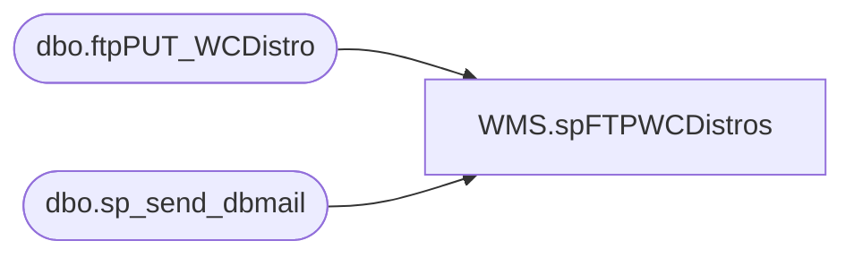

# WMS.spFTPWCDistros

**Database:** IntegrationStaging  
**Server:** STL-SSIS-P-01  

## Architecture Diagram



## Table Dependencies

| Referenced Table |
|---|
| dbo.ftpPUT_WCDistro |
| dbo.sp_send_dbmail |

## Stored Procedure Code

```sql
CREATE proc WMS.spFTPWCDistros

as

-- =====================================================================================================
-- Name: WMS.spFTPWCDistros
--
-- Description:	Checks for existence of WC Distro file, uploads to WC FTP server, moves file to Done folder
--				 
-- Revision History
--		Name:			Date:			Comments:
--		Dan Tweedie		2020-09-17		Created proc.	
-- =====================================================================================================

	
set nocount on

--DELETE PREVIOUS LOG FILES
IF (Object_ID('tempdb..#DEL') IS NOT NULL) DROP TABLE #DEL
create table #DEL(output varchar(1000))
insert #DEL exec master..xp_cmdshell 'dir \\kermode\FileRepository\MERCHANDISING\WC_Distro\FTP\WinSCP\Logs\Outbound\DistroUpload.log /B'
insert #DEL exec master..xp_cmdshell 'dir \\kermode\FileRepository\MERCHANDISING\WC_Distro\FTP\WinSCP\Logs\Outbound\ftpPUT_WCDistroLog.txt /B'
delete from #DEL where output is null or output = 'File Not Found'

IF (select count(*) from #DEL where output = 'DistroUpload.log') > 0
	begin
		exec master..xp_cmdshell 'del \\kermode\FileRepository\MERCHANDISING\WC_Distro\FTP\WinSCP\Logs\Outbound\DistroUpload.log'
	end
IF (select count(*) from #DEL where output = 'ftpPUT_WCDistroLog.txt') > 0
	begin
		exec master..xp_cmdshell 'del \\kermode\FileRepository\MERCHANDISING\WC_Distro\FTP\WinSCP\Logs\Outbound\ftpPUT_WCDistroLog.txt'
	end


--CHECK FOR FILES TO UPLOAD
-------------do a DIR command and store the results in a temp table
IF (Object_ID('tempdb..#DIR') IS NOT NULL) DROP TABLE #DIR
create table #DIR (output varchar(1000))
insert #DIR exec master..xp_cmdshell 'dir \\kermode\FileRepository\MERCHANDISING\WC_Distro\OUTBOUND\*.txt /B'
delete from #DIR where output is null or output = 'File Not Found'

------------query temp table to see if there are CSV files
if (select count(*) from #DIR) > 0

BEGIN
			-----ftp upload
					declare 
							@winSCP varchar(1000),
							@ini varchar(1000),
							@script varchar(1000),
							@log varchar(1000),
							@FTP varchar(4000),
							@Log_query varchar(1000),
							@Log_filename varchar(100),
							@Log_file_location varchar(100),
							@Log_bcp varchar(1000),
							@body varchar(4000)
							
					select 
							@winSCP = '"\\stl-ssis-p-01\C$\Program Files (x86)\WinSCP\winscp.com"',
							--@ini = ' /ini=\\kermode\FileRepository\MERCHANDISING\WC_Distro\FTP\WinSCP\WINSCP.ini',
							@script = ' /script=\\kermode\FileRepository\MERCHANDISING\WC_Distro\FTP\WinSCP\Scripts\Distros\DistroUpload.txt',
							@log = ' /log=\\kermode\FileRepository\MERCHANDISING\WC_Distro\FTP\WinSCP\Logs\Outbound\DistroUpload.log',
							@FTP = concat(@winSCP, /*@ini,*/ @script, @log)

					--create temp tables for ftp logs
					IF (Object_ID('me_01..ftpPUT_WCDistro') IS NOT NULL) DROP TABLE ftpPUT_WCDistro
					create table ftpPUT_WCDistro
					(ftpLog varchar(4000))

					--execute sql/ftp
					----connect to ftp server, if connection unsuccessful, send email
							insert ftpPUT_WCDistro exec master..xp_cmdshell @FTP
							if (select count(*) from ftpPUT_WCDistro where ftplog like 'DISTRIBUTION%.txt%100[%]') < 1
								begin
									set @Log_query = 'select * from bedrockdb02.me_01.dbo.ftpPUT_WCDistro'
									set @Log_filename = 'ftpPUT_WCDistroLog.txt'
									set @Log_file_location = '\\kermode\FileRepository\MERCHANDISING\WC_Distro\FTP\WinSCP\Logs\Outbound\'
									set @Log_bcp = 'bcp "' + @Log_query + '" queryout "' + @Log_file_location + @Log_filename + '" -t, -T -c -Sbedrockdb02'

									exec master..xp_cmdshell @Log_bcp
															
									set @body =	'An attempt to FTP a WC Distro to DDC failed.' 
												+ char(10) + char(13) + 
												'See the attached logs for details.'
												+ char(10) + char(13) + 
												+ char(10) + char(13) + 
												'This process is managed by bedrockdb02.me_01.dbo.spMerchandisingFtpWCDistroWinSCP'
							
									EXEC bedrockdb02.msdb.dbo.sp_send_dbmail
									@profile_name = 'MerchAdmin',
									@recipients = 'merchadmin@buildabear.com',
									@subject = 'FTP Failure: WC Distro File Upload from BAB to DDC',
									@body = @body,
									@file_attachments = '\\kermode\FileRepository\MERCHANDISING\WC_Distro\FTP\WinSCP\Logs\Outbound\ftpPUT_WCDistroLog.txt;\\kermode\FileRepository\MERCHANDISING\WC_Distro\FTP\WinSCP\Logs\Outbound\DistroUpload.log',
									@importance = 'HIGH'
								end
							else
								begin
									EXEC master..xp_cmdshell 'move \\kermode\FileRepository\MERCHANDISING\WC_Distro\OUTBOUND\* \\kermode\FileRepository\MERCHANDISING\WC_Distro\OUTBOUND\done'
								end

END
```

