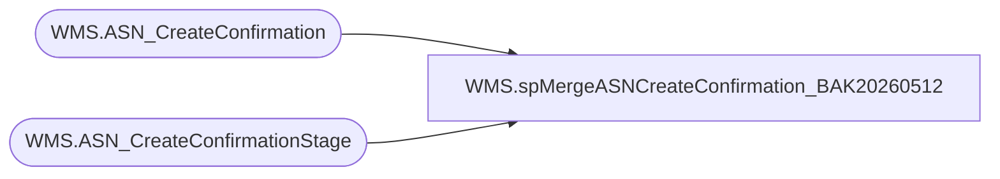

# WMS.spMergeASNCreateConfirmation_BAK20260512

**Database:** IntegrationStaging  
**Server:** STL-SSIS-P-01  

## Architecture Diagram



## Table Dependencies

| Referenced Table |
|---|
| WMS.ASN_CreateConfirmation |
| WMS.ASN_CreateConfirmationStage |

## Stored Procedure Code

```sql
CREATE proc [WMS].[spMergeASNCreateConfirmation_BAK20260512]

as
----================================================================================================================================================
--	Tim Callahan	2020-09-25	Created proc to merge messages from Azure Service Bus 
--================================================================================================================================================

set nocount on 


merge into [WMS].[ASN_CreateConfirmation] as target

using  [WMS].[ASN_CreateConfirmationStage] as source 

on (
		target.messageId=source.MessageId
		and 
		target.[_upstream.EnqueuedTimeUTC]=source.[_upstream.EnqueuedTimeUTC]

)

-- Not sure if an update is necessary due to likely unique message ID 
--when matched  and 
--	(
--	target.[Message]<>source.[Message]
--	)

--then 
--	update 
--		set 

when  not matched by target 
then insert 
	(
	AsnShipmentNumber,
	messageId ,
	hasErrors,
	[Message],
	errorMessage,
	[_upstream.EnqueuedTimeUTC],
	EnqueuedTimeCST,
	InsertDate

	)
values 
	(
	SUBSTRING(source.messageId, 0,CHARINDEX('{',messageId,0)),
	source.messageId, 
	source.hasErrors,
	source.Message,
	source.errorMessage,
	source.[_upstream.EnqueuedTimeUTC],
	convert(datetime, cast (source.[_upstream.EnqueuedTimeUTC ] as datetime) At time Zone  'UTC' AT Time Zone  'Central Standard Time') , --as QueueDateTimeCST_DropUTC_Offset -- UTC Offset for Eastern time added but converted to remove from view
	getdate()
	)
;
```

