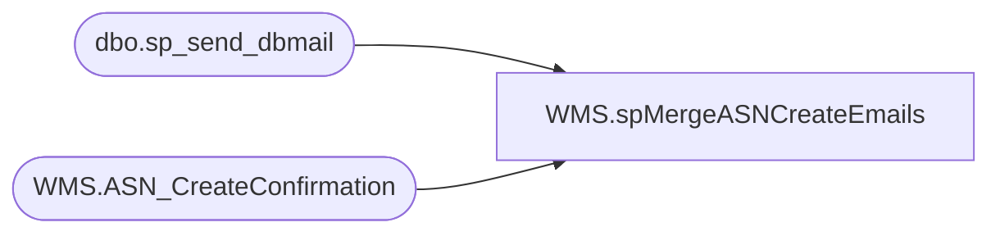

# WMS.spMergeASNCreateEmails

**Database:** IntegrationStaging  
**Server:** STL-SSIS-P-01  

## Architecture Diagram



## Table Dependencies

| Referenced Table |
|---|
| dbo.sp_send_dbmail |
| WMS.ASN_CreateConfirmation |

## Stored Procedure Code

```sql
CREATE proc [WMS].[spMergeASNCreateEmails]

as
----================================================================================================================================================
-- Matthew Lewis	2026-05-12 Creation of SP to send emails for ASN numbers
-- Matthew Lewis	2026-06-02 Changed time window from 31 to 30 minutes
--================================================================================================================================================
declare @html nvarchar(max),
		@head nvarchar(max),
		@ASNHTML nvarchar(max),
		@Subject varchar(max)
declare @ASNsForEmail TABLE(AsnShipmentNumber XML, [Message] XML, hasErrors varchar(20), errorMessage XML, exportDT varchar(30))


----------------------------------------------------------------------------------------
--   Get my initial dataset 
----------------------------------------------------------------------------------------
insert into @ASNsForEmail
	select 	AsnShipmentNumber, message, CASE WHEN hasErrors > 0 THEN 'Yes' ELSE 'No' END, 
	 errorMessage, CONVERT(VARCHAR, [_upstream.EnqueuedTimeUTC])
	 FROM WMS.ASN_CreateConfirmation with(nolock)
	 -- here we set out window for how far back we grab data 
	 where InsertDate > DATEADD(minute, -30, GETDATE())
	 order by InsertDate desc


----------------------------------------------------------------------------------------
--   Check if there's anything to send
----------------------------------------------------------------------------------------
	if (select count(AsnShipmentNumber) from @ASNsForEmail) > 0

	BEGIN
----------------------------------------------------------------------------------------
--   Setting the Subject, the opening tags for the full html, and the heading
----------------------------------------------------------------------------------------
		set @Subject = 'ASN Export Summary - FDE to Dynamics'  

		set @html = '<html><style>h3{margin-bottom:0px; font-family:Calibri;}div{margin-left:50px; font-family:Calibri;}</style>'
		--set @html = ''
		set @head = '<div style="margin:20px 0 15px 5px; font-weight:bold; font-size:16px;">ASN report for ' +  CONVERT(VARCHAR, GETDATE())   + '</div>'
		--set @head = '';

		set @ASNHTML = '<div style="margin-left:5px; margin-bottom:10px;"><div style="font-size:13pt; font-weight:bold;">New ASNs since last run time</div></div>' +
		   '<table cellpadding="0" cellspacing="0" border="1" style="border-collapse:collapse; font-family:Calibri, Arial, sans-serif; font-size:11pt; margin-left:5px;">' +
			' <tr style="background-color:#4b6c9e; color:#ffffff; font-weight:bold;">' +
			'<td align="center" style="padding:5px;">ASN Shipment #</td>' +    -- Manually type headers
			'<td align="center" style="padding:5px;">Message ID</td>' +    -- Manually type headers
			'<td align="center" style="padding:5px;">Has Errors</td>' +    -- Manually type headers
			'<td align="center" style="padding:5px;">Message</td>' +	   -- Manually type headers
			'<td align="center" style="padding:5px;">Export Date and Time</td>' +
			'</tr>'-- Manually type headers
----------------------------------------------------------------------------------------
--   Assembling the body HTML
----------------------------------------------------------------------------------------
		declare @body varchar(max)
		select @body =
		(
			select  td = AsnShipmentNumber
			, td = [Message] 
			, td =  hasErrors
			, td = errorMessage    
			, td = exportDT -- Here we put the column names
	
			FROM  @ASNsForEmail
			for XML raw('tr'), elements
		)

		set @body = REPLACE(@body, '<td>', '<td align=center><font face="calibri">')
		set @body = REPLACE(@body, '</td>', '</font></td>')
		set @body = REPLACE(@body, '_x0020_', space(1))
		set @body = REPLACE(@body, '_x003D_', '=')
		set @body = REPLACE(@body, '<tr><TRRow>0</TRRow>', '<tr bgcolor=#F8F8FD>')
		set @body = REPLACE(@body, '<tr><TRRow>1</TRRow>', '<tr bgcolor=#EEEEF4>')
		set @body = REPLACE(@body, '<TRRow>0</TRRow>', '')

		SET @ASNHTML =  @ASNHTML + @body + '</table></div><BR>'
		set @html = @html + @head + ISNULL(@ASNHTML,'') + '
<br>
   <font face =arial size = 1><B>This report was run from stl-ssis-p-01.IntegrationStaging. WMS.[spMergeASNCreateEmails vis SSIS WMS.ASN_CreateConfirmation</B></font>
   <br>
   <br>
  <font face =arial size = 1><i>The information in this message may be privileged, “confidential” and protected from disclosure and/or intended only for the addressee(s) named above.  If the reader of this message is not the intended recipient, or an employee or agent responsible for delivering this message to the intended recipient, you are hereby notified that any dissemination, distribution or copying of the communication is strictly prohibited.  If you have received this communication in error, please notify us immediately by replying to the message and deleting it from your computer.  Thank you beary much.</i></font>
 '
		set @html = '<div style="color:Black; font-size:11pt; font-family:Calibri;">' + @html + '</div>'
----------------------------------------------------------------------------------------
--   Send email
----------------------------------------------------------------------------------------
			exec msdb.dbo.sp_send_dbmail
				@profile_name = 'biadmin',
				@recipients = 'SantiagoB@buildabear.com;DorisM@buildabear.com',
				@copy_recipients = 'EntSysSupport@buildabear.com; matthewl@buildabear.com',
				@body = @html,
				@subject = @Subject,
				@body_format = 'HTML'
END
```

