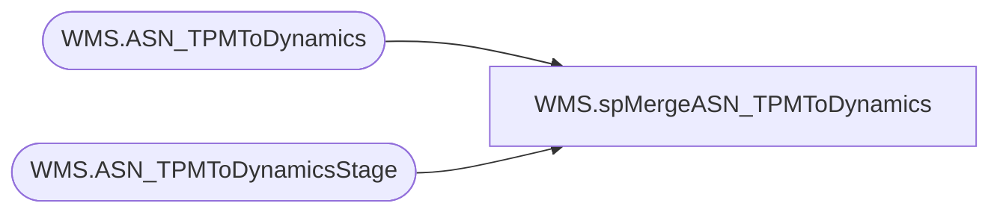

# WMS.spMergeASN_TPMToDynamics

**Database:** IntegrationStaging  
**Server:** STL-SSIS-P-01  

## Architecture Diagram



## Table Dependencies

| Referenced Table |
|---|
| WMS.ASN_TPMToDynamics |
| WMS.ASN_TPMToDynamicsStage |

## Stored Procedure Code

```sql
CREATE proc [WMS].[spMergeASN_TPMToDynamics]

as 

-------------------------------------------------------------------------------------------------------
-- Kelly Farrar		2019-07-09	Created Proc for merging ASN Data from TPM
--	Tim Callahan	2023-12-08	Backed Up and Updated Proc	Added Condition to Update\When Matched - We only want to perform updates if we haven't sent the ASN to Dynamics yet
--								This is related to ad hoc requests from Santiago Beltran to backend modify the Po Line Number because of conflicts between TPM and Dynamics 
-------------------------------------------------------------------------------------------------------

set nocount on

merge into [WMS].[ASN_TPMToDynamics] as target
using [WMS].[ASN_TPMToDynamicsStage] as source 
on 
	(
		target.[lpn]=source.[lpn]
		
	)
When Matched and
	(
		(	
		isnull(target.[shipment],'x')<>isnull(source.[shipment],'x')
		OR
		isnull(target.[ItemId],'x')<>isnull(source.[ItemId],'x')
		OR
		isnull(target.[PO_nbr],'x')<>isnull(source.[PO_nbr],'x')
		OR
		isnull(target.[Po_Shipment_Line_nbr],'x')<>isnull(source.[Po_Shipment_Line_nbr],'x')
		OR
		isnull(target.[Qty],'x')<>isnull(source.[Qty],'x')
		OR
		isnull(target.Unit,'x')<>isnull(source.Unit,'x')
		or
		isnull(target.Vehicle,'x')<>isnull(source.Vehicle,'x')
		)
		and 
		target.SentTo365 is null -- Added 2023-12-08
	)
Then Update
	set 
		target.[shipment]=source.[shipment],
		target.[ItemId]=source.[ItemId],
		target.[PO_nbr]=source.[PO_nbr],
		target.[Po_Shipment_Line_nbr]=source.[Po_Shipment_Line_nbr],
		target.[Qty]=source.[Qty],
		target.Unit=source.Unit,
		target.Vehicle=source.Vehicle,
		--target.SentTo365=NULL,
		target.UpdateDate=getdate()
When Not Matched by target
Then Insert
	(
		[shipment],
		[lpn],
		[itemId],
		[PO_nbr],
		[Po_Shipment_Line_nbr],
		[Qty],
		Unit,
		Vehicle,
		[InsertDate]
	)
Values
	(
		
		source.[shipment],
		source.[lpn],
		source.[itemId],
		source.[PO_nbr],
		source.[Po_Shipment_Line_nbr],
		source.[Qty],
		source.Unit,
		source.Vehicle,
		getdate()
	)
;
```

