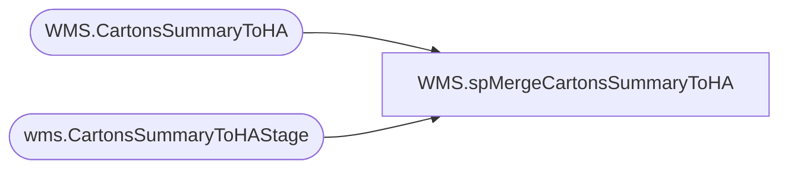

# WMS.spMergeCartonsSummaryToHA

**Database:** IntegrationStaging  
**Server:** STL-SSIS-P-01  

## Architecture Diagram



## Table Dependencies

| Referenced Table |
|---|
| WMS.CartonsSummaryToHA |
| wms.CartonsSummaryToHAStage |

## Stored Procedure Code

```sql
CREATE proc [WMS].[spMergeCartonsSummaryToHA]

as 

-------------------------------------------------------------------------------------------------------
-- Kelly Farrar	2019-07-09	Created Proc for merging Carton Summary To HA data
-------------------------------------------------------------------------------------------------------


set nocount on

merge into [IntegrationStaging].[WMS].[CartonsSummaryToHA] as target
using 
	(
		select
			shipmentId,	
			deliveryName,	
			street,	
			city,	
			state,	
			zip,	
			country,
			shipCarrier,	
			modeOfDelivery,	
			waveId,	
			containerId,	
			grossWeight,	
			length,	
			width,	
			height,	
			shipTo,	
			warehouse,	
			description,	
			deliveryDescription,	
			totalQuantityContainer,	
			itemNumber,	
			sum(cast(totalQuantity as int)) as totalQuantity,
			OrderNumber,
			CustomerAccount,
			case 
				when AptosDistroNumber = '' 
				then NULL 
				else AptosDistroNumber 
			end as AptosDistroNumber,
			MessageDateUTC
		from wms.CartonsSummaryToHAStage
		where MessageDateUTC > '2020-01-20 19:12:31.000'-- temporary for testing new json, don't want the old data
		and floor(totalQuantity) = ceiling(totalQuantity) --verifies whole number\integer **Added 10/13/2020
		group by 
			shipmentId,	
			deliveryName,	
			street,	
			city,	
			state,	
			zip,	
			country,
			shipCarrier,	
			modeOfDelivery,	
			waveId,	
			containerId,	
			grossWeight,	
			length,	
			width,	
			height,	
			shipTo,	
			warehouse,	
			description,	
			deliveryDescription,	
			totalQuantityContainer,	
			itemNumber,	
			OrderNumber,
			CustomerAccount,
			case 
				when AptosDistroNumber = '' 
				then NULL 
				else AptosDistroNumber 
			end,
			MessageDateUTC
	) as source
on 
	(
		target.[shipmentId]=source.[shipmentId]
		and
		target.[waveId]=source.[waveId]
		and
		target.[containerId]=source.[containerId]
		and 
		target.[itemNumber]=source.[itemNumber]
		and 
		isnull(target.[AptosDistroNumber],'x')=isnull(source.[AptosDistroNumber],'x')
	)
When Matched and
	(
	
		isnull(target.[deliveryName],'x')<>isnull(source.[deliveryName],'x')
		OR
		isnull(target.[street],'x')<>isnull(source.[street],'x')
		OR
		isnull(target.[city],'x')<>isnull(source.[city],'x')
		OR
		isnull(target.[state],'x')<>isnull(source.[state],'x')
		OR
		isnull(target.[zip],'x')<>isnull(source.[zip],'x')
		OR
		isnull(target.[country],'x')<>isnull(source.[country],'x')
		OR
		isnull(target.[shipCarrier],'x')<>isnull(source.[shipCarrier],'x')
		OR
		isnull(target.[modeOfDelivery],'x')<>isnull(source.[modeOfDelivery],'x')
		OR
		isnull(target.[grossWeight],'0')<>isnull(source.[grossWeight],'0')
		OR
		isnull(target.[length],'0')<>isnull(source.[length],'0')
		OR
		isnull(target.[width],'0')<>isnull(source.[width],'0')
		OR
		isnull(target.[height],'0')<>isnull(source.[height],'0')
		OR
		isnull(target.[totalQuantityContainer],'0')<>isnull(source.[totalQuantityContainer],'0')
		OR
		isnull(target.[totalQuantity],'0')<>isnull(source.[totalQuantity],'0')
		OR
		isnull(target.[shipTo],'x')<>isnull(source.[shipTo],'x')
		OR
		isnull(target.[warehouse],'x')<>isnull(source.[warehouse],'x')
		OR
		isnull(target.[description],'x')<>isnull(source.[description],'x')
		OR
		isnull(target.[deliveryDescription] ,'x')<>isnull(source.[deliveryDescription],'x')
		OR
		isnull(target.OrderNumber,'x')<>isnull(source.OrderNumber,'x') 
		OR
		isnull(target.CustomerAccount,'x')<>isnull(source.CustomerAccount,'x')
		or
		isnull(target.MessageDateUTC, '3030-12-31')<>isnull(source.MessageDateUTC,'3030-12-31')
		
	)
Then Update
	set 
		target.[deliveryName]=source.[deliveryName],
		target.[street]=source.[street],
		target.[city]=source.[city],
		target.[state]=source.[state],
		target.[zip]=source.[zip],
		target.[country]=source.[country],
		target.[shipCarrier]=source.[shipCarrier],
		target.[modeOfDelivery]=source.[modeOfDelivery],
		target.[grossWeight]=source.[grossWeight],
		target.[length]=source.[length],
		target.[width]=source.[width],
		target.[height]=source.[height],
		target.[totalQuantityContainer]=source.[totalQuantityContainer],
		target.[totalQuantity]=source.[totalQuantity],
		target.[shipTo]=source.[shipTo],
		target.[warehouse]=source.[warehouse],
		target.[description]=source.[description],
		target.[deliveryDescription]=source.[deliveryDescription],
		target.OrderNumber=source.OrderNumber,
		target.CustomerAccount=source.CustomerAccount,
		target.MessageDateUTC=source.MessageDateUTC,
		target.UpdateDate=getdate()

When Not Matched by target
Then Insert
	(
	[shipmentId],
	OrderNumber,
	CustomerAccount,
    [deliveryName],
    [street],
    [city],
    [state],
    [zip],
    [country],
    [shipCarrier],
    [modeOfDelivery],
    [waveId],
    [containerId],
    [grossWeight],
    [length],
    [width],
    [height],
    [totalQuantityContainer],
    [shipTo],
    [warehouse],
    [itemNumber],
    [description],
	[deliveryDescription],
    [totalQuantity],
	AptosDistroNumber,
	MessageDateUTC,
	[InsertDate]
)
Values
	(
		
		source.[shipmentId],
		source.OrderNumber,
		source.CustomerAccount,
		source.[deliveryName],
		source.[street],
		source.[city],
		source.[state],
		source.[zip],
		source.[country],
		source.[shipCarrier],
		source.[modeOfDelivery],
		source.[waveId],
		source.[containerId],
		source.[grossWeight],
		source.[length],
		source.[width],
		source.[height],
		source.[totalQuantityContainer],
		source.[shipTo],
		source.[warehouse],
		source.[itemNumber],
		source.[description],
		source.[deliveryDescription],
		source.[totalQuantity],
		source.AptosDistroNumber,
		source.MessageDateUTC,
		getdate()
	)
;
```

