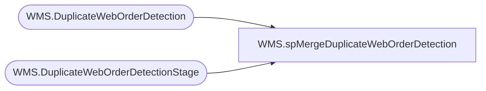

# WMS.spMergeDuplicateWebOrderDetection

**Database:** IntegrationStaging  
**Server:** STL-SSIS-P-01  

## Architecture Diagram



## Table Dependencies

| Referenced Table |
|---|
| WMS.DuplicateWebOrderDetection |
| WMS.DuplicateWebOrderDetectionStage |

## Stored Procedure Code

```sql
CREATE proc [WMS].[spMergeDuplicateWebOrderDetection] -- Update to Proper Name 

as 

-------------------------------------------------------------------------------------------------------
--	Tim Callahan	-	2021-11-16	-	Created proc - 
-------------------------------------------------------------------------------------------------------

set nocount on

merge into WMS.[DuplicateWebOrderDetection] as target
using WMS.[DuplicateWebOrderDetectionStage] as source -- Use Entire Table as Source 

on 
	(
		target.[WebOrderNumber]=source.[WebOrderNumber] -- Key 
		and
		target.[SalesOrderNumber]=source.[SalesOrderNumber]
	)
 
When Not Matched by target
Then Insert
	(
		-- Fields to be inserted 
    [WebOrderNumber],
    [SalesOrderNumber], 
	[InsertDate]
         
	)
Values
	(
           source.[WebOrderNumber],
		   source.[SalesOrderNumber],
           getdate()

	)
When not matched by source 
then delete 
;
```

