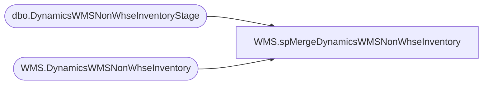

# WMS.spMergeDynamicsWMSNonWhseInventory

**Database:** IntegrationStaging  
**Server:** STL-SSIS-P-01  

## Architecture Diagram



## Table Dependencies

| Referenced Table |
|---|
| dbo.DynamicsWMSNonWhseInventoryStage |
| WMS.DynamicsWMSNonWhseInventory |

## Stored Procedure Code

```sql
CREATE proc WMS.[spMergeDynamicsWMSNonWhseInventory] -- Update to Proper Name 

as 

---------------------------------------------------------------------------------------------------------
----	Tim Callahan	-	2023-08-29	-	Created proc - Merges Dynamics Inentory Data from DynamicsWMSNonWhseInventoryStage to DynamicsWMSNonWhseInventory
---------------------------------------------------------------------------------------------------------

set nocount on

merge into IntegrationStaging.WMS.DynamicsWMSNonWhseInventory as target
using	( 
			select
			s.LocationCode, 
			s.StyleCode, 
			s.SKUDescription,
			s.Qty 
			from DynamicsWMSNonWhseInventoryStage s
		) as source 
on 
	(
		-- Key 
		target.[LocationCode]=source.[LocationCode] 
			and
		target.[StyleCode]=source.[StyleCode]
	)


When Not Matched by target
Then Insert
	(
		-- Fields to be inserted 
		   [LocationCode],
		   [StyleCode],
		   [SKUDescription], 
		   [Qty], 
		   [InsertDate]
         
	)
Values
	(
           source.[LocationCode],
		   source.[StyleCode],
		   source.[SKUDescription], 
		   source.[Qty],
           getdate()

	)

When Matched and
	(		
			-- Besure to use isnull logic for compare otherwise may have unintended results 
		    isnull(target.[Qty],0)<>isnull(source.[Qty],0) 
		      
	)
Then Update
	-- Fields to be updated
	set     
		 target.[Qty]=source.[Qty],		 
		 target.[UpdateDate]=getdate()
 
 -- If we find records that exist in target but not the source, we just want to set them to zero 
 WHEN NOT MATCHED BY Source 
  THEN Update 
	set target.Qty = 0 , 
	target.[UpdateDate]=getdate()

;
```

