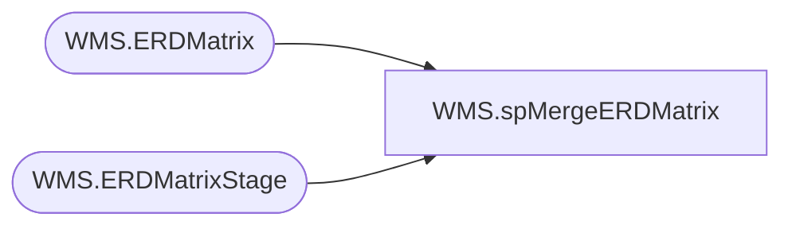

# WMS.spMergeERDMatrix

**Database:** IntegrationStaging  
**Server:** STL-SSIS-P-01  

## Architecture Diagram



## Table Dependencies

| Referenced Table |
|---|
| WMS.ERDMatrix |
| WMS.ERDMatrixStage |

## Stored Procedure Code

```sql
create proc [WMS].[spMergeERDMatrix]

as

set nocount on 

merge into WMS.ERDMatrix as target
using WMS.ERDMatrixStage as source
on 
	(
		target.location_code=source.location_code
		and 
		target.rec_type=source.rec_type
	)
when matched and
	(
		isnull(target.[days],0)<>isnull(source.[days],0)
	)
then update
	set 
		target.[days]=source.[days],
		target.UpdateDate=getdate()
when not matched by target
	then insert
		(
			location_code,
			rec_type,
			[days],
			InsertDate
		)
	values
		(
			source.location_code,
			source.rec_type,
			source.[days],
			getdate()
		)
;
```

