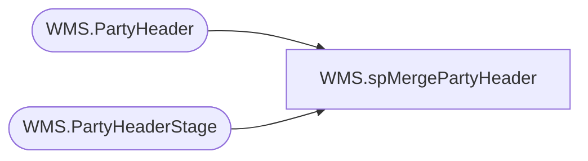

# WMS.spMergePartyHeader

**Database:** IntegrationStaging  
**Server:** STL-SSIS-P-01  

## Architecture Diagram



## Table Dependencies

| Referenced Table |
|---|
| WMS.PartyHeader |
| WMS.PartyHeaderStage |

## Stored Procedure Code

```sql
CREATE proc [WMS].[spMergePartyHeader] 

as


-- =====================================================================================================
-- Name: spMergePartyHeader
--
-- Description:	Merges from WMS.PartyHeaderStage to WMS.PartyHeader
--
--
-- Revision History
--		Name:			Date:			Comments:
--		Lizzy Timm		2024-06-11		Created proc.	
-- =====================================================================================================


set nocount on

Update WMS.PartyHeader
set SendData = 0 

Merge into WMS.PartyHeader as target
Using WMS.PartyHeaderStage as source
On (
		target.PartyID=source.PartyID
	)
When Not Matched By Target 
	Then 
		Insert (
					PartyDate,
					PartyId,
					StoreNumber,
					SubmittedBy,
					SourceFile,
					SendData,
					InsertDate
				)
		Values (	
					source.PartyDate,
					source.PartyId,
					source.StoreNumber,
					source.SubmittedBy,
					source.SourceFile,
					1,
					getdate()
				)
;
```

