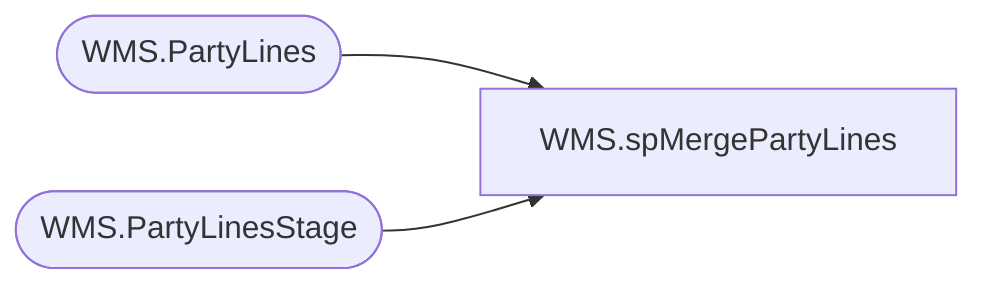

# WMS.spMergePartyLines

**Database:** IntegrationStaging  
**Server:** STL-SSIS-P-01  

## Architecture Diagram



## Table Dependencies

| Referenced Table |
|---|
| WMS.PartyLines |
| WMS.PartyLinesStage |

## Stored Procedure Code

```sql
CREATE proc [WMS].[spMergePartyLines] 

as


-- =====================================================================================================
-- Name: spMergePartyLines
--
-- Description:	Merges from WMS.PartyLinesStage to WMS.PartyLines
--
--
-- Revision History
--		Name:			Date:			Comments:
--		Lizzy Timm		2024-06-11		Created proc.	
-- =====================================================================================================


set nocount on

Update WMS.PartyLines
set SendData = 0 

Merge into WMS.PartyLines as target
Using WMS.PartyLinesStage as source
On (
		target.PartyID=source.PartyID
)
When Not Matched By Target 
	Then 
		Insert (
					ItemNumber,
					LineNumber,
					PartyId,
					Quantity,
					SendData,
					InsertDate
				)
		Values (	
					source.ItemNumber,
					source.LineNumber,
					source.PartyId,
					source.Quantity,
					1,
					getdate()
				)
;
```

