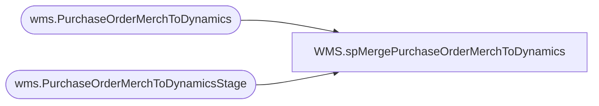

# WMS.spMergePurchaseOrderMerchToDynamics

**Database:** IntegrationStaging  
**Server:** STL-SSIS-P-01  

## Architecture Diagram



## Table Dependencies

| Referenced Table |
|---|
| wms.PurchaseOrderMerchToDynamics |
| wms.PurchaseOrderMerchToDynamicsStage |

## Stored Procedure Code

```sql
CREATE proc [WMS].[spMergePurchaseOrderMerchToDynamics]

as 
--------------------------------------------------------------------------------------------------------------------------------------
--	Dan Tweedie	2019-07-02	Created Proc - Merges PO data that is exported from Merch into a final table for integration to Dynamics
--------------------------------------------------------------------------------------------------------------------------------------

set nocount on

--set staged factory code for 'deleted lines' from aptos to have the same factory code as what was previously already captured and used to interface to dynamics

if (select count(*) from wms.PurchaseOrderMerchToDynamicsStage where FactoryCode is NULL) > 0
begin
	update s
	set 
		s.FactoryCode=po.FactoryCode,
		s.ItemNumber=po.ItemNumber
	from wms.PurchaseOrderMerchToDynamicsStage s 
	join wms.PurchaseOrderMerchToDynamics po
		on po.PONumber=s.PONumber
		and po.POLineNumber=s.POLineNumber
		and po.POMainLIne=s.POMainLine
	where s.FactoryCode is NULL
	and s.ItemNumber is NULL
	and s.Quantity=0
end


merge into WMS.PurchaseOrderMerchToDynamics as target
using WMS.PurchaseOrderMerchToDynamicsStage as source
on 
	target.PONumber=source.PONumber
	and
	target.POLineNumber=source.POLineNumber
	and
	target.POMainLine=source.POMainLine
when matched 
	and 
		(
			isnull(target.ItemNumber,'x')<>isnull(source.ItemNumber,'x')
			or
			isnull(target.Quantity,0)<>isnull(source.Quantity,0)
			or
			isnull(target.DeliveryDate,'3030-12-31')<>isnull(source.DeliveryDate,'3030-12-31')
			or
			isnull(target.VendorCode,'x')<>isnull(source.VendorCode,'x')
			or
			isnull(target.UnitCost,0)<>isnull(source.UnitCost,0)
			or
			isnull(target.FactoryCode,'x')<>isnull(source.FactoryCode,'x')
			or
			isnull(target.NetFinalPrice,0)<>isnull(source.NetFinalPrice,0)
			or
			isnull(target.CancelDate,'3030-12-31')<>isnull(source.CancelDate,'3030-12-31')
			or
			isnull(target.Warehouse,'x')<>isnull(source.Warehouse,'x')
			or 
			isnull(target.Company,'x')<>isnull(source.Company,'x')
			or
			isnull(target.StartShipDate,'3030-12-31')<>isnull(source.StartShipDate,'3030-12-31')
		)
then update
	set
		target.ItemNumber=source.ItemNumber,
		target.Quantity=source.Quantity,
		target.DeliveryDate=source.DeliveryDate,
		target.VendorCode=source.VendorCode,
		target.UnitCost=source.UnitCost,
		target.FactoryCode=source.FactoryCode,
		target.NetFinalPrice=source.NetFinalPrice,
		target.CancelDate=source.CancelDate,
		target.Warehouse=source.Warehouse,
		target.Company=source.Company,
		target.StartShipDate=source.StartShipDate,
		target.UpdateDate=getdate(),
		target.ExportedToDynamicsDate=NULL
when not matched by target
	then insert 
		(
			PONumber,
			POLineNumber,
			ItemNumber,
			Quantity,
			DeliveryDate,
			VendorCode,
			UnitCost,
			FactoryCode,
			NetFinalPrice,
			POMainLine,
			Warehouse,
			Company,
			CancelDate,
			StartShipDate,
			InsertDate
		)
	values
		(
			source.PONumber,
			source.POLineNumber,
			source.ItemNumber,
			source.Quantity,
			source.DeliveryDate,
			source.VendorCode,
			source.UnitCost,
			source.FactoryCode,
			source.NetFinalPrice,
			source.POMainLIne,
			source.Warehouse,
			source.Company,
			source.CancelDate,
			source.StartShipDate,
			getdate()
		)

;
----ensure that if one or more lines on a po are updated and going to send through the api, send all lines on the po again
--with POUpdates as
--(
--	select PONumber 
--	from WMS.PurchaseOrderMerchToDynamics with (nolock)
--	where datediff(dd, updateDate, getdate()) = 0
--	and ExportedToDynamicsDate is NULL
--	group by PONumber
--)
--update s
--set s.updateDate=getdate()
--from WMS.PurchaseOrderMerchToDynamics s
--join POUpdates p on s.PONumber=s.PONumber
--where s.updateDate is NULL
--;
```

