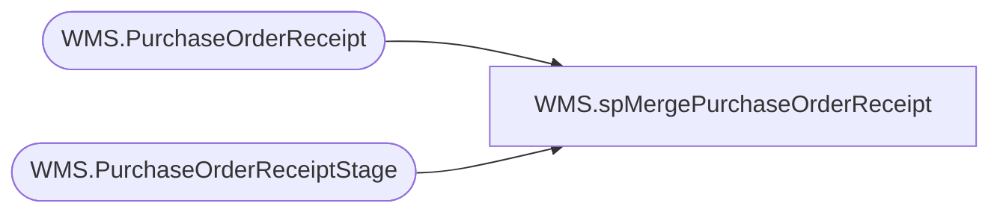

# WMS.spMergePurchaseOrderReceipt

**Database:** IntegrationStaging  
**Server:** STL-SSIS-P-01  

## Architecture Diagram



## Table Dependencies

| Referenced Table |
|---|
| WMS.PurchaseOrderReceipt |
| WMS.PurchaseOrderReceiptStage |

## Stored Procedure Code

```sql
CREATE proc [WMS].[spMergePurchaseOrderReceipt]

------------------------------------------------------------------------------------------------------------------------------------------------------------------------------
--	Dan Tweedie	2019-07-02	Created proc to merge new WMS PO Receipt messages from Azure Service Bus so we can post to Aptos / Merch system
--							Updated messages are not allowed, only new messages based on the AptosPONumber, POLineNumber, ItemID, MessageID, MessageSequence, MessageRowIndex
--							Data will be pushed to Aptos / Merch via a different process 
------------------------------------------------------------------------------------------------------------------------------------------------------------------------------

as 

set nocount on 


merge into WMS.PurchaseOrderReceipt as target 
using WMS.PurchaseOrderReceiptStage as source
	on 
		target.AptosPONumber=source.AptosPONumber
		and
		target.POLineNumber=source.POLineNumber
		and 
		target.ItemID=source.ItemID
		and 
		isnull(target.ASN,'NO ASN')=isnull(source.ASN, 'NO ASN')
		and
		target.MessageID=source.MessageID
when not matched by target
then
	insert
		(
			AptosPONumber,
			POLineNumber,
			ItemID,
			ReceivedQty,
			CanceledQty,
			Warehouse,
			ASN,
			MessageQueueDateUTC,
			MessageID,
			--MessageSequence,
			--MessageRowIndex,
			InsertDate
		)
	values
		(
			source.AptosPONumber,
			source.POLineNumber,
			source.ItemID,
			source.ReceivedQty,
			source.CanceledQty,
			source.Warehouse,
			isnull(source.ASN, 'NO ASN'),
			source.MessageQueueDateUTC,
			source.MessageID,
			--source.MessageSequence,
			--source.MessageRowIndex,
			getdate()
		)
;
```

