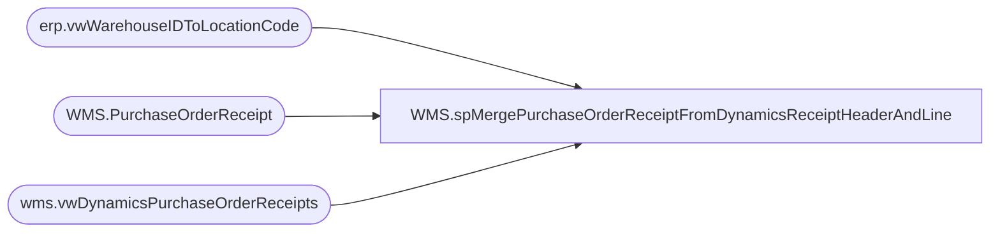

# WMS.spMergePurchaseOrderReceiptFromDynamicsReceiptHeaderAndLine

**Database:** IntegrationStaging  
**Server:** STL-SSIS-P-01  

## Architecture Diagram



## Table Dependencies

| Referenced Table |
|---|
| erp.vwWarehouseIDToLocationCode |
| WMS.PurchaseOrderReceipt |
| wms.vwDynamicsPurchaseOrderReceipts |

## Stored Procedure Code

```sql
CREATE proc [WMS].[spMergePurchaseOrderReceiptFromDynamicsReceiptHeaderAndLine]

------------------------------------------------------------------------------------------------------------------------------------------------------------------------------
--	Dan Tweedie	2019-07-02	Created proc to merge new WMS PO Receipt messages from Azure Service Bus so we can post to Aptos / Merch system
--							Updated messages are not allowed, only new messages based on the AptosPONumber, POLineNumber, ItemID, MessageID, MessageSequence, MessageRowIndex
--							Data will be pushed to Aptos / Merch via a different process 
------------------------------------------------------------------------------------------------------------------------------------------------------------------------------

as 

set nocount on 

--select *
--from WMS.PurchaseOrderReceipt
--where datediff(dd, InsertDate, getdate())=0

select 
	pr.AptosPOnumber,
	pr.AptosPOShipmentLineNumber as POLineNumber,
	pr.ItemNumber as ItemID,
	sum(pr.ReceivedPurchaseQuantity) as ReceivedQty,
	0 as CanceledQty,
	w.LocationCode as Warehouse,
	--pr.ReceivingWarehouseID as Warehouse,
	isnull(pr.ProductReceiptNumber, 'NO ASN') as ASN,
	cast(pr.ProductReceiptDate as datetime) as MessageQueueDateUTC,
	NULL as MessageID,
	NULL as MessageSequence,
	NULL as MessageRowIndex
into #tmp
from wms.vwDynamicsPurchaseOrderReceipts pr
join erp.vwWarehouseIDToLocationCode w 
	on pr.ReceivingWarehouseID=w.WarehouseID 
	and pr.Entity=w.Entity
where 1=1
and pr.ReceivingWarehouseID in ('9980','0980', '1013','0013', '2991', '8010') --should really bea 9980,1013,8010...(I think) but we're using the Aptos number and might also have the dynamics
and pr.AptosPOnumber is not null
group by 
	pr.AptosPONumber,
	pr.AptosPOShipmentLineNumber,
	pr.ItemNumber,
	w.LocationCode,
	pr.ReceivingWarehouseID,
	pr.ProductReceiptNumber,
	cast(pr.ProductReceiptDate as datetime)


merge into WMS.PurchaseOrderReceipt as target 
using #tmp as source
	on 
		target.AptosPONumber=source.AptosPONumber
		and
		target.POLineNumber=source.POLineNumber
		and 
		target.ItemID=source.ItemID
		and 
		isnull(target.ASN,'NO ASN')=isnull(source.ASN, 'NO ASN')
		
when not matched by target
then
	insert
		(
			AptosPONumber,
			POLineNumber,
			ItemID,
			ReceivedQty,
			CanceledQty,
			Warehouse,
			ASN,
			MessageQueueDateUTC,
			--MessageID,
			--MessageSequence,
			--MessageRowIndex,
			InsertDate
		)
	values
		(
			source.AptosPONumber,
			source.POLineNumber,
			source.ItemID,
			source.ReceivedQty,
			source.CanceledQty,
			source.Warehouse,
			isnull(source.ASN, 'NO ASN'),
			source.MessageQueueDateUTC,
			--source.MessageID,
			--source.MessageSequence,
			--source.MessageRowIndex,
			getdate()
		)
when matched
and 
	isnull(target.ReceivedQty,0)<>isnull(source.ReceivedQty,0)
then update
	set
		target.ReceivedQty=source.ReceivedQty
;
```

