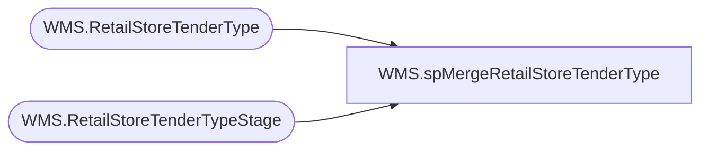

# WMS.spMergeRetailStoreTenderType

**Database:** IntegrationStaging  
**Server:** STL-SSIS-P-01  

## Architecture Diagram



## Table Dependencies

| Referenced Table |
|---|
| WMS.RetailStoreTenderType |
| WMS.RetailStoreTenderTypeStage |

## Stored Procedure Code

```sql
CREATE proc [WMS].[spMergeRetailStoreTenderType] -- Update to Proper Name 

as 

-------------------------------------------------------------------------------------------------------
--	Tim Callahan	-	2022-03-31	-	Created proc - Merges Tender Type Data from WMS.RetailStoreTenderTypeStage to WMS.RetailStoreTenderType
-------------------------------------------------------------------------------------------------------

set nocount on

merge into WMS.RetailStoreTenderType as target
using WMS.RetailStoreTenderTypeStage as source -- Use Entire Table as Source 
--using ( select * from table) as source -- Use SQL Command As Source
on 
	(
		target.[PaymentMethodNumber]=source.[PaymentMethodNumber] -- Key 
		and
		target.[dataAreaId]=source.[dataAreaId]

	)
When Matched and
	(		
			-- Besure to use isnull logic for compare otherwise may have unintended results 
		isnull(target.[AboveMinimumTenderId],'x')<>isnull(target.[AboveMinimumTenderId],'x')OR
		isnull(target.[AccountType],'x')<>isnull(target.[AccountType],'x')OR
		isnull(target.[AccountTypeGiftCardCompany],'x')<>isnull(target.[AccountTypeGiftCardCompany],'x')OR
		isnull(target.[ActiveAccount],'x')<>isnull(target.[ActiveAccount],'x')OR
		isnull(target.[AllowFloat],'x')<>isnull(target.[AllowFloat],'x')OR
		isnull(target.[AllowOvertender],'x')<>isnull(target.[AllowOvertender],'x')OR
		isnull(target.[AllowReturnNegative],'x')<>isnull(target.[AllowReturnNegative],'x')OR
		isnull(target.[AllowUndertender],'x')<>isnull(target.[AllowUndertender],'x')OR
		isnull(target.[AskForDate],'x')<>isnull(target.[AskForDate],'x')OR
		isnull(target.[BankBagAccountType],'x')<>isnull(target.[BankBagAccountType],'x')OR
		isnull(target.[BankBagLedgerDimensionDisplayValue],'x')<>isnull(target.[BankBagLedgerDimensionDisplayValue],'x')OR
		isnull(target.[ChangeLineOnReceipt],'x')<>isnull(target.[ChangeLineOnReceipt],'x')OR
		isnull(target.[ChangeTenderId],'x')<>isnull(target.[ChangeTenderId],'x')OR
		isnull(target.[CheckPayee],'x')<>isnull(target.[CheckPayee],'x')OR
		isnull(target.[CompressPaymentEntries],'x')<>isnull(target.[CompressPaymentEntries],'x')OR
		isnull(target.[ConnectorName],'x')<>isnull(target.[ConnectorName],'x')OR
		isnull(target.[CountingRequired],'x')<>isnull(target.[CountingRequired],'x')OR
		isnull(target.[DefaultDimensionDisplayValue],'x')<>isnull(target.[DefaultDimensionDisplayValue],'x')OR
		isnull(target.[DiffAccBigDiffLedgerDimensionDisplayValue],'x')<>isnull(target.[DiffAccBigDiffLedgerDimensionDisplayValue],'x')OR
		isnull(target.[DifferenceAccLedgerDimensionDisplayValue],'x')<>isnull(target.[DifferenceAccLedgerDimensionDisplayValue],'x')OR
		isnull(target.[EndorseCheck],'x')<>isnull(target.[EndorseCheck],'x')OR
		isnull(target.[EndorsmentLine1],'x')<>isnull(target.[EndorsmentLine1],'x')OR
		isnull(target.[EndorsmentLine2],'x')<>isnull(target.[EndorsmentLine2],'x')OR
		isnull(target.[FrontOfCheck],'x')<>isnull(target.[FrontOfCheck],'x')OR
		isnull(target.[Function],'x')<>isnull(target.[Function],'x')OR
		isnull(target.[GiftCardCashOutThreshold],'x')<>isnull(target.[GiftCardCashOutThreshold],'x')OR
		isnull(target.[GiftCardCompany],'x')<>isnull(target.[GiftCardCompany],'x')OR
		isnull(target.[GiftCardItemId],'x')<>isnull(target.[GiftCardItemId],'x')OR
		isnull(target.[HideCardInputDetailsInPOS],'x')<>isnull(target.[HideCardInputDetailsInPOS],'x')OR
		isnull(target.[LedgerDimensionDisplayValue],'x')<>isnull(target.[LedgerDimensionDisplayValue],'x')OR
		isnull(target.[LedgerDimensionGiftCardCompanyDisplayValue],'x')<>isnull(target.[LedgerDimensionGiftCardCompanyDisplayValue],'x')OR
		isnull(target.[LineNumInTransaction],'x')<>isnull(target.[LineNumInTransaction],'x')OR
		isnull(target.[MaxCountingDifference],'x')<>isnull(target.[MaxCountingDifference],'x')OR
		isnull(target.[MaximumAmountAllowed],'x')<>isnull(target.[MaximumAmountAllowed],'x')OR
		isnull(target.[MaximumAmountEntered],'x')<>isnull(target.[MaximumAmountEntered],'x')OR
		isnull(target.[MaximumOvertenderAmount],'x')<>isnull(target.[MaximumOvertenderAmount],'x')OR
		isnull(target.[MaxNormalDifferenceAmount],'x')<>isnull(target.[MaxNormalDifferenceAmount],'x')OR
		isnull(target.[MaxRecount],'x')<>isnull(target.[MaxRecount],'x')OR
		isnull(target.[MinimumAmountAllowed],'x')<>isnull(target.[MinimumAmountAllowed],'x')OR
		isnull(target.[MinimumAmountEntered],'x')<>isnull(target.[MinimumAmountEntered],'x')OR
		isnull(target.[MinimumChangeAmount],'x')<>isnull(target.[MinimumChangeAmount],'x')OR
		isnull(target.[MultiplyInTenderOperations],'x')<>isnull(target.[MultiplyInTenderOperations],'x')OR
		isnull(target.[Name],'x')<>isnull(target.[Name],'x')OR
		isnull(target.[OpenDrawer],'x')<>isnull(target.[OpenDrawer],'x')OR
		isnull(target.[PayAccountBill],'x')<>isnull(target.[PayAccountBill],'x')OR
		isnull(target.[PaymTermId],'x')<>isnull(target.[PaymTermId],'x')OR
		isnull(target.[PosCountEntries],'x')<>isnull(target.[PosCountEntries],'x')OR
		isnull(target.[PosOperation],'x')<>isnull(target.[PosOperation],'x')OR
		isnull(target.[RetailChannelId],'x')<>isnull(target.[RetailChannelId],'x')OR
		isnull(target.[Rounding],'x')<>isnull(target.[Rounding],'x')OR
		isnull(target.[RoundingMethod],'x')<>isnull(target.[RoundingMethod],'x')OR
		isnull(target.[SafeAccLedgerDimensionDisplayValue],'x')<>isnull(target.[SafeAccLedgerDimensionDisplayValue],'x')OR
		isnull(target.[SafeAccountType],'x')<>isnull(target.[SafeAccountType],'x')OR
		isnull(target.[SafeActiveAccount],'x')<>isnull(target.[SafeActiveAccount],'x')OR
		isnull(target.[SeekAuthorization],'x')<>isnull(target.[SeekAuthorization],'x')OR
		isnull(target.[SigCapEnabled],'x')<>isnull(target.[SigCapEnabled],'x')OR
		isnull(target.[SignatureCaptureMinAmount],'x')<>isnull(target.[SignatureCaptureMinAmount],'x')OR
		isnull(target.[SlipBackInPrinter],'x')<>isnull(target.[SlipBackInPrinter],'x')OR
		isnull(target.[SlipFrontInPrinter],'x')<>isnull(target.[SlipFrontInPrinter],'x')OR
		isnull(target.[TakenToBank],'x')<>isnull(target.[TakenToBank],'x')OR
		isnull(target.[TakenToSafe],'x')<>isnull(target.[TakenToSafe],'x')OR
		isnull(target.[TenderFlowLedgerDimensionDisplayValue],'x')<>isnull(target.[TenderFlowLedgerDimensionDisplayValue],'x')OR
		isnull(target.[UndertenderAmount],'x')<>isnull(target.[UndertenderAmount],'x')

       
	)
Then Update
	-- Fields to be updated
	set     
		target.[AboveMinimumTenderId]=source.[AboveMinimumTenderId],
		target.[AccountType]=source.[AccountType],
		target.[AccountTypeGiftCardCompany]=source.[AccountTypeGiftCardCompany],
		target.[ActiveAccount]=source.[ActiveAccount],
		target.[AllowFloat]=source.[AllowFloat],
		target.[AllowOvertender]=source.[AllowOvertender],
		target.[AllowReturnNegative]=source.[AllowReturnNegative],
		target.[AllowUndertender]=source.[AllowUndertender],
		target.[AskForDate]=source.[AskForDate],
		target.[BankBagAccountType]=source.[BankBagAccountType],
		target.[BankBagLedgerDimensionDisplayValue]=source.[BankBagLedgerDimensionDisplayValue],
		target.[ChangeLineOnReceipt]=source.[ChangeLineOnReceipt],
		target.[ChangeTenderId]=source.[ChangeTenderId],
		target.[CheckPayee]=source.[CheckPayee],
		target.[CompressPaymentEntries]=source.[CompressPaymentEntries],
		target.[ConnectorName]=source.[ConnectorName],
		target.[CountingRequired]=source.[CountingRequired],
		target.[DefaultDimensionDisplayValue]=source.[DefaultDimensionDisplayValue],
		target.[DiffAccBigDiffLedgerDimensionDisplayValue]=source.[DiffAccBigDiffLedgerDimensionDisplayValue],
		target.[DifferenceAccLedgerDimensionDisplayValue]=source.[DifferenceAccLedgerDimensionDisplayValue],
		target.[EndorseCheck]=source.[EndorseCheck],
		target.[EndorsmentLine1]=source.[EndorsmentLine1],
		target.[EndorsmentLine2]=source.[EndorsmentLine2],
		target.[FrontOfCheck]=source.[FrontOfCheck],
		target.[Function]=source.[Function],
		target.[GiftCardCashOutThreshold]=source.[GiftCardCashOutThreshold],
		target.[GiftCardCompany]=source.[GiftCardCompany],
		target.[GiftCardItemId]=source.[GiftCardItemId],
		target.[HideCardInputDetailsInPOS]=source.[HideCardInputDetailsInPOS],
		target.[LedgerDimensionDisplayValue]=source.[LedgerDimensionDisplayValue],
		target.[LedgerDimensionGiftCardCompanyDisplayValue]=source.[LedgerDimensionGiftCardCompanyDisplayValue],
		target.[LineNumInTransaction]=source.[LineNumInTransaction],
		target.[MaxCountingDifference]=source.[MaxCountingDifference],
		target.[MaximumAmountAllowed]=source.[MaximumAmountAllowed],
		target.[MaximumAmountEntered]=source.[MaximumAmountEntered],
		target.[MaximumOvertenderAmount]=source.[MaximumOvertenderAmount],
		target.[MaxNormalDifferenceAmount]=source.[MaxNormalDifferenceAmount],
		target.[MaxRecount]=source.[MaxRecount],
		target.[MinimumAmountAllowed]=source.[MinimumAmountAllowed],
		target.[MinimumAmountEntered]=source.[MinimumAmountEntered],
		target.[MinimumChangeAmount]=source.[MinimumChangeAmount],
		target.[MultiplyInTenderOperations]=source.[MultiplyInTenderOperations],
		target.[Name]=source.[Name],
		target.[OpenDrawer]=source.[OpenDrawer],
		target.[PayAccountBill]=source.[PayAccountBill],
		target.[PaymTermId]=source.[PaymTermId],
		target.[PosCountEntries]=source.[PosCountEntries],
		target.[PosOperation]=source.[PosOperation],
		target.[RetailChannelId]=source.[RetailChannelId],
		target.[Rounding]=source.[Rounding],
		target.[RoundingMethod]=source.[RoundingMethod],
		target.[SafeAccLedgerDimensionDisplayValue]=source.[SafeAccLedgerDimensionDisplayValue],
		target.[SafeAccountType]=source.[SafeAccountType],
		target.[SafeActiveAccount]=source.[SafeActiveAccount],
		target.[SeekAuthorization]=source.[SeekAuthorization],
		target.[SigCapEnabled]=source.[SigCapEnabled],
		target.[SignatureCaptureMinAmount]=source.[SignatureCaptureMinAmount],
		target.[SlipBackInPrinter]=source.[SlipBackInPrinter],
		target.[SlipFrontInPrinter]=source.[SlipFrontInPrinter],
		target.[TakenToBank]=source.[TakenToBank],
		target.[TakenToSafe]=source.[TakenToSafe],
		target.[TenderFlowLedgerDimensionDisplayValue]=source.[TenderFlowLedgerDimensionDisplayValue],
		target.[UndertenderAmount]=source.[UndertenderAmount],
		target.[UpdateDate]=getdate()
          
 
When Not Matched by target
Then Insert
			(
		AboveMinimumTenderId, 
		AccountType, 
		AccountTypeGiftCardCompany, 
		ActiveAccount, 
		AllowFloat, 
		AllowOvertender, 
		AllowReturnNegative, 
		AllowUndertender, 
		AskForDate, 
		BankBagAccountType, 
		BankBagLedgerDimensionDisplayValue, 
		ChangeLineOnReceipt, 
		ChangeTenderId, 
		CheckPayee, 
		CompressPaymentEntries, 
		ConnectorName, 
		CountingRequired, 
		dataAreaId, 
		DefaultDimensionDisplayValue, 
		DiffAccBigDiffLedgerDimensionDisplayValue, 
		DifferenceAccLedgerDimensionDisplayValue, 
		EndorseCheck, 
		EndorsmentLine1, 
		EndorsmentLine2, 
		FrontOfCheck, 
		[Function], 
		GiftCardCashOutThreshold, 
		GiftCardCompany, 
		GiftCardItemId, 
		HideCardInputDetailsInPOS, 
		LedgerDimensionDisplayValue, 
		LedgerDimensionGiftCardCompanyDisplayValue, 
		LineNumInTransaction, 
		MaxCountingDifference, 
		MaximumAmountAllowed, 
		MaximumAmountEntered, 
		MaximumOvertenderAmount, 
		MaxNormalDifferenceAmount, 
		MaxRecount, 
		MinimumAmountAllowed, 
		MinimumAmountEntered, 
		MinimumChangeAmount, 
		MultiplyInTenderOperations, 
		[Name], 
		OpenDrawer, 
		PayAccountBill, 
		PaymentMethodNumber, 
		PaymTermId, 
		PosCountEntries, 
		PosOperation, 
		RetailChannelId, 
		Rounding, 
		RoundingMethod, 
		SafeAccLedgerDimensionDisplayValue, 
		SafeAccountType, 
		SafeActiveAccount, 
		SeekAuthorization, 
		SigCapEnabled, 
		SignatureCaptureMinAmount, 
		SlipBackInPrinter, 
		SlipFrontInPrinter, 
		TakenToBank, 
		TakenToSafe, 
		TenderFlowLedgerDimensionDisplayValue, 
		UndertenderAmount,
		InsertDate
         
	)
Values
	(
		source.AboveMinimumTenderId, 
		source.AccountType, 
		source.AccountTypeGiftCardCompany, 
		source.ActiveAccount, 
		source.AllowFloat, 
		source.AllowOvertender, 
		source.AllowReturnNegative, 
		source.AllowUndertender, 
		source.AskForDate, 
		source.BankBagAccountType, 
		source.BankBagLedgerDimensionDisplayValue, 
		source.ChangeLineOnReceipt, 
		source.ChangeTenderId, 
		source.CheckPayee, 
		source.CompressPaymentEntries, 
		source.ConnectorName, 
		source.CountingRequired, 
		source.dataAreaId, 
		source.DefaultDimensionDisplayValue, 
		source.DiffAccBigDiffLedgerDimensionDisplayValue, 
		source.DifferenceAccLedgerDimensionDisplayValue, 
		source.EndorseCheck, 
		source.EndorsmentLine1, 
		source.EndorsmentLine2, 
		source.FrontOfCheck, 
		source.[Function], 
		source.GiftCardCashOutThreshold, 
		source.GiftCardCompany, 
		source.GiftCardItemId, 
		source.HideCardInputDetailsInPOS, 
		source.LedgerDimensionDisplayValue, 
		source.LedgerDimensionGiftCardCompanyDisplayValue, 
		source.LineNumInTransaction, 
		source.MaxCountingDifference, 
		source.MaximumAmountAllowed, 
		source.MaximumAmountEntered, 
		source.MaximumOvertenderAmount, 
		source.MaxNormalDifferenceAmount, 
		source.MaxRecount, 
		source.MinimumAmountAllowed, 
		source.MinimumAmountEntered, 
		source.MinimumChangeAmount, 
		source.MultiplyInTenderOperations, 
		source.[Name], 
		source.OpenDrawer, 
		source.PayAccountBill, 
		source.PaymentMethodNumber, 
		source.PaymTermId, 
		source.PosCountEntries, 
		source.PosOperation, 
		source.RetailChannelId, 
		source.Rounding, 
		source.RoundingMethod, 
		source.SafeAccLedgerDimensionDisplayValue, 
		source.SafeAccountType, 
		source.SafeActiveAccount, 
		source.SeekAuthorization, 
		source.SigCapEnabled, 
		source.SignatureCaptureMinAmount, 
		source.SlipBackInPrinter, 
		source.SlipFrontInPrinter, 
		source.TakenToBank, 
		source.TakenToSafe, 
		source.TenderFlowLedgerDimensionDisplayValue, 
		source.UndertenderAmount,
		getdate()

	)
;
```

