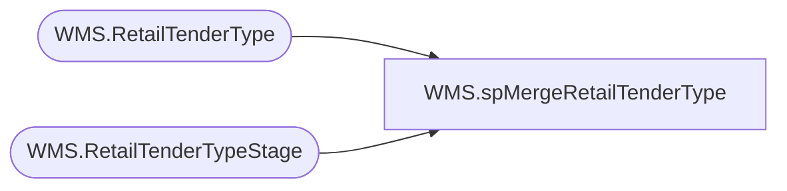

# WMS.spMergeRetailTenderType

**Database:** IntegrationStaging  
**Server:** STL-SSIS-P-01  

## Architecture Diagram



## Table Dependencies

| Referenced Table |
|---|
| WMS.RetailTenderType |
| WMS.RetailTenderTypeStage |

## Stored Procedure Code

```sql
CREATE proc [WMS].[spMergeRetailTenderType] 

as 

-------------------------------------------------------------------------------------------------------
--	Tim Callahan	-	2024-02-07	-	Created proc - Merges Tender Type Data from WMS.RetailTenderTypeStage to WMS.RetailTenderType
-------------------------------------------------------------------------------------------------------

set nocount on

merge into WMS.RetailTenderType as target
using WMS.RetailTenderTypeStage as source -- Use Entire Table as Source 
--using ( select * from table) as source -- Use SQL Command As Source
on 
(

		target.[PaymentMethodNumber]=source.[PaymentMethodNumber] -- Key 
		and
		target.[DefaultFunction]=source.[DefaultFunction]

)

When Not Matched by target
Then Insert
(
	DefaultFunction,
	Name,
	PaymentMethodNumber,
	InsertDate

)
Values
(
	source.DefaultFunction,
	source.Name,
	source.PaymentMethodNumber,
	getdate()


)
;
```

