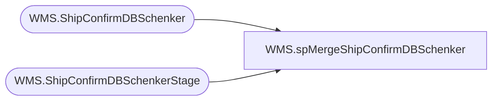

# WMS.spMergeShipConfirmDBSchenker

**Database:** IntegrationStaging  
**Server:** STL-SSIS-P-01  

## Architecture Diagram



## Table Dependencies

| Referenced Table |
|---|
| WMS.ShipConfirmDBSchenker |
| WMS.ShipConfirmDBSchenkerStage |

## Stored Procedure Code

```sql
CREATE proc [WMS].[spMergeShipConfirmDBSchenker]

as 

-------------------------------------------------------------------------------------------------------
-- Kelly Farrar	2019-07-09	Created Proc for merging Ship Confirm data for DB Schenker
-------------------------------------------------------------------------------------------------------

set nocount on

merge into [IntegrationStaging].[WMS].[ShipConfirmDBSchenker] as target
using [IntegrationStaging].[WMS].[ShipConfirmDBSchenkerStage] as source 
on 
	(
		target.[_upstream.MessageId]=source.[_upstream.MessageId]
		
	)
When Matched and
	(
	
		isnull(target.[itemId],'x')<>isnull(source.[itemId],'x')
		OR
		isnull(target.[itemName],'x')<>isnull(source.[itemName],'x')
		OR
		isnull(target.[countryOfOrigin],'x')<>isnull(source.[countryOfOrigin],'x')
		OR
		isnull(target.[harmonizedCode],'x')<>isnull(source.[harmonizedCode],'x')
		OR
		isnull(target.[quantity],'x')<>isnull(source.[quantity],'x')
		OR
		isnull(target.[unitPrice],'x')<>isnull(source.[unitPrice],'x')
		OR
		isnull(target.[netSalesPrice],'x')<>isnull(source.[netSalesPrice],'x')
		OR
		isnull(target.[loadNumber],'x')<>isnull(source.[loadNumber],'x')
		OR
		isnull(target.[warehouse],'x')<>isnull(source.[warehouse],'x')
		or
		isnull(target.ShipToCountry,'x')<>isnull(source.ShipToCountry,'x')
		
	)
Then Update
	set 
		target.[itemId]=source.[itemId],
		target.[itemName]=source.[itemName],
		target.[countryOfOrigin]=source.[countryOfOrigin],
		target.[harmonizedCode]=source.[harmonizedCode],
		target.[quantity]=source.[quantity],
		target.[unitPrice]=source.[unitPrice],
		target.[netSalesPrice]=source.[netSalesPrice],
		target.[loadNumber]=source.[loadNumber],
		target.[warehouse]=source.[warehouse],
		target.ShipToCountry=source.ShipToCountry,
		target.UpdateDate=getdate()

When Not Matched by target
Then Insert
	(
	[_RowIndex],
    [itemId],
    [itemName],
    [countryOfOrigin],
    [harmonizedCode],
    [quantity],
    [unitPrice],
    [netSalesPrice],
    [loadNumber],
    [warehouse],
	ShipToCountry,
    [_upstream.EnqueuedTimeUTC],
    [_upstream.MessageId],
	[InsertDate]


		)
Values
	(
		
		source.[_RowIndex],
		source.[itemId],
		source.[itemName],
		source.[countryOfOrigin],
		source.[harmonizedCode],
		source.[quantity],
		source.[unitPrice],
		source.[netSalesPrice],
		source.[loadNumber],
		source.[warehouse],
		source.ShipToCountry,
		source.[_upstream.EnqueuedTimeUTC],
		source.[_upstream.MessageId],
		getdate()
	)
;
```

