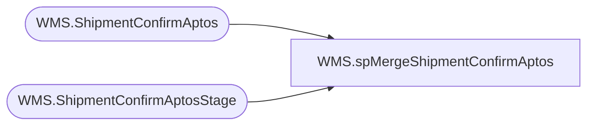

# WMS.spMergeShipmentConfirmAptos

**Database:** IntegrationStaging  
**Server:** STL-SSIS-P-01  

## Architecture Diagram



## Table Dependencies

| Referenced Table |
|---|
| WMS.ShipmentConfirmAptos |
| WMS.ShipmentConfirmAptosStage |

## Stored Procedure Code

```sql
CREATE proc [WMS].[spMergeShipmentConfirmAptos] 

as 

set nocount on

merge into WMS.ShipmentConfirmAptos as target
using WMS.ShipmentConfirmAptosStage as source
on 
	target.AptosShipmentID=source.AptosShipmentID
	and
	target.ContainerID=source.ContainerID
	and
	target.ItemNumber=source.ItemNumber
	and
	target.AptosDistributionNumber=source.AptosDistributionNumber
	and
	target.AptosDistributionDocLineNumber=source.AptosDistributionDocLineNumber
when not matched by target
then insert
	(
		AptosShipmentID,
		ModeOfDelivery,
		ShipConfirmDateTime,
		Warehouse,
		ContainerID,
		AptosDistributionNumber,
		AptosDistributionDocLineNumber,
		ContainerUnitOfMeasure,
		ContainerUnitsShipped,
		ItemNumber,
		OrderedQuantity,
		OrderedUnitOfMeasure,
		OrderNumber,
		ShippedQuantity,
		ShippedUnitOfMeasure,
		ToLocation,
		ContainerManifestID,
		InsertDate
	)
values
	(
		source.AptosShipmentID,
		source.ModeOfDelivery,
		source.ShipConfirmDateTime,
		source.Warehouse,
		source.ContainerID,
		source.AptosDistributionNumber,
		source.AptosDistributionDocLineNumber,
		source.ContainerUnitOfMeasure,
		source.ContainerUnitsShipped,
		source.ItemNumber,
		source.OrderedQuantity,
		source.OrderedUnitOfMeasure,
		source.OrderNumber,
		source.ShippedQuantity,
		source.ShippedUnitOfMeasure,
		source.ToLocation,
		source.ContainerManifestID,
		getdate()
	)
;
```

