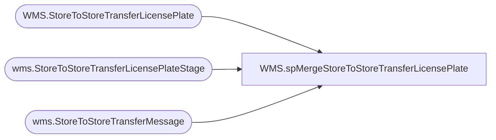

# WMS.spMergeStoreToStoreTransferLicensePlate

**Database:** IntegrationStaging  
**Server:** STL-SSIS-P-01  

## Architecture Diagram



## Table Dependencies

| Referenced Table |
|---|
| WMS.StoreToStoreTransferLicensePlate |
| wms.StoreToStoreTransferLicensePlateStage |
| wms.StoreToStoreTransferMessage |

## Stored Procedure Code

```sql
CREATE proc [WMS].[spMergeStoreToStoreTransferLicensePlate] -- Update to Proper Name 

as 

-------------------------------------------------------------------------------------------------------
--	Tim Callahan	-	2023-02-13	-	Created proc - Merges License Plate Data for Printing Labels
--	Tim Callahan	-	2023-04-18	-	Updated proc - Added Item Number and Quantity Fields per JIRA BIB-532
-------------------------------------------------------------------------------------------------------

set nocount on

merge into [WMS].[StoreToStoreTransferLicensePlate] as target
using
(
	select lps.dataAreaId as Entity, 
	lps.SourceOrderNumber as TransferOrderNumber, 
	tm.FromWarehouse, 
	tm.ToWarehouse, 
	lps.TargetLicensePlateNumber as LicensePlateNumber, 
	cast (case when dataAreaId in ('1100','1700')
		then 'Store'+right(tm.FromWarehouse,3)+'@buildabear.com'
		else 'Store'+tm.FromWarehouse+'@buildabear.com' end 
		as varchar (30))
		as EmailAddress, 
	lps.ItemNumber, 
	lps.Quantity 
	from wms.StoreToStoreTransferLicensePlateStage LPS 
	join wms.StoreToStoreTransferMessage TM on tm.TransferOrderNumber=lps.SourceOrderNumber
											and tm.Entity=lps.dataAreaId
											and tm.FromWarehouse=lps.WarehouseId
	where lps.TargetLicensePlateNumber <> ''


) as source -- Use SQL Command As Source
on 
	(
		target.Entity = source.Entity
			and
		target.TransferOrderNumber  = source.TransferOrderNumber
			and
		target.FromWarehouse = source.FromWarehouse
			and
		target.ToWarehouse = source.ToWarehouse
			and
		target.LicensePlateNumber = source.LicensePlateNumber

	)

 
When Not Matched by target
Then Insert
	(
		-- Fields to be inserted 
		Entity, 
		TransferOrderNumber, 
		FromWarehouse, 
		ToWarehouse, 
		LicensePlateNumber, 
		EmailAddress,
		InsertDate, 
		ItemNumber,
		Quantity

         
	)
Values
	(
			source.Entity, 
			source.TransferOrderNumber, 
			source.FromWarehouse, 
			source.ToWarehouse, 
			source.LicensePlateNumber, 
			source.EmailAddress,
			getdate(), 
			source.ItemNumber, 
			source.Quantity

	)
;
```

