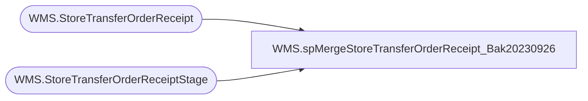

# WMS.spMergeStoreTransferOrderReceipt_Bak20230926

**Database:** IntegrationStaging  
**Server:** STL-SSIS-P-01  

## Architecture Diagram



## Table Dependencies

| Referenced Table |
|---|
| WMS.StoreTransferOrderReceipt |
| WMS.StoreTransferOrderReceiptStage |

## Stored Procedure Code

```sql
CREATE proc [WMS].[spMergeStoreTransferOrderReceipt_Bak20230926] -- Update to Proper Name 

as 

-------------------------------------------------------------------------------------------------------
--	Tim Callahan	-	2022-11-30	-	Created proc - Merges <Data Description> Data from <Staging Table> to <Destination Table>

-------------------------------------------------------------------------------------------------------

set nocount on

merge into WMS.StoreTransferOrderReceipt as target
using
	(
		select 
		InventorySiteId,
		WarehouseId, 
		DataAreaId as Entity, 
		SourceOrderNumber, 
		ContainerId,
		TargetLicensePlateNumber,
		LoadId, 
		ShipmentId, 
		WarehouseWorkId, 
		WarehouseWorkOrderType, 
		WarehouseWorkStatus
		--select *
		from WMS.StoreTransferOrderReceiptStage
		where ISNUMERIC(left(TargetLicensePlateNumber,1)) = 1 
			   
	) as source -- Use SQL Command As Source
on 
	(
		target.[InventorySiteId]=source.[InventorySiteId] -- Key 
		and
		target.[WarehouseId]=source.[WarehouseId] -- Key 
		and 
		target.[Entity] =source.[Entity]
		and 
		target.[SourceOrderNumber] = source.[SourceOrderNumber]
		and 
		target.[TargetLicensePlateNumber] = source.[TargetLicensePlateNumber]
	)
 
When Not Matched by target
Then Insert
	(
		-- Fields to be inserted 
		InventorySiteId, 
		WarehouseId, 
		Entity, 
		SourceOrderNumber, 
		ContainerId, 
		TargetLicensePlateNumber, 
		LoadId, 
		ShipmentId, 
		WarehouseWorkId, 
		WarehouseWorkOrderType, 
		WarehouseWorkStatus, 
		InsertDate
         
	)
Values
	(
		source.InventorySiteId, 
		source.WarehouseId, 
		source.Entity, 
		source.SourceOrderNumber, 
		source.ContainerId, 
		source.TargetLicensePlateNumber, 
		source.LoadId, 
		source.ShipmentId, 
		source.WarehouseWorkId, 
		source.WarehouseWorkOrderType, 
		source.WarehouseWorkStatus, 
		getdate()

	)
;
```

