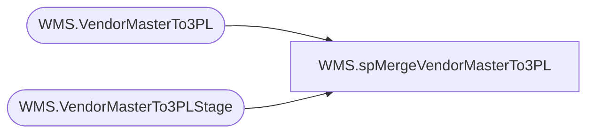

# WMS.spMergeVendorMasterTo3PL

**Database:** IntegrationStaging  
**Server:** STL-SSIS-P-01  

## Architecture Diagram



## Table Dependencies

| Referenced Table |
|---|
| WMS.VendorMasterTo3PL |
| WMS.VendorMasterTo3PLStage |

## Stored Procedure Code

```sql
create proc [WMS].[spMergeVendorMasterTo3PL]

as 

set nocount on

merge into WMS.VendorMasterTo3PL as target
using WMS.VendorMasterTo3PLStage as source
on 
	target.vendor_name=source.vendor_name
	and
	target.address_name=source.address_name
when matched and
	isnull(target.city,'x')<>isnull(source.city,'x') or
	isnull(target.port,'x')<>isnull(source.port,'x') or	
	isnull(target.address,'x')<>isnull(source.address,'x') or	
	isnull(target.province,'x')<>isnull(source.province,'x') or	
	isnull(target.country,'x')<>isnull(source.country,'x') or	
	isnull(target.phone_number,'x')<>isnull(source.phone_number,'x') 
then update
	set
		target.city=source.city,	
		target.port=source.port,	
		target.address=source.address,	
		target.province=source.province,	
		target.country=source.country,	
		target.phone_number=source.phone_number,
		target.UpdateDate=getdate()
when not matched by target
then insert
	(
		city,	
		vendor_name,	
		address_name,	
		port,	
		address,	
		province,	
		country,	
		phone_number,
		InsertDate
	)
values
	(
		source.city,	
		source.vendor_name,	
		source.address_name,	
		source.port,	
		source.address,	
		source.province,	
		source.country,	
		source.phone_number,
		getdate()
	)

;
```

