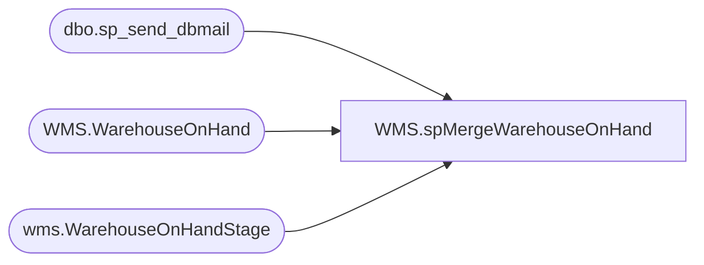

# WMS.spMergeWarehouseOnHand

**Database:** IntegrationStaging  
**Server:** STL-SSIS-P-01  

## Architecture Diagram



## Table Dependencies

| Referenced Table |
|---|
| dbo.sp_send_dbmail |
| WMS.WarehouseOnHand |
| wms.WarehouseOnHandStage |

## Stored Procedure Code

```sql
CREATE proc [WMS].[spMergeWarehouseOnHand] 

as 
--=================================================================================================
--	Dan Tweedie	2019-11-11	Created proc to merge staged inventory data captured from Dynamics WMS
--	Tim Callahan 2022-3-3	Added some temp handling to exclude duplicate lines we were getting from the the ODATA entity 
--	Tim Callahan 2022-3-7	Updated logic for duplicates and source. Maria Sharma's ES team's position was that there was no issue with ODATA and this is an integration issue to solve. 
--=================================================================================================

set nocount on

-- Added 3/3/2022
IF (Object_ID('tempdb..##dupes') IS NOT NULL) DROP TABLE ##dupes;

-- Staged CTE added 3/7/2022
with Staged as (
	select distinct * 
	from wms.WarehouseOnHandStage
) 


select
DataAreaID,
InventoryWarehouseID,
InventorySiteID,
ItemNumber
into ##Dupes
from Staged
group by
DataAreaID,
InventoryWarehouseID,
InventorySiteID,
ItemNumber
having count(*) > 1


;

merge into WMS.WarehouseOnHand as target 
--using wms.WarehouseOnHandStage as source -- Remarked out on 3/3/2022
using
(
	select distinct s.* -- Added "Distinct" on 3/7/2022
	from wms.WarehouseOnHandStage s
	where not exists (
					select d.ItemNumber
					from ##dupes d
					where d.ItemNumber=s.ItemNumber
					and d.DataAreaID=s.DataAreaID
					and d.InventoryWarehouseID=s.InventoryWarehouseID
					and d.InventorySiteID=s.InventorySiteID
					)
)
as source


on 
	(
		target.DataAreaID=source.DataAreaID
		and
		target.InventoryWarehouseID=source.InventoryWarehouseID
		and
		target.InventorySiteID=source.InventorySiteID
		and 
		target.ItemNumber=source.ItemNumber
	)
when matched 
and 
	(
		   isnull(target.AreWarehouseManagementProcessesUsed,0)<>isnull(source.AreWarehouseManagementProcessesUsed,0)
		or isnull(target.AvailableOnHandQuantity,0)<>isnull(source.AvailableOnHandQuantity,0)	
		or isnull(target.AvailableOrderedQuantity,0)<>isnull(source.AvailableOrderedQuantity,0)	
		or isnull(target.OnHandQuantity,0)<>isnull(source.OnHandQuantity,0)	
		or isnull(target.OnOrderQuantity,0)<>isnull(source.OnOrderQuantity,0)	
		or isnull(target.OrderedQuantity,0)<>isnull(source.OrderedQuantity,0)	
		or isnull(target.ProductColorId,0)<>isnull(source.ProductColorId,0)	
		or isnull(target.ProductConfigurationId,0)<>isnull(source.ProductConfigurationId,0)	
		or isnull(target.ProductName,'x')<>isnull(source.ProductName,'x')	
		or isnull(target.ProductSizeId,0)<>isnull(source.ProductSizeId,0)	
		or isnull(target.ProductStyleId,0)<>isnull(source.ProductStyleId,0)	
		or isnull(target.ReservedOnHandQuantity,0)<>isnull(source.ReservedOnHandQuantity,0)	
		or isnull(target.ReservedOrderedQuantity,0)<>isnull(source.ReservedOrderedQuantity,0)	
		or isnull(target.TotalAvailableQuantity,0)<>isnull(source.TotalAvailableQuantity,0)
	)
then update
	set
		target.AreWarehouseManagementProcessesUsed=source.AreWarehouseManagementProcessesUsed,
		target.AvailableOnHandQuantity=source.AvailableOnHandQuantity,	
		target.AvailableOrderedQuantity=source.AvailableOrderedQuantity,	
		target.OnHandQuantity=source.OnHandQuantity,	
		target.OnOrderQuantity=source.OnOrderQuantity,	
		target.OrderedQuantity=source.OrderedQuantity,	
		target.ProductColorId=source.ProductColorId,	
		target.ProductConfigurationId=source.ProductConfigurationId,	
		target.ProductName=source.ProductName,	
		target.ProductSizeId=source.ProductSizeId,	
		target.ProductStyleId=source.ProductStyleId,	
		target.ReservedOnHandQuantity=source.ReservedOnHandQuantity,	
		target.ReservedOrderedQuantity=source.ReservedOrderedQuantity,	
		target.TotalAvailableQuantity=source.TotalAvailableQuantity,
		target.UpdateDate=getdate()
when not matched by target
then insert 
	(
		AreWarehouseManagementProcessesUsed,
		AvailableOnHandQuantity,	
		AvailableOrderedQuantity,	
		dataAreaId,	
		InventorySiteId,
		InventoryWarehouseId,	
		ItemNumber,	
		OnHandQuantity,	
		OnOrderQuantity,	
		OrderedQuantity,	
		ProductColorId,	
		ProductConfigurationId,	
		ProductName,	
		ProductSizeId,	
		ProductStyleId,	
		ReservedOnHandQuantity,	
		ReservedOrderedQuantity,	
		TotalAvailableQuantity,	
		InsertDate
	)
values
	(
		source.AreWarehouseManagementProcessesUsed,
		source.AvailableOnHandQuantity,	
		source.AvailableOrderedQuantity,	
		source.dataAreaId,	
		source.InventorySiteId,
		source.InventoryWarehouseId,	
		source.ItemNumber,	
		source.OnHandQuantity,	
		source.OnOrderQuantity,	
		source.OrderedQuantity,	
		source.ProductColorId,	
		source.ProductConfigurationId,	
		source.ProductName,	
		source.ProductSizeId,	
		source.ProductStyleId,	
		source.ReservedOnHandQuantity,	
		source.ReservedOrderedQuantity,	
		source.TotalAvailableQuantity,	
		getdate()
	)
when not matched by source
then update
	set
		target.AvailableOnHandQuantity=0,	
		target.AvailableOrderedQuantity=0,	
		target.OnHandQuantity=0,	
		target.OnOrderQuantity=0,	
		target.OrderedQuantity=0,	
		target.ProductColorId=0,	
		target.ReservedOnHandQuantity=0,	
		target.ReservedOrderedQuantity=0,	
		target.TotalAvailableQuantity=0,
		target.UpdateDate=getdate()
;

-- Send Simple Email if Dupes were present and excluded 
-- Added 3/3/2022

-- 
If (select count (*) From ##Dupes) > 0 

Begin 


declare @query varchar(1000),
@date varchar(200),
@file_name1 varchar(100),
@file_location varchar(100),
@server varchar(20),
@database varchar(20),
@sqlcmd varchar(1000),
@query_text varchar(1000),
@attach varchar(1000)


set @date = convert(varchar, datepart(yyyy, getdate())) + '-' + convert(varchar, datepart(mm, getdate())) + '-' + convert(varchar, datepart(dd, getdate()))+ '-' + convert(varchar, datepart(hh, getdate()))+ '-' + convert(varchar, datepart(mi, getdate()))+ '-' + convert(varchar, datepart(ss, getdate()))
set @file_location = '\\kermode\FileRepository\MERCHANDISING\WMS\'
set @server = 'stl-ssis-p-01'
set @database = 'IntegrationStaging'
set @query = 'select * from ##Dupes '
set @file_name1 = 'ItemsExcludedWMSInventorySync.' + @date + '.csv'
set @sqlcmd = 'sqlcmd -S' + @server + ' -d' + @database + ' -Q' + '"' + @query + '"' + ' -o' + '"' + @file_location + @file_name1 + '"' + ' -s"," -w2000 -W'
exec master..xp_cmdshell @sqlcmd

set @attach = @file_location + @file_name1


exec msdb.dbo.sp_send_dbmail
@profile_name = 'BIADMIN',
@recipients = 'EntSysSupport@buildabear.com',
@copy_recipients = 'BIAdmin@buildabear.com',
@body = 'The attached CSV contains data for items excluded from WMS Inventory Sync due to duplicate entries downloaded from Dynamics',
@subject = 'Duplicate Lines Were Excluded from the WMS Inventory Sync due to duplicate entries downloaded from Dynamics. ',
@file_attachments = @attach,
@body_format = 'HTML'


END
```

