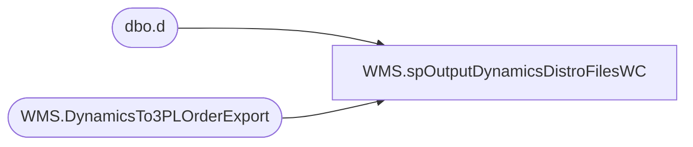

# WMS.spOutputDynamicsDistroFilesWC

**Database:** IntegrationStaging  
**Server:** STL-SSIS-P-01  

## Architecture Diagram



## Table Dependencies

| Referenced Table |
|---|
| dbo.d |
| WMS.DynamicsTo3PLOrderExport |

## Stored Procedure Code

```sql
CREATE proc [WMS].[spOutputDynamicsDistroFilesWC]

as 

set nocount on 

DECLARE @Output TABLE (OutputMessage NVARCHAR(4000));

IF (Object_ID('tempdb..##WCDistros') IS NOT NULL) DROP TABLE ##WCDistros
select *
into ##WCDistros
from WMS.DynamicsTo3PLOrderExport 
where ExportDate is null and SourceID='0960'
--where RecId = '626' -- For Testing Only

if (select count(*) from ##WCDistros) > 0 


begin

	--Generate WC File
	declare 
		@query varchar(1000),
		@date varchar(52),
		@file_name varchar(100),
		@file_location varchar(100),
		@server varchar(20),
		@bcp varchar(1000)

	select
		@query = 'set nocount on select document_number,destid,rec_type,message,style_code,quantity,convert(varchar, getdate(), 101) as ExportDate,distribution_number,ref_field_1,short_desc,vendor_style,color_code from ##WCDistros order by  document_number, style_code',
		@date = replace(replace(replace(replace(convert(varchar, getdate(), 121), ' ', ''), '-', ''), ':', ''), '.', ''),
		@file_location = '\\kermode\FileRepository\MERCHANDISING\WC_Distro\OUTBOUND\',
		--@file_location = '\\stl-ssis-p-01\IntegrationStaging\3PW\WC_Distro\OUTBOUND\', -- Aptos Decom New Path -- Remark Out Above
		@file_name = 'DISTRIBUTION_WC.' + @date + '.txt',
		@server = 'stl-ssis-p-01',
		@bcp = 'bcp "' + @query + '" queryout "' + @file_location + @file_name + '"  -T -c -S' + @server 
	
	Insert into @Output
	exec master..xp_cmdshell @bcp
	DELETE FROM @Output WHERE OutputMessage IS NULL

	DECLARE @Statement NVARCHAR(MAX)

	SELECT TOP 1 @Statement = OutputMessage FROM @Output

    IF @Statement LIKE '%Error%'
    BEGIN
      SET @Statement = 'Unexpected error in procedure: ' + @Statement
      RAISERROR(@Statement, 16, 1)
    END

end


--Set ExportDate
IF @Statement not LIKE '%Error%'
Begin 
	update d
	set d.ExportDate = getdate()
	from WMS.DynamicsTo3PLOrderExport d
	join ##WCDistros e 
		on d.RecID=e.RecID
End
```

