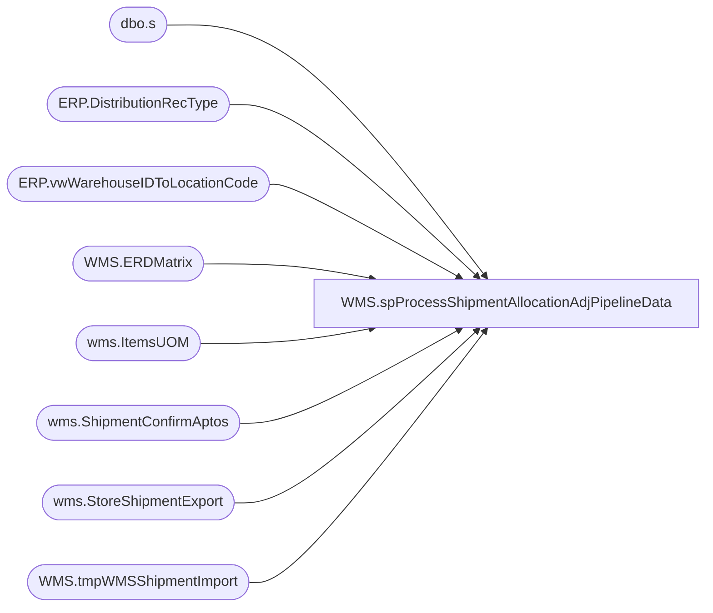

# WMS.spProcessShipmentAllocationAdjPipelineData

**Database:** IntegrationStaging  
**Server:** STL-SSIS-P-01  

## Architecture Diagram



## Table Dependencies

| Referenced Table |
|---|
| dbo.s |
| ERP.DistributionRecType |
| ERP.vwWarehouseIDToLocationCode |
| WMS.ERDMatrix |
| wms.ItemsUOM |
| wms.ShipmentConfirmAptos |
| wms.StoreShipmentExport |
| WMS.tmpWMSShipmentImport |

## Stored Procedure Code

```sql
CREATE proc [WMS].[spProcessShipmentAllocationAdjPipelineData] 
@ShipmentsFilePath nvarchar(1000),
@AllocAdjFilePath nvarchar(1000)

as

---------------------------------------------------------------------------------------------------------------------------------------------------
--	Dan Tweedie	2019-07-30 - Created proc to generate Pipeline files for Shipments and Allocation Adjustments from staged WMS Dynamics shipments
--							--modeled after bedrockdb02.me_01.dbo.spMerchandisingSelectUKStoreShipments
--				2020-10-05 - Updated to add a single line of code to filter the insert into  WMS.tmpWMSShipmentImport
--								so it now has where len(s.distribution_number) = 6;
--				2020-11-19 - fixed erd code for getting transit days (fixed join) and updated the erd logic to use the ship date instead of getdate()
--				2020-12-16 - Added default rectype = 1 when not present
--	Lizzy Timm	2025-05-12 - Modified the filter the insert into  WMS.tmpWMSShipmentImport to len(s.distribution_number) IN (6,7) to include the larger distro numbers
---------------------------------------------------------------------------------------------------------------------------------------------------
set nocount on 


if (
		select count(*) 
		from wms.ShipmentConfirmAptos s
		left join wms.ItemsUOM uom 
			on s.ItemNumber=uom.ProductNumber
			and s.ContainerUnitOfMeasure=uom.FromUnitSymbol and uom.ToUnitSymbol='ea'
			and uom.entity=1100
		where 
			s.Warehouse='9980' 
			and s.AptosShipmentID<>''
			and s.AptosDistributionNumber not in (0, '')
			and s.AptosDistributionDocLinenumber not in (0, '')
			and s.SentToPipelineDate is NULL
			and exists (select sse.AptosShipmentNumber from wms.StoreShipmentExport sse with (nolock) where s.AptosShipmentID= sse.AptosShipmentNumber)
	) > 0

	begin

		---convert qty for supplies - stage into holding table
		if (object_id('tempdb..#shipment') is not null) drop table #shipment
		select
			s.AptosShipmentID as shipment, 
			s.ToLocation as location_code, 
			convert(varchar, cast(s.ShipConfirmDatetime as date), 101) ship_date,
			s.AptosDistributionNumber as distribution_number, 
			s.AptosDistributionDocLineNumber as distribution_line,  
			right(('000000000000' + s.ItemNumber),12)  as style_code, 
			s.OrderedQuantity as req_qty,
			(isnull(uom.Factor,1) * s.ContainerUnitsShipped) as sent_qty,
			(s.OrderedQuantity - s.ShippedQuantity) as variance_qty,
			right(s.ContainerID,20) as carton_nbr
		into #shipment
		from wms.ShipmentConfirmAptos s
		left join wms.ItemsUOM uom 
			on s.ItemNumber=uom.ProductNumber
			and s.ContainerUnitOfMeasure=uom.FromUnitSymbol and uom.ToUnitSymbol='ea'
			and uom.entity=1100
		where 
			Warehouse='9980' 
			and AptosShipmentID<>''
			and AptosDistributionNumber not in (0, '')
			and AptosDistributionDocLinenumber not in (0, '')
			and SentToPipelineDate is NULL
			and exists (select sse.AptosShipmentNumber from wms.StoreShipmentExport sse with (nolock) where s.AptosShipmentID= sse.AptosShipmentNumber)

		--set exported date 
		Update s
		set s.SentToPipelineDate = getdate()
		from WMS.ShipmentConfirmAptos s
		join #shipment ss 
			on s.AptosShipmentID=ss.shipment
			and s.ToLocation=ss.location_code
			and convert(varchar, cast(ShipConfirmDatetime as date), 101)=ss.ship_date
			and s.AptosDistributionNumber=ss.distribution_number
			and s.AptosDistributionDocLineNumber=ss.distribution_line
			and right(('000000000000' + s.ItemNumber),12) =ss.style_code
			and s.ContainerID=ss.carton_nbr
		where s.SentToPipelineDate is NULL 

		--get rec_types per distro
		IF (Object_ID('tempdb..#rectype') IS NOT NULL) DROP TABLE #rectype
		select	distinct sh.distribution_number,
				min(dre.rectype) as rec_type, --- we have some modes that map to multiple rec types, but for our purposes here we just need to use this to calculate transit days, which will be same per
				sh.location_code,
				sh.carton_nbr 
		into #rectype
		from #shipment sh
		join WMS.ShipmentConfirmAptos sca on sh.Shipment=sca.AptosShipmentID
		--join ERP.DistributionRecType dre on sca.ModeOfDelivery=dre.ModeOfDelivery
		join ERP.DistributionRecType dre 
			on dre.ModeOfDelivery = case 
										when sca.ModeOfDelivery = '' 
											then '1' 
										else sca.ModeOfDelivery 
									end
		group by sh.distribution_number,sh.location_code,sh.carton_nbr

		IF (Object_ID('tempdb..#erd') IS NOT NULL) DROP TABLE #erd
		select distinct rt.*, isnull(em.days, 7) as 'days', rt1.message external_system_name
		into #erd
		from #rectype rt 
		join ERP.vwWarehouseIDToLocationCode vw on rt.location_code=vw.WarehouseID and vw.entity=1100
		--left join WMS.ERDMatrix em (nolock) 
		--	on rt.rec_type = em.rec_type 
		--	and rt.location_code = vw.WarehouseID
		left join WMS.ERDMatrix em (nolock) 
			on rt.rec_type = em.rec_type 
			and em.location_code=vw.LocationCode
		join ERP.DistributionRecType rt1 (nolock) on rt.rec_type = rt1.rectype

	
		IF (Object_ID('IntegrationStaging.WMS.tmpWMSShipmentImport') IS NOT NULL) DROP TABLE WMS.tmpWMSShipmentImport
		select 
			s.shipment,
			vw.LocationCode as location_code,
			s.ship_date,
			s.distribution_number,
			s.distribution_line,
			s.style_code,
			s.req_qty,
			s.sent_qty,
			s.variance_qty,
			s.carton_nbr,
			e.rec_type, e.external_system_name,
			--case when upper(datename(dw,getdate())) = 'MONDAY' and e.days > 4 or upper(datename(dw,getdate())) = 'TUESDAY' and e.days > 3
			--or upper(datename(dw,getdate())) = 'WEDNESDAY' and e.days > 2 or upper(datename(dw,getdate())) = 'THURSDAY' and e.days > 1
			--or upper(datename(dw,getdate())) = 'FRIDAY'
			--	then convert(varchar(10), getdate() + e.days + 2,101)
			--when upper(datename(dw,getdate())) = 'MONDAY' and e.rec_type in (55,89,1005)
			--	then convert(varchar(10), getdate() + e.days + 5,101)
			--when upper(datename(dw,getdate())) = 'TUESDAY' and e.rec_type in (55,89,1005)
			--	then convert(varchar(10), getdate() + e.days + 4,101)
			--when upper(datename(dw,getdate())) = 'WEDNESDAY' and e.rec_type in (55,89,1005)
			--	then convert(varchar(10), getdate() + e.days + 3,101)
			--when upper(datename(dw,getdate())) = 'THURSDAY' and e.rec_type in (55,89,1005)
			--	then convert(varchar(10), getdate() + e.days + 2,101)
			--when upper(datename(dw,getdate())) = 'FRIDAY' and e.rec_type in (55,89,1005)
			--	then convert(varchar(10), getdate() + e.days + 1,101)
			--else
			--	 convert(varchar, getdate() + e.days,101)
			--end as erd_date
			case when upper(datename(dw,s.ship_date)) = 'MONDAY' and e.days > 4 or upper(datename(dw,s.ship_date)) = 'TUESDAY' and e.days > 3
			or upper(datename(dw,s.ship_date)) = 'WEDNESDAY' and e.days > 2 or upper(datename(dw,s.ship_date)) = 'THURSDAY' and e.days > 1
			or upper(datename(dw,s.ship_date)) = 'FRIDAY'
				then convert(varchar(10), dateadd(dd, + e.days + 2, cast(s.ship_date as date)), 101)
			when upper(datename(dw,s.ship_date)) = 'MONDAY' and e.rec_type in (55,89,1005)
				then convert(varchar(10), dateadd(dd, + e.days + 5, cast(s.ship_date as date)), 101)
			when upper(datename(dw,s.ship_date)) = 'TUESDAY' and e.rec_type in (55,89,1005)
				then convert(varchar(10), dateadd(dd, + e.days + 4, cast(s.ship_date as date)), 101)
			when upper(datename(dw,s.ship_date)) = 'WEDNESDAY' and e.rec_type in (55,89,1005)
				then convert(varchar(10), dateadd(dd, + e.days + 3, cast(s.ship_date as date)), 101)
			when upper(datename(dw,s.ship_date)) = 'THURSDAY' and e.rec_type in (55,89,1005)
				then convert(varchar(10), dateadd(dd, + e.days + 2, cast(s.ship_date as date)), 101)
			when upper(datename(dw,s.ship_date)) = 'FRIDAY' and e.rec_type in (55,89,1005)
				then convert(varchar(10), dateadd(dd, + e.days + 1, cast(s.ship_date as date)), 101)
			else
				 convert(varchar(10), dateadd(dd, + e.days, cast(s.ship_date as date)), 101)
			end as erd_date
		into WMS.tmpWMSShipmentImport
		from #shipment s
		join #erd e on s.distribution_number = e.distribution_number and s.location_code = e.location_code 
			AND S.CARTON_NBR = E.CARTON_NBR 
		join ERP.vwWarehouseIDToLocationCode vw on s.location_code=vw.WarehouseID and vw.entity= 1100
		where len(s.distribution_number) IN (6,7)--= 6
		order by s.shipment

		----copy data into allocations adjustment staging table 
		------first, stage allocation data
		--IF (Object_ID('tempdb..#allocations') IS NOT NULL) DROP TABLE #allocations
		--select	s.style_code,
		--		l.location_code,
		--		ia.allocation_number distribution_number,
		--		sum(ia.allocated_units) allocated_units
		--into #allocations
		--from bedrockdb02.me_01.dbo.ib_allocation ia (nolock)
		--join bedrockdb02.me_01.dbo.sku sk (nolock) on ia.sku_id = sk.sku_id
		--join bedrockdb02.me_01.dbo.style s (nolock) on sk.style_id = s.style_id
		--join bedrockdb02.me_01.dbo.location l (nolock) on ia.location_id = l.location_id
		--where 1=1
		--and ia.allocation_number in (select cast(distribution_number as nvarchar) from WMS.tmpWMSShipmentImport)
		--and l.location_code in (select location_code from WMS.tmpWMSShipmentImport)
		--group by s.style_code, l.location_code, ia.allocation_number
		
		
		-----second, stage the variance qty to be subtracted from the allocated qty
		--IF (Object_ID('tempdb..#shippedStageTwo') IS NOT NULL) DROP TABLE #shippedStageTwo
		--select fi.distribution_number, fi.distribution_line, fi.style_code UPC, fi.location_code, max(fi.variance_qty) variance_qty, carton_nbr --the reason we have max(variance_qty) is because the uk whse has been known to report duplicate carton data from time to time
		--into #shippedStageTwo
		--from WMS.tmpWMSShipmentImport fi
		--group by fi.distribution_number, fi.distribution_line, fi.style_code, fi.location_code, carton_nbr

		----third, join alloacation and variance data, subtracting variance units from allocated units
		--IF (Object_ID('IntegrationStaging..tmpAllocationsAdjWMS') IS NOT NULL) DROP TABLE tmpAllocationsAdjWMS
		--select sst.distribution_number, sst.distribution_line, sst.UPC, sst.location_code, 
		--(a.allocated_units - sum((sst.variance_qty * -1))) Adj_qty 
		--into tmpAllocationsAdjWMS
		--from #shippedStageTwo sst
		----join ERP.vwWarehouseIDToLocationCode vw on sst.location_code = vw.WarehouseID and vw.Entity = 1100
		--join #allocations a on sst.distribution_number = a.distribution_number
		--	and right(sst.UPC, 6) = a.style_code
		--	and sst.location_code = a.location_code
		----where carton_nbr = '00000000000000000000' 
		--group by sst.distribution_number, sst.distribution_line, sst.UPC, sst.location_code, a.allocated_units
		
		

		---- Additional Data Refinement -- Added 6/13/2017
		---- Massage data again, if negative then make 0 as you cannot have a negative allocation
		--if (select count(*) from tmpAllocationsAdjWMS where Adj_qty < 0 ) > 0 

		--Begin
		--	IF (Object_ID('tempdb..#AllocTemp') IS NOT NULL) DROP TABLE #AllocTemp
		--	select distribution_number, 
		--			distribution_line,
		--			upc,
		--			location_code,
		--			case when Adj_qty < 0 then 0 else Adj_qty end as Adj_Qty
		--			into #AllocTemp
		--			from tmpAllocationsAdjWMS

		--	-- Now insert modified data backinto tmpAllocationsAdjWMS table from temp massage table
		--	-- This is so the Printing Stored Proc will not have to be rewritten and will pull the correct data. 

		--	IF (Object_ID('IntegrationStaging..tmpAllocationsAdjWMS') IS NOT NULL) DROP TABLE tmpAllocationsAdjWMS
		--	select *
		--	into tmpAllocationsAdjWMS
		--	from #AllocTemp

		--End 

		-- End of Code added 06/13/2017
			
		if (select count(*) from WMS.tmpWMSShipmentImport where sent_qty <> 0) > 0
		
		begin

			---generate store shipment file for pipeline
			declare @query1 varchar(1000),
			@file_location1 varchar(100),
			@file_name1 varchar(100),
			@server1 varchar(52),
			@database1 varchar(52),
			@username1 varchar(52),
			@password1 varchar(52),
			@sqlcmd varchar(1000)
			
			set @query1 = 'set nocount on exec IntegrationStaging.WMS.spOutputWMSShipment'
			set @file_location1 = @ShipmentsFilePath 
			set @file_name1 = 'NSBIMSTORESHIPMENT.WMS.' + convert(varchar, datepart(yyyy, getdate())) + convert(varchar, datepart(mm, getdate())) + convert(varchar, datepart(dd, getdate())) + convert(varchar, datepart(hh, getdate())) + convert(varchar, datepart(mi, getdate())) + convert(varchar, datepart(ss, getdate())) + '.GO'
			set @sqlcmd = 'sqlcmd -Q' + '"' + @query1 + '"' + ' -o' + '"' + @file_location1 + @file_name1 + '"' + ' -s"," -w100 -W'
			exec master..xp_cmdshell @sqlcmd

		end

	
		--if (select count(*) from tmpAllocationsAdjWMS) > 0
		
		--begin

		---- GENERATE ALLOCATIONS ADJUSTMENT RECORDS FOR PIPELINE
		--	declare @query_alloc varchar(1000),
		--			@date_alloc varchar(200),
		--			@file_name_alloc varchar(100),
		--			@file_location_alloc varchar(100),
		--			@server_alloc varchar(20),
		--			@database_alloc varchar(20),
		--			@sqlcmd_alloc varchar(1000)

		--	set @date_alloc = convert(varchar, datepart(yyyy, getdate())) + convert(varchar, datepart(mm, getdate())) + convert(varchar, datepart(dd, getdate())) + convert(varchar, datepart(hh, getdate())) + convert(varchar, datepart(mi, getdate())) + convert(varchar, datepart(ss, getdate()))
		--	set @query_alloc = 'set nocount on exec IntegrationStaging.WMS.spOutputWMSAllocAdj'
		--	set @file_location_alloc = @AllocAdjFilePath --'\\pipetestapp01\Company01\Text File to AR Import Tables - Allocation Adjustment\'
		--	set @file_name_alloc = 'NSBIMALLADJUSTMENT.WMS.' + @date_alloc + '.GO'
		--	set @sqlcmd_alloc = 'sqlcmd -S' + @server_alloc + ' -d' + @database_alloc + ' -Q' + '"' + @query_alloc + '"' + ' -o' + '"' + @file_location_alloc + @file_name_alloc + '"' + ' -w1000 -W'
		--	set @sqlcmd_alloc = 'sqlcmd -Q' + '"' + @query_alloc + '"' + ' -o' + '"' + @file_location_alloc + @file_name_alloc + '"' + ' -w1000 -W'
		--	--exec master..xp_cmdshell @sqlcmd_alloc -- NOT CURRENTLY RUNNING THE ALLOCATION ADJUSTMENT FILE...

		--end
	end
```

