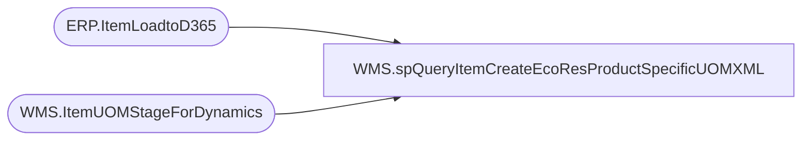

# WMS.spQueryItemCreateEcoResProductSpecificUOMXML

**Database:** IntegrationStaging  
**Server:** STL-SSIS-P-01  

## Architecture Diagram



## Table Dependencies

| Referenced Table |
|---|
| ERP.ItemLoadtoD365 |
| WMS.ItemUOMStageForDynamics |

## Stored Procedure Code

```sql
CREATE proc [WMS].[spQueryItemCreateEcoResProductSpecificUOMXML]
@Entity varchar(4),
@ItemType varchar(10)


as

---- To use during testing:
--DECLARE @ItemType varchar(10), @Entity varchar(4)
--SET @ItemType = 'Serv'
--SET @Entity = '1100'

set nocount on

select 
	cast(uom.style_code as varchar(6)) as 'PRODUCTNUMBER',
	uom.FROMUNITSYMBOL as 'FROMUNITSYMBOL',
	uom.TOUNITSYMBOL as 'TOUNITSYMBOL',
	uom.DENOMINATOR as 'DENOMINATOR',
	CAST(uom.FACTOR AS DECIMAL(10, 4)) as 'FACTOR'
  into #UOM
  from WMS.ItemUOMStageForDynamics uom with (nolock)
  where uom.style_code in (
		select e.ItemNumber
		from ERP.ItemLoadtoD365 e
		where 1=1
		and e.SendData = 1 --this is only set on insert or update
		and e.UpdateDate is null --this is only set on update, means this is the first time item is flowing
		and e.entity=1100
		group by e.ItemNumber
	) --ONLY INCLUDE UOM IF THE ITEM IS NEW
--UNION
/* 
select 
	cast(u.ProductNumber as varchar(6)) as 'PRODUCTNUMBER',
	u.fromSymbol AS 'FROMUNITSYMBOL',
	u.toSymbol AS 'TOUNITSYMBOL',
	u.DENOMINATOR,
	CAST(u.FACTOR AS DECIMAL(10, 4)) as 'FACTOR'
  from dynamics_productuom u 
  where u.ProductNumber in (
							select e.ItemNumber
							from ERP.ItemLoadtoD365 e
							where 1=1
							and e.SendData = 1 
							and e.UpdateDate is not null
							and e.entity=2300
							group by e.ItemNumber
						) 
  --and u.Entity=@Entity
*/
;
with
XMLStage (xml) as
	( --UOM - ONLY INCLUDE ON THE FIRST PASS / ITEM CREATE
		select 
			cast(uom.PRODUCTNUMBER as varchar(6)) as '@PRODUCTNUMBER',
			uom.FROMUNITSYMBOL as '@FROMUNITSYMBOL',
			uom.TOUNITSYMBOL as '@TOUNITSYMBOL',
			uom.DENOMINATOR as '@DENOMINATOR',
			uom.FACTOR as '@FACTOR',
			'0.000000' as '@INNEROFFSET',
			'1' as '@NUMERATOR',
			'0.000000' as '@OUTEROFFSET',
			'0' as '@ROUNDING'
		from #UOM uom with (nolock)
		where 1=1
		--and uom.ProductNumber in (
		--							select e.ItemNumber
		--							from ERP.ItemLoadtoD365 e
		--							where 1=1
		--							and e.SendData = 1 --this is only set on insert or update
		--							and e.UpdateDate is null --this is only set on update, means this is the first time item is flowing
		--							and e.entity=1100
		--							and e.ItemNumber=ps.ProductNumber
		--							group by e.ItemNumber
		--						) --ONLY INCLUDE UOM IF THE ITEM IS NEW
			and exists (select e.ItemNumber 
			from ERP.ItemLoadtoD365 e 
			where e.ItemNumber=uom.PRODUCTNUMBER 
			and e.ServiceItem = case when @ItemType='Serv' then 1 else 0 end)
		for xml path ('EcoResProductSpecificUnitOfMeasureConversionEntity'), root('Document'), TYPE
	)
select cast(XML as xml) as XMLData
from XMLStage
;
```

