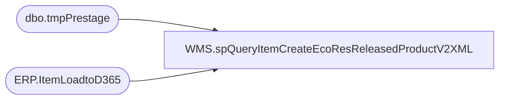

# WMS.spQueryItemCreateEcoResReleasedProductV2XML

**Database:** IntegrationStaging  
**Server:** STL-SSIS-P-01  

## Architecture Diagram



## Table Dependencies

| Referenced Table |
|---|
| dbo.tmpPrestage |
| ERP.ItemLoadtoD365 |

## Stored Procedure Code

```sql
CREATE proc [WMS].[spQueryItemCreateEcoResReleasedProductV2XML]
@Entity varchar(4),
@ItemType varchar(10)


as

---- To use during testing:
--DECLARE @ItemType varchar(10), @Entity varchar(4)
--SET @ItemType = 'Merch'
--SET @Entity = '1100'

set nocount on;

with
XMLStage (xml) as
	(
		select 
			ps2.ITEMNUMBER as '@ITEMNUMBER',
			'1' as '@ARETRANSPORTATIONMANAGEMENTPROCESSESENABLED',
			ps2.INVENTORYRESERVATIONHIERARCHYNAME as '@INVENTORYRESERVATIONHIERARCHYNAME',
			'EA' as '@INVENTORYUNITSYMBOL', --per design doc, hard-coded for all
			ps2.ITEMGROUPID as '@ITEMGROUPID',
			ps2.ITEMMODELGROUPID as '@ITEMMODELGROUPID',
			case when @Entity=3001 then '' else isnull(ps2.ORIGINCOUNTRYREGIONID,'') end as '@ORIGINCOUNTRYREGIONID',
			cast('0' as numeric(38,4)) as '@OVERDELIVERYPCT',	
			ps2.PRODUCTNUMBER as '@PRODUCTNUMBER',
			ps2.PROPERTYID as '@PROPERTYID',	
			cast('0' as numeric(38,4)) as '@PURCHASEOVERDELIVERYPERCENTAGE',
			cast(ps2.PURCHASEPRICE as numeric(38,4)) as '@PURCHASEPRICE',
			'1' as '@PURCHASEPRICEQUANTITY',
			cast(ps2.PURCHASEUNDERDELIVERYPERCENTAGE as numeric(38,4)) as '@PURCHASEUNDERDELIVERYPERCENTAGE',
			'EA' as '@PURCHASEUNITSYMBOL',	
			cast('0' as numeric(38,4)) as '@SALESOVERDELIVERYPERCENTAGE',
			cast(ps2.SALESPRICE as numeric(38,4)) as '@SALESPRICE',
			'1' as '@SALESPRICEQUANTITY',
			cast(ps2.SALESUNDERDELIVERYPERCENTAGE as numeric(38,4)) as '@SALESUNDERDELIVERYPERCENTAGE',
			'EA' as '@SALESUNITSYMBOL',
			ps2.SEARCHNAME as '@SEARCHNAME',
			ps2.STORAGEDIMENSIONGROUPNAME as '@STORAGEDIMENSIONGROUPNAME',
			ps2.TRACKINGDIMENSIONGROUPNAME as '@TRACKINGDIMENSIONGROUPNAME',
			cast(ps2.UNDERDELIVERYPCT as numeric(38,4)) as '@UNDERDELIVERYPCT',
			ps2.UNITCONVERSIONSEQUENCEGROUPID as '@UNITCONVERSIONSEQUENCEGROUPID',
			cast(ps2.UNITCOST as numeric(38,4)) as '@UNITCOST',
			'1' as '@UNITCOSTQUANTITY',
			ps2.WAREHOUSEMOBILEDEVICEDESCRIPTIONLINE2 as '@WAREHOUSEMOBILEDEVICEDESCRIPTIONLINE2',					
			case when (@ItemType='Merch' AND @Entity='1100') then 'SALESTAX' else NULL end AS '@SALESSALESTAXITEMGROUPCODE',			
			CASE WHEN @ItemType='Merch' THEN ps2.APPROVEDVENDORCHECKMETHOD ELSE NULL END as '@APPROVEDVENDORCHECKMETHOD', --LT
			ps2.COLORDESCRIPTION as '@COLORDESCRIPTION'					
			from tmpPrestage ps2 
			where 1=1
				and exists (
					select e.ItemNumber 
					from ERP.ItemLoadtoD365 e 
					where e.ItemNumber=ps2.ITEMNUMBER 
					and e.ServiceItem = case when @ItemType='Serv' then 1 else 0 end
					)
			for xml path('EcoResReleasedProductV2Entity'), root('Document'), TYPE
		)		
select cast(XML as xml) as XMLData
from XMLStage
;
```

