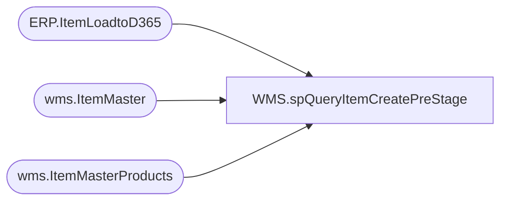

# WMS.spQueryItemCreatePreStage

**Database:** IntegrationStaging  
**Server:** STL-SSIS-P-01  

## Architecture Diagram



## Table Dependencies

| Referenced Table |
|---|
| ERP.ItemLoadtoD365 |
| wms.ItemMaster |
| wms.ItemMasterProducts |

## Stored Procedure Code

```sql
CREATE proc [WMS].[spQueryItemCreatePreStage]

@Entity varchar(4),
@ItemType varchar(10)	

AS

---- To use during testing:
--DECLARE @ItemType varchar(10), @Entity varchar(4)
--SET @ItemType = 'Serv'
--SET @Entity = '1100'

set nocount on	
select
		--=====VALUES WILL ALWAYS COME FROM MERCH=========================================================
		e.entity,
		e.ITEMNUMBER, 
		e.PRODUCTNUMBER, 
		e.PRODUCTDESCRIPTION,	
		e.PRODUCTNAME,	
		isnull(e.SEARCHNAME,'') as SEARCHNAME,
		isnull(e.HARMONIZEDSYSTEMCODE,'') as HARMONIZEDSYSTEMCODE,
		case when e.Entity=3001 then NULL else isnull(e.ORIGINCOUNTRYREGIONID,'') end as ORIGINCOUNTRYREGIONID,
		e.HierarchyGroup as PRODUCTCATEGORYNAME,
		--================================================================================================
		--=====VALUES WILL ALWAYS BE HARD-CODED===========================================================
		--'Merchandise' as PRODUCTCATEGORYNAME, 
		--'Procurement Categories' as PRODUCTCATEGORYHIERARCHYNAME, 
		'Retail Product Hierarchy' as PRODUCTCATEGORYHIERARCHYNAME,
		--case when e.ITEMMODELGROUPID='SERV' then 'Service' else 'Merch' end as 'PROPERTYID',
		case when e.ServiceItem=1 then '' else 'Merch' end as PROPERTYID, 
		'0' as OVERDELIVERYPCT, 
		e.ItemGroup as ITEMGROUPID,
		--case when e.ServiceItem=1 then 'SERV' else 'MERCH' end as ITEMGROUPID, 
		--case when e.ITEMMODELGROUPID='SERV' then 2 else 1 end as 'PRODUCTTYPE',
		case when e.ServiceItem=1 then '2' else '1' end as PRODUCTTYPE,	
		'1' as PRODUCTSUBTYPE,
		case when e.ServiceItem=1 then '0' else '100' end as PURCHASEUNDERDELIVERYPERCENTAGE ,
		case when e.ServiceItem=1 then '0' else '100' end as SALESUNDERDELIVERYPERCENTAGE, 
		case when e.ServiceItem=1 then '0' else '100' end as UNDERDELIVERYPCT,
		case when e.ServiceItem=1 then 'SWL' else 'BABWMS' end as STORAGEDIMENSIONGROUPNAME,
		e.ServiceItem
		--================================================================================================
	into #UpdatesAndHardCoded
	FROM ERP.ItemLoadtoD365 e
	where 1=1
	and e.SendData = 1
	and e.Entity = @Entity 


select 
	--=====WILL SEND DATA PRODUCT DATA DOWNLOADED FROM DYNAMICS===================
	im.entity,
	im.ProductNumber,
	im.ItemNumber,
	im.PRODUCTSEARCHNAME,		
	case 
		when im.TRACKINGDIMENSIONGROUPNAME=''
			then NULL
		else im.TRACKINGDIMENSIONGROUPNAME
	end as TRACKINGDIMENSIONGROUPNAME,	
	case
		when im.STORAGEDIMENSIONGROUPNAME=''
			then NULL
		else im.STORAGEDIMENSIONGROUPNAME
	end as STORAGEDIMENSIONGROUPNAME,
	im.UNITCOSTQUANTITY, 	
	im.UNITCOST, 	
	im.SALESUNITSYMBOL,	
	im.SALESUNDERDELIVERYPERCENTAGE,	
	im.SALESPRICEQUANTITY,	
	im.SALESPRICE,
	im.SALESOVERDELIVERYPERCENTAGE,	
	im.PURCHASEUNITSYMBOL, 
	im.PURCHASEUNDERDELIVERYPERCENTAGE,	
	im.PURCHASEPRICEQUANTITY, 
	im.PURCHASEPRICE,	
	im.PURCHASEOVERDELIVERYPERCENTAGE,	
	case 
		when im.ITEMMODELGROUPID =''
			then NULL
		else im.ITEMMODELGROUPID
	end as ITEMMODELGROUPID,	
	im.INVENTORYUNITSYMBOL,
	case
		when im.ARETRANSPORTATIONMANAGEMENTPROCESSESENABLED='yes'
			then 1
		else 0
	end as ARETRANSPORTATIONMANAGEMENTPROCESSESENABLED,
	p.NMFCCODE,
	case 
		when p.ISPRODUCTKIT='yes' 
			then 1
		else 0
	end as ISPRODUCTKIT,
	case 
		when im.UNITCONVERSIONSEQUENCEGROUPID =''
			then NULL
		else im.UNITCONVERSIONSEQUENCEGROUPID
	end as UNITCONVERSIONSEQUENCEGROUPID,
	case 
		when im.WAREHOUSEMOBILEDEVICEDESCRIPTIONLINE2 = '' 
			then NULL 
		else im.WAREHOUSEMOBILEDEVICEDESCRIPTIONLINE2
	end as WAREHOUSEMOBILEDEVICEDESCRIPTIONLINE2,
	case 
		when im.PRODUCTGROUPID=''
			then NULL
		else im.PRODUCTGROUPID
	end as PRODUCTGROUPID, 
	case 
		when im.INVENTORYRESERVATIONHIERARCHYNAME=''
			then NULL
		else im.INVENTORYRESERVATIONHIERARCHYNAME
	end as INVENTORYRESERVATIONHIERARCHYNAME
	--============================================================================
into #DynamicsData
from wms.ItemMaster im 
join wms.ItemMasterProducts p on im.ItemNumber=p.ProductNumber
where 1=1
and isnumeric(im.ItemNumber)=1
and exists (select u.ProductNumber from #UpdatesAndHardCoded u where u.ProductNumber=p.ProductNumber and u.entity=im.entity)

select  
	i.entity,
	i.ProductNumber,
	i.ProductName as 'PRODUCTNAME',
	i.ProductDescription as 'PRODUCTDESCRIPTION',
	isnull(i.SalesPrice,0) as 'SALESPRICE',
	isnull(i.PurchasePrice,0) as 'PURCHASEPRICE',
	i.ProductSearchName as 'PRODUCTSEARCHNAME',
	'1' as 'PRODUCTTYPE',
	--case when i.ITEMMODELGROUPID='SERV' then 2 else 1 end as 'PRODUCTTYPE',
	'1' as 'PRODUCTSUBTYPE',
	i.HierarchyGroup as 'PRODUCTCATEGORYNAME',
	'Retail Product Hierarchy' as 'PRODUCTCATEGORYHIERARCHYNAME',
	'FAK70' as 'NMFCCODE',
	'0' as 'ISPRODUCTKIT',
	'NEW' as 'WAREHOUSEMOBILEDEVICEDESCRIPTIONLINE2',
	'1' as 'UNITCOSTQUANTITY',
	'0' as 'UNITCOST',
	--'EAIPCS' as 'UNITCONVERSIONSEQUENCEGROUPID',
	i.UNITCONVERSIONSEQUENCEGROUPID as UNITCONVERSIONSEQUENCEGROUPID,
	case when i.ServiceItem=1 then '0' else '100' end as  'UNDERDELIVERYPCT',
	'NONE' as 'TRACKINGDIMENSIONGROUPNAME',
		--case when i.ITEMMODELGROUPID='SERV' then 'SERVICE' else 'BABWMS' end as 'STORAGEDIMENSIONGROUPNAME',
		'BABWMS' as 'STORAGEDIMENSIONGROUPNAME',
	'EA' as 'SALESUNITSYMBOL',
	case when i.ServiceItem=1 then '0' else '100' end as 'SALESUNDERDELIVERYPERCENTAGE',
	'1' as 'SALESPRICEQUANTITY',
	'0' as 'SALESOVERDELIVERYPERCENTAGE',
	'EA' as 'PURCHASEUNITSYMBOL',
	case when i.ServiceItem=1 then '0' else '100' end as 'PURCHASEUNDERDELIVERYPERCENTAGE',
	'1' as 'PURCHASEPRICEQUANTITY',
	'0' as 'PURCHASEOVERDELIVERYPERCENTAGE',
		--case when i.ITEMMODELGROUPID='SERV' then 'Service' else 'Merch' end as 'PROPERTYID',
		'Merch' as 'PROPERTYID',
	'Merch' as 'PRODUCTGROUPID',
	'0' as 'OVERDELIVERYPCT',
	i.ITEMMODELGROUPID as 'ITEMMODELGROUPID',
	i.ITEMGROUP as 'ITEMGROUPID',
	'EA' as 'INVENTORYUNITSYMBOL',
		case when i.ITEMMODELGROUPID='SERV' then '' else 'BABW' end as 'INVENTORYRESERVATIONHIERARCHYNAME', 
	'1' as 'ARETRANSPORTATIONMANAGEMENTPROCESSESENABLED',
	i.ItemNumber as 'ITEMNUMBER',			
	i.COLORDESCRIPTION,
	 CASE
		WHEN i.entity = '1700' THEN 'Warning Only'
		ELSE 'Not Allowed' 
	  END as APPROVEDVENDORCHECKMETHOD,
	--'Not Allowed' as APPROVEDVENDORCHECKMETHOD,
	i.ServiceItem
into #OriginalNewAndHardCoded
FROM ERP.ItemLoadtoD365 i
join #UpdatesAndHardCoded u 
	on i.entity=u.entity
	and i.ProductNumber=u.ProductNumber
group by 
	i.entity, 
	i.ProductNumber,
	i.ItemNumber,
	i.ProductName,
	i.ProductDescription,
	isnull(i.SalesPrice,0),
	isnull(i.PurchasePrice,0),
	i.ProductSearchName,
	--case when i.ITEMMODELGROUPID='SERV' then 2 else 1 end ,
	i.HierarchyGroup,
	i.ITEMMODELGROUPID,
	i.ITEMGROUP,
	i.UNITCONVERSIONSEQUENCEGROUPID,
	i.serviceItem,
	i.COLORDESCRIPTION


IF EXISTS (SELECT 1 FROM INFORMATION_SCHEMA.TABLES WHERE TABLE_SCHEMA = 'dbo' AND TABLE_NAME = 'tmpPrestage') DROP TABLE tmpPrestage
select  
	--UPDATES AND HARD-CODES
	u.Entity,
	u.ProductNumber as PRODUCT_NUMBER,
	u.ITEMNUMBER,	
	u.PRODUCTNUMBER,	
	u.PRODUCTDESCRIPTION,	
	u.PRODUCTNAME,	
	u.SEARCHNAME,	
	u.HARMONIZEDSYSTEMCODE,	
	u.ORIGINCOUNTRYREGIONID,	
	u.PRODUCTCATEGORYNAME,	
	u.PRODUCTCATEGORYHIERARCHYNAME,	
	u.UNDERDELIVERYPCT,	
	u.PROPERTYID,	
	u.OVERDELIVERYPCT,	
	u.ITEMGROUPID,
	u.PRODUCTTYPE,	
	u.PRODUCTSUBTYPE,	
	--IF NO DYNAMICS DATA, THEN ORIGINAL HARD-CODED
	cast(isnull(dd.PRODUCTSEARCHNAME,o.PRODUCTSEARCHNAME) as nvarchar(100)) as PRODUCTSEARCHNAME,
	cast(isnull(dd.TRACKINGDIMENSIONGROUPNAME,o.TRACKINGDIMENSIONGROUPNAME) as varchar(4)) as TRACKINGDIMENSIONGROUPNAME,	
	--cast(isnull(dd.STORAGEDIMENSIONGROUPNAME,o.STORAGEDIMENSIONGROUPNAME) as varchar(6)) as STORAGEDIMENSIONGROUPNAME,	
	u.STORAGEDIMENSIONGROUPNAME,
	isnull(dd.UNITCOSTQUANTITY,o.UNITCOSTQUANTITY) as UNITCOSTQUANTITY,	
	--isnull(dd.UNITCOST,o.UNITCOST) as UNITCOST,	
	isnull(dd.PURCHASEPRICE,o.PURCHASEPRICE) as UNITCOST,
	cast(isnull(dd.SALESUNITSYMBOL,o.SALESUNITSYMBOL) as varchar(2)) as SALESUNITSYMBOL,	
	--cast(isnull(dd.SALESUNDERDELIVERYPERCENTAGE,o.SALESUNDERDELIVERYPERCENTAGE) as int) as SALESUNDERDELIVERYPERCENTAGE,
	cast(u.SALESUNDERDELIVERYPERCENTAGE as int) as SALESUNDERDELIVERYPERCENTAGE,
	isnull(dd.SALESPRICEQUANTITY,o.SALESPRICEQUANTITY) as SALESPRICEQUANTITY,	
	isnull(dd.SALESPRICE,o.SALESPRICE) as SALESPRICE,	
	cast(isnull(dd.SALESOVERDELIVERYPERCENTAGE,o.SALESOVERDELIVERYPERCENTAGE) as int) as SALESOVERDELIVERYPERCENTAGE,	
	cast(isnull(dd.PURCHASEUNITSYMBOL,o.PURCHASEUNITSYMBOL) as varchar(2)) as PURCHASEUNITSYMBOL,	
	--cast(isnull(dd.PURCHASEUNDERDELIVERYPERCENTAGE,o.PURCHASEUNDERDELIVERYPERCENTAGE) as int) as PURCHASEUNDERDELIVERYPERCENTAGE,	
	cast(u.PURCHASEUNDERDELIVERYPERCENTAGE as int) as PURCHASEUNDERDELIVERYPERCENTAGE,
	isnull(dd.PURCHASEPRICEQUANTITY,o.PURCHASEPRICEQUANTITY) as PURCHASEPRICEQUANTITY,	
	isnull(dd.PURCHASEPRICE,o.PURCHASEPRICE) as PURCHASEPRICE,	
	cast(isnull(dd.PURCHASEOVERDELIVERYPERCENTAGE,o.PURCHASEOVERDELIVERYPERCENTAGE) as int) as PURCHASEOVERDELIVERYPERCENTAGE,	
	cast(isnull(dd.ITEMMODELGROUPID,o.ITEMMODELGROUPID) as varchar(7)) as ITEMMODELGROUPID,	
	cast(isnull(dd.INVENTORYUNITSYMBOL,o.INVENTORYUNITSYMBOL) as varchar(2)) as INVENTORYUNITSYMBOL,	
	isnull(dd.ARETRANSPORTATIONMANAGEMENTPROCESSESENABLED,o.ARETRANSPORTATIONMANAGEMENTPROCESSESENABLED) as ARETRANSPORTATIONMANAGEMENTPROCESSESENABLED,	
	cast(isnull(dd.NMFCCODE,o.NMFCCODE) as varchar(5)) as NMFCCODE,	
	isnull(dd.ISPRODUCTKIT,o.ISPRODUCTKIT) as ISPRODUCTKIT,
	case 
		when u.ItemGroupID='SERV'
			then ''
		else cast(isnull(dd.UNITCONVERSIONSEQUENCEGROUPID,o.UNITCONVERSIONSEQUENCEGROUPID) as varchar(10)) 
	end as UNITCONVERSIONSEQUENCEGROUPID,
	case
		when u.ItemGroupID='SERV'
			then ''
		else 'NEW' -- cast(isnull(dd.WAREHOUSEMOBILEDEVICEDESCRIPTIONLINE2,o.WAREHOUSEMOBILEDEVICEDESCRIPTIONLINE2) as varchar(10)) 
	end as WAREHOUSEMOBILEDEVICEDESCRIPTIONLINE2,
	cast(isnull(dd.PRODUCTGROUPID,o.PRODUCTGROUPID) as varchar(10)) as PRODUCTGROUPID, 
			
	case 
		when u.ItemGroupID='SERV' 
			then NULL 
		else cast(isnull(dd.INVENTORYRESERVATIONHIERARCHYNAME,o.INVENTORYRESERVATIONHIERARCHYNAME) as varchar(10)) 
	end as INVENTORYRESERVATIONHIERARCHYNAME,			
	o.COLORDESCRIPTION,
	o.APPROVEDVENDORCHECKMETHOD,
	u.ServiceItem
into tmpPrestage
from #UpdatesAndHardCoded u
left join #DynamicsData dd 
	on u.entity=dd.entity
	and u.ProductNumber=dd.ItemNumber
join #OriginalNewAndHardCoded o 
	on u.entity=o.entity
	and u.ProductNumber=o.ProductNumber			
	and u.ServiceItem = o.serviceItem
WHERE 1=1
	AND u.ServiceItem = case when @ItemType='Serv' then 1 else 0 end
```

