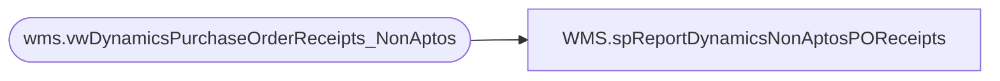

# WMS.spReportDynamicsNonAptosPOReceipts

**Database:** IntegrationStaging  
**Server:** STL-SSIS-P-01  

## Architecture Diagram



## Table Dependencies

| Referenced Table |
|---|
| wms.vwDynamicsPurchaseOrderReceipts_NonAptos |

## Stored Procedure Code

```sql
CREATE proc [WMS].[spReportDynamicsNonAptosPOReceipts]
@date1 date, @date2 date

as 
set nocount on

select 
	PurchaseOrderNumber DynamicsPONumber,
	AptosPONumber,
	ProductReceiptDate,
	ItemNumber,
	ProductDescription,
	sum(OrderedPurchaseQuantity) as OrderedPurchaseQuantity,
	sum(ReceivedPurchaseQuantity) as ReceivedPurchaseQuantity,
	sum(RemainingPurchaseQuantity) as RemainingPurchaseQuantity
from wms.vwDynamicsPurchaseOrderReceipts_NonAptos
where ProductReceiptDate between @date1 and @date2
group by 
	PurchaseOrderNumber,
	AptosPONumber,
	ProductReceiptDate,
	ItemNumber,
	ProductDescription
order by 
	ProductReceiptDate, 
	AptosPONumber, 
	ItemNumber
```

