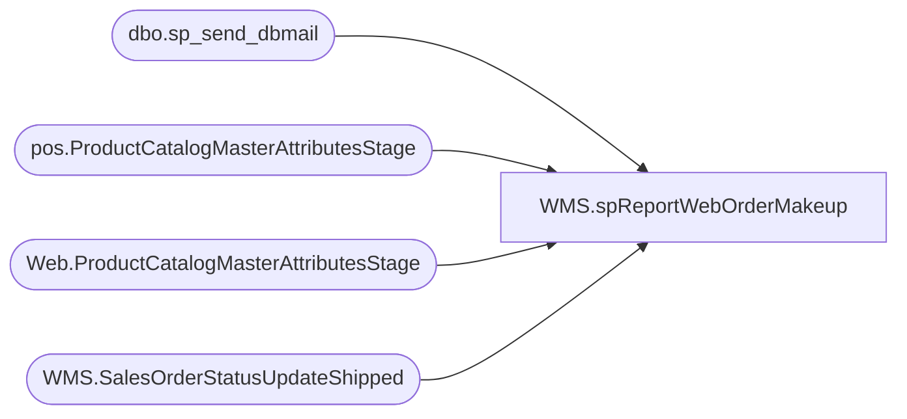

# WMS.spReportWebOrderMakeup

**Database:** IntegrationStaging  
**Server:** STL-SSIS-P-01  

## Architecture Diagram



## Table Dependencies

| Referenced Table |
|---|
| dbo.sp_send_dbmail |
| pos.ProductCatalogMasterAttributesStage |
| Web.ProductCatalogMasterAttributesStage |
| WMS.SalesOrderStatusUpdateShipped |

## Stored Procedure Code

```sql
CREATE proc [WMS].[spReportWebOrderMakeup]
as 
-- =====================================================================================================
-- Name: WMS.spReportWebOrderMakeup
--
-- Description:	Email Bearhouse team an Order Makeup Report; JIRA BIB-769
--		Order status times are in central, report is delivered in eastern time.
--
-- Revision History
--		Name:			Date:			Comments:
--		Lizzy Timm		05/13/2024		Created proc
--		Lizzy Timm		07/24/2024		Modified proc to point to WMS.SalesOrderStatusUpdateShipped instead of the WebOrderProcessing database source; Jira BIB-988 and BIB-769
-- =====================================================================================================
set nocount on;

---stage count by item types
IF (Object_ID('tempdb..#plushCount') IS NOT null) DROP TABLE #plushCount
select distinct 'Plush' Category
	, sum(so.ShippedQty) Qty
	--, MIN( DATEADD(hour,1,os.StatusDate)) StartDate
	--, MAX( DATEADD(hour,1,os.StatusDate)) EndDate
  INTO #plushCount
  FROM WMS.SalesOrderStatusUpdateShipped so
 -- from [bearcluster01.sql.buildabear.com].WebOrderProcessing.wm.Orders o with (nolock)
 -- join [bearcluster01.sql.buildabear.com].WebOrderProcessing.wm.OrderStatus os with (nolock) on o.orderID=os.OrderID
	--and os.currentStatus=1
 -- join [bearcluster01.sql.buildabear.com].WebOrderProcessing.wm.OrderItems oi with (nolock) on o.orderID=oi.OrderID 
  JOIN IntegrationStaging.Web.ProductCatalogMasterAttributesStage p with (nolock) ON so.ItemId = p.Style_Code--so.ItemId=p.Style_Code
  where 1=1
	/*AND os.Status in ('Shipped')
	and isnull(o.PickupStore,'0013')='0013'
	and len(so.ItemId)=6 */
	--and	cast(os.StatusDate as date)=cast(getdate()-1 as date) 
	and len(so.ItemId)=6
	and p.Department IN ('Unstuffed','Stuffed','Plush')
	and so.ItemId NOT IN (select DISTINCT
			StyleCode
	    from IntegrationStaging.pos.ProductCatalogMasterAttributesStage with (nolock)
	    where (ItemName like '%jumbo%' or ItemName like '%giant%')
			and left(StyleCode,1) in ('0','2','3')
			and ItemName not like '%giants%')
	and CONVERT(datetime, so.ShipConfirmDateTime AT TIME ZONE 'UTC' AT TIME ZONE 'Eastern Standard Time') >
		CASE
			WHEN DATEPART(Hour,getdate()) BETWEEN 14 AND 22 THEN CONCAT(cast(getdate() as date),' 05:00:00.000')
			WHEN DATEPART(Hour,getdate()) = 23 THEN CONCAT(cast(getdate() as date),' 05:00:00.000')
			ELSE CONCAT(cast(DATEADD(day,-1,getdate()) as date),' 05:00:00.000')
		END
	and CONVERT(datetime, so.ShipConfirmDateTime AT TIME ZONE 'UTC' AT TIME ZONE 'Eastern Standard Time') < 
		CASE
			WHEN DATEPART(Hour,getdate()) BETWEEN 14 AND 22 THEN CONCAT(cast(getdate() as date),' 15:00:00.000')
			WHEN DATEPART(Hour,getdate()) = 23 THEN CONCAT(cast(getdate() as date),' 23:59:59.999')
			ELSE CONCAT(cast(DATEADD(day,-1,getdate()) as date),' 23:59:59.999')
		END
UNION
select distinct 'Jumbo' Category
	, sum(so.ShippedQty) Qty
  FROM WMS.SalesOrderStatusUpdateShipped so
 -- from [bearcluster01.sql.buildabear.com].WebOrderProcessing.wm.Orders o with (nolock)
 -- join [bearcluster01.sql.buildabear.com].WebOrderProcessing.wm.OrderStatus os with (nolock) on o.orderID=os.OrderID
	--and os.currentStatus=1
 -- join [bearcluster01.sql.buildabear.com].WebOrderProcessing.wm.OrderItems oi with (nolock) on o.orderID=oi.OrderID 
  JOIN IntegrationStaging.Web.ProductCatalogMasterAttributesStage p with (nolock) ON so.ItemId = p.Style_Code--so.ItemId=p.Style_Code
  where 1=1
	/*AND os.Status in ('Shipped')
	and isnull(o.PickupStore,'0013')='0013'
	and len(so.ItemId)=6 */
	and len(so.ItemId)=6
	--and	cast(os.StatusDate as date)=cast(getdate()-1 as date) 
	--and p.Department IN ('Unstuffed','Stuffed','Plush')
	and so.ItemId IN (select DISTINCT
			StyleCode
	    from IntegrationStaging.pos.ProductCatalogMasterAttributesStage with (nolock)
	    where (ItemName like '%jumbo%' or ItemName like '%giant%')
			and left(StyleCode,1) in ('0','2','3')
			and ItemName not like '%giants%')
	and CONVERT(datetime, so.ShipConfirmDateTime AT TIME ZONE 'UTC' AT TIME ZONE 'Eastern Standard Time') >
		CASE
			WHEN DATEPART(Hour,getdate()) BETWEEN 14 AND 22 THEN CONCAT(cast(getdate() as date),' 05:00:00.000')
			WHEN DATEPART(Hour,getdate()) = 23 THEN CONCAT(cast(getdate() as date),' 05:00:00.000')
			ELSE CONCAT(cast(DATEADD(day,-1,getdate()) as date),' 05:00:00.000')
		END
	and CONVERT(datetime, so.ShipConfirmDateTime AT TIME ZONE 'UTC' AT TIME ZONE 'Eastern Standard Time') < 
		CASE
			WHEN DATEPART(Hour,getdate()) BETWEEN 14 AND 22 THEN CONCAT(cast(getdate() as date),' 15:00:00.000')
			WHEN DATEPART(Hour,getdate()) = 23 THEN CONCAT(cast(getdate() as date),' 23:59:59.999')
			ELSE CONCAT(cast(DATEADD(day,-1,getdate()) as date),' 23:59:59.999')
		END
UNION
select distinct 'Other' Category
	, sum(so.ShippedQty) Qty
  FROM WMS.SalesOrderStatusUpdateShipped so
 -- from [bearcluster01.sql.buildabear.com].WebOrderProcessing.wm.Orders o with (nolock)
 -- join [bearcluster01.sql.buildabear.com].WebOrderProcessing.wm.OrderStatus os with (nolock) on o.orderID=os.OrderID
	--and os.currentStatus=1
 -- join [bearcluster01.sql.buildabear.com].WebOrderProcessing.wm.OrderItems oi with (nolock) on o.orderID=oi.OrderID 
  JOIN IntegrationStaging.Web.ProductCatalogMasterAttributesStage p with (nolock) ON so.ItemId = p.Style_Code--so.ItemId=p.Style_Code
  where 1=1
	/*AND os.Status in ('Shipped')
	and isnull(o.PickupStore,'0013')='0013'
	and len(so.ItemId)=6 */
	and len(so.ItemId)=6
	--and	cast(os.StatusDate as date)=cast(getdate()-1 as date) 
	and p.Department NOT IN ('Unstuffed','Stuffed','Plush')
	and so.ItemId NOT IN (select DISTINCT
			StyleCode
	    from IntegrationStaging.pos.ProductCatalogMasterAttributesStage with (nolock)
	    where (ItemName like '%jumbo%' or ItemName like '%giant%')
			and left(StyleCode,1) in ('0','2','3')
			and ItemName not like '%giants%')
	and CONVERT(datetime, so.ShipConfirmDateTime AT TIME ZONE 'UTC' AT TIME ZONE 'Eastern Standard Time') >
		CASE
			WHEN DATEPART(Hour,getdate()) BETWEEN 14 AND 22 THEN CONCAT(cast(getdate() as date),' 05:00:00.000')
			WHEN DATEPART(Hour,getdate()) = 23 THEN CONCAT(cast(getdate() as date),' 05:00:00.000')
			ELSE CONCAT(cast(DATEADD(day,-1,getdate()) as date),' 05:00:00.000')
		END
	and CONVERT(datetime, so.ShipConfirmDateTime AT TIME ZONE 'UTC' AT TIME ZONE 'Eastern Standard Time') < 
		CASE
			WHEN DATEPART(Hour,getdate()) BETWEEN 14 AND 22 THEN CONCAT(cast(getdate() as date),' 15:00:00.000')
			WHEN DATEPART(Hour,getdate()) = 23 THEN CONCAT(cast(getdate() as date),' 23:59:59.999')
			ELSE CONCAT(cast(DATEADD(day,-1,getdate()) as date),' 23:59:59.999')
		END

--main query

IF (Object_ID('tempdb..#mainJam') IS NOT null) DROP TABLE #mainJam
select
	cast(CONVERT(datetime, so.ShipConfirmDateTime AT TIME ZONE 'UTC' AT TIME ZONE 'Eastern Standard Time') as date) as ShipDate,
	CASE
		WHEN so.SalesPoolId = 'AC' THEN CONCAT('Accessory (',so.SalesPoolId,')')
		WHEN so.SalesPoolId = 'BA' THEN CONCAT('Build A Sound (',so.SalesPoolId,')')
		WHEN so.SalesPoolId = 'EM' THEN CONCAT('Embroidery (',so.SalesPoolId,')')
		WHEN so.SalesPoolId = 'ES' THEN CONCAT('Stores (',so.SalesPoolId,')')
		WHEN so.SalesPoolId = 'FP' THEN CONCAT('Friend Plus (',so.SalesPoolId,')')
		WHEN so.SalesPoolId = 'FO' THEN CONCAT('Friend Only (',so.SalesPoolId,')')
		WHEN so.SalesPoolId = 'GO' THEN CONCAT('Gift Card Only (',so.SalesPoolId,')')
		WHEN so.SalesPoolId = 'IN' THEN CONCAT('International (',so.SalesPoolId,')')
		WHEN so.SalesPoolId = 'RU' THEN CONCAT('Rush (',so.SalesPoolId,')')
		WHEN so.SalesPoolId = 'UN' THEN CONCAT('Unstuffed (',so.SalesPoolId,')')
		WHEN so.SalesPoolId = 'XX' THEN CONCAT('Pre-Built Kit (',so.SalesPoolId,')')
		WHEN so.SalesPoolId = 'CA' THEN CONCAT('Amazon (',so.SalesPoolId,')')
		WHEN so.SalesPoolId = 'XP' THEN CONCAT('Pre-Built Kits (',so.SalesPoolId,')')
		WHEN so.SalesPoolId = 'HB' THEN CONCAT('Heart Box (',so.SalesPoolId,')')
		WHEN so.SalesPoolId = 'PR' THEN CONCAT('Girl Scouts (',so.SalesPoolId,')')
		WHEN so.SalesPoolId = 'FR' THEN CONCAT('Friend Only (',so.SalesPoolId,')')
		WHEN so.SalesPoolId = 'GC' THEN CONCAT('Gift Card Plus (',so.SalesPoolId,')')
		ELSE so.SalesPoolId
	END AS OrderType,
	CONVERT(decimal (10,2), ROUND(count(distinct so.DeckSalesOrderReferenceNumber),2)) OrdersShipped,
	CONVERT(decimal (10,2), ROUND(sum(so.ShippedQty),2)) UnitsShipped,
	--count(distinct o.OrderNum) OrdersShipped,
	--sum(so.ShippedQty) UnitsShipped,
--	CONVERT(decimal (10,2), ROUND(sum(so.ShippedQty) / count(distinct o.OrderNum),2))  as UPO,
	0 as SortType
into #mainJam
/*from [bearcluster01.sql.buildabear.com].WebOrderProcessing.wm.Orders o with (nolock)
join [bearcluster01.sql.buildabear.com].WebOrderProcessing.wm.OrderStatus os with (nolock)
	on o.orderID=os.OrderID
	and os.currentStatus=1
join [bearcluster01.sql.buildabear.com].WebOrderProcessing.wm.OrderItems oi on o.orderID=oi.OrderID*/
FROM WMS.SalesOrderStatusUpdateShipped so
where 1=1
	/*AND os.Status in ('Shipped')
	and isnull(o.PickupStore,'0013')='0013'*/
	and len(so.ItemId)=6
--and	cast(os.StatusDate as date)=cast(getdate()-1 as date)	
	and CONVERT(datetime, so.ShipConfirmDateTime AT TIME ZONE 'UTC' AT TIME ZONE 'Eastern Standard Time') >
		CASE
			WHEN DATEPART(Hour,getdate()) BETWEEN 14 AND 22 THEN CONCAT(cast(getdate() as date),' 05:00:00.000')
			WHEN DATEPART(Hour,getdate()) = 23 THEN CONCAT(cast(getdate() as date),' 05:00:00.000')
			ELSE CONCAT(cast(DATEADD(day,-1,getdate()) as date),' 05:00:00.000')
		END
	and CONVERT(datetime, so.ShipConfirmDateTime AT TIME ZONE 'UTC' AT TIME ZONE 'Eastern Standard Time') < 
		CASE
			WHEN DATEPART(Hour,getdate()) BETWEEN 14 AND 22 THEN CONCAT(cast(getdate() as date),' 15:00:00.000')
			WHEN DATEPART(Hour,getdate()) = 23 THEN CONCAT(cast(getdate() as date),' 23:59:59.999')
			ELSE CONCAT(cast(DATEADD(day,-1,getdate()) as date),' 23:59:59.999')
		END
group by cast(CONVERT(datetime, so.ShipConfirmDateTime AT TIME ZONE 'UTC' AT TIME ZONE 'Eastern Standard Time') as date), so.SalesPoolId


IF (Object_ID('tempdb..#TotalsA') IS NOT null) DROP TABLE #TotalsA
SELECT ShipDate
	, SUM(OrdersShipped) TotalOrderShipped
	, SUM(UnitsShipped) TotalUnitShipped
	, CONVERT(decimal (10,2), ROUND(SUM(UnitsShipped) / SUM(OrdersShipped),2)) TotalUPO
	, 1 AS SortType
  INTO #TotalsA
  FROM #mainJam
  GROUP BY ShipDate

declare @PlushCount int, @JumboCount int,@OtherCount int

SELECT @PlushCount = Qty FROM #plushCount WHERE Category = 'Plush'
SELECT @JumboCount = Qty FROM #plushCount WHERE Category = 'Jumbo'
SELECT @otherCount = Qty FROM #plushCount WHERE Category = 'Other'
--SELECT @OtherCount = t.TotalUnitShipped - s.Unstuffed 
--  FROM #plushCount s 
--	JOIN #TotalsA t ON 1=1
--  GROUP BY t.TotalUnitShipped, Unstuffed


IF (Object_ID('tempdb..#TotalsB') IS NOT null) DROP TABLE #TotalsB
SELECT @PlushCount TotalPlush
	, @JumboCount TotalJumbo
	, @OtherCount TotalOther
	, 3 AS SortType
  INTO #TotalsB

IF (Object_ID('tempdb..#Final') IS NOT null) DROP TABLE #Final
SELECT 'Total Order Shipped' AS a
	,ISNULL(CAST(CAST(TotalOrderShipped AS INT) AS varchar), '0') AS b
	,ISNULL(CAST(CAST(TotalUnitShipped AS INT) AS varchar), '0') AS c
	--,CASE 
	--	WHEN RIGHT(CAST(TotalUPO AS varchar),2) = '00' THEN ISNULL(CAST(TotalUPO AS varchar), '0')
	--	ELSE ISNULL(CAST(TotalUPO AS varchar), '0')
	--END AS d 
	, ISNULL(CAST(TotalUPO AS varchar), '0') AS d
	,SortType
	INTO #Final
	FROM #TotalsA	
UNION
SELECT 'Total Jumbo' AS a
	,ISNULL(CAST(TotalJumbo AS varchar), '0') AS b
	,'' AS c
	,'' AS d
	,SortType
	FROM #TotalsB	
UNION
SELECT 'Total Plush' AS a
	,ISNULL(CAST(TotalPlush AS varchar), '0') AS b
	,'' AS c
	,'' AS d
	,SortType
	FROM #TotalsB	
UNION
SELECT 'Total Other' AS a
	,ISNULL(CAST(TotalOther AS varchar), '0') AS b
	,'' AS c
	,'' AS d
	,SortType
	FROM #TotalsB
UNION
SELECT ISNULL(CAST(OrderType AS varchar), '-') AS a
	,ISNULL(CAST(CAST(OrdersShipped AS INT) AS varchar), '0') AS b
	,ISNULL(CAST(CAST(UnitsShipped AS INT) AS varchar), '0') AS c
	,ISNULL(CAST(CONVERT(decimal (10,2), ROUND(UnitsShipped / OrdersShipped,2)) AS varchar), '0') d 
	,SortType
	FROM #mainJam
	ORDER BY SortType

-- Email results	
DECLARE @xml NVARCHAR(MAX)
	, @btext nvarchar(max)
	, @body NVARCHAR(MAX)
	, @sub NVARCHAR(MAX)
	, @shipDate NVARCHAR(30)

SET @shipDate =  
	CASE
		WHEN DATEPART(Hour,getdate()) BETWEEN 14 AND 22 THEN CONCAT(CONVERT(VARCHAR,GETDATE(), 101), ' 5:00AM - 3:00PM')
		WHEN DATEPART(Hour,getdate()) = 23 THEN CONCAT(CONVERT(VARCHAR,GETDATE(), 101),' 5:00AM - 11:59PM')
		ELSE CONCAT(CONVERT(VARCHAR,DATEADD(Day,-1,GETDATE()), 101), ' 5:00AM - 11:59PM')
	END 


SET @xml = CAST(
	( SELECT ISNULL(CAST(a AS varchar), '-') AS 'td',''
		,ISNULL(CAST(b AS varchar), '0') AS 'td',''
		,ISNULL(CAST(c AS varchar), '0') AS 'td',''
		,ISNULL(CAST(d AS varchar), '0') AS 'td',''
	  FROM #Final
	FOR XML PATH('tr'), ELEMENTS ) AS NVARCHAR(MAX)
  )


SET @body = '<html><body><H3>Order Makeup Report for Ship Date '
			+ @shipDate
			+ '</H3><table border = 1 style="border-collapse: collapse; padding: 5px;"> 
					<tr style="background-color: #0056a2; color: #ffffff;">
						<th> Order Type </th> 
						<th> Oder Shipped </th> 
						<th> Units Shipped </th> 
						<th> UPO </th> 						
					</tr>' 
			+ @xml
			+ '</table>'
SET @btext = @body + '<p style="font-size:12px;"><br><br>This report was generated from STL-SSIS-P-01.IntegrationStaging.WMS.spReportWebOrderMakeup</p></body></html>'
SET @sub = 'Order Makeup Report'

exec msdb.dbo.sp_send_dbmail
@profile_name = 'BIAdmin',
--@recipients = 'EntSysSupport@buildabear.com;',
@recipients = 'ChrisTh@buildabear.com;WilliamD@buildabear.com;WilliamK@buildabear.com;JosephF@buildabear.com;LarryW@buildabear.com',
@blind_copy_recipients = 'LizzyT@buildabear.com;',
@body = @btext,
@subject = @sub,
@body_format = 'HTML'
```

