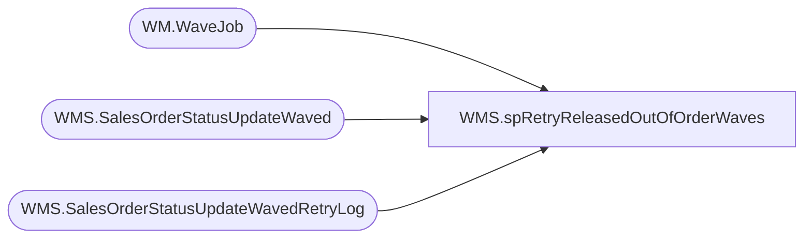

# WMS.spRetryReleasedOutOfOrderWaves

**Database:** IntegrationStaging  
**Server:** STL-SSIS-P-01  

## Architecture Diagram



## Table Dependencies

| Referenced Table |
|---|
| WM.WaveJob |
| WMS.SalesOrderStatusUpdateWaved |
| WMS.SalesOrderStatusUpdateWavedRetryLog |

## Stored Procedure Code

```sql
CREATE PROCEDURE WMS.spRetryReleasedOutOfOrderWaves

-- =====================================================================================================
-- Name: spRetryReleasedOutOfOrderWaves
--
-- Description:	Retry processing waves that released of order to the Service Bus
--
-- Revision History
--		Name:			Date:			Comments:
--		Ben Barud		2025-05-30		Created proc
-- =====================================================================================================
	@daysToGoBack AS INT = 1
AS
BEGIN

	SET NOCOUNT ON;

	DECLARE @waveId AS INT, @releasedDateAndTime AS DATETIME;

    WITH salesOrderStatusUpdateWaved([WaveId]
      ,[ReleasedDateAndTime]
      ,[Warehouse]
      ,[ShipmentStatus]
      ,[ContainerId]
      ,[MasterTrackingNumber]
      ,[ItemId]
      ,[SalesPoolId]
      ,[DeckSalesOrderReferenceNumber]
      ,[OrderNum]
      ,[WorkId]
      ,[ServiceBusSequence])
	AS (
	SELECT CAST(RIGHT([WaveId], 9) AS INT)
		  ,[ReleasedDateAndTime]
		  ,[Warehouse]
		  ,[ShipmentStatus]
		  ,[ContainerId]
		  ,[MasterTrackingNumber]
		  ,[ItemId]
		  ,[SalesPoolId]
		  ,[DeckSalesOrderReferenceNumber]
		  ,[OrderNum]
		  ,[WorkId]
		  ,[ServiceBusSequence]
	  FROM [IntegrationStaging].[WMS].[SalesOrderStatusUpdateWaved]
	  WHERE ReleasedDateAndTime BETWEEN DATEADD(DAY, -@daysToGoBack, GETUTCDATE()) AND GETUTCDATE()
	), waveJob([WaveID]
		  ,[WaveNum]
		  ,[WaveComplete]
		  ,[ReleasedDateAndTime]
		  ,[PickTicketJobDateAndTime])
	AS (
	SELECT [WaveID]
		  ,CAST(RIGHT([WaveNum], 9) AS INT)
		  ,[WaveComplete]
		  ,[ReleasedDateAndTime]
		  ,[PickTicketJobDateAndTime]
	  FROM [bearcluster01.sql.buildabear.com].[WebOrderProcessing].[WM].[WaveJob]
	  WHERE ReleasedDateAndTime BETWEEN DATEADD(DAY, -@daysToGoBack, GETUTCDATE()) AND GETUTCDATE()
	), distinctWaveIds(WaveId, ReleasedDateAndTime)
	AS (
	SELECT WaveId, CAST(ReleasedDateAndTime AS DATETIME) AS ReleasedDateAndTime FROM salesOrderStatusUpdateWaved GROUP BY WaveId, ReleasedDateAndTime
	)

	SELECT TOP(1) @waveId = d.WaveId, @releasedDateAndTime = d.ReleasedDateAndTime
	FROM distinctWaveIds d
	LEFT JOIN waveJob w ON d.WaveId = w.WaveNum
	WHERE w.WaveID IS NULL
	ORDER BY d.ReleasedDateAndTime DESC

	IF @waveId IS NOT NULL AND (SELECT MAX(RetryCount) FROM [IntegrationStaging].[WMS].[SalesOrderStatusUpdateWavedRetryLog]) < 3
	BEGIN
	  DECLARE @retryCount AS INT

	  SELECT @retryCount = MAX(RetryCount) FROM [IntegrationStaging].[WMS].[SalesOrderStatusUpdateWavedRetryLog] WHERE WaveId = @waveId

	  IF @retryCount IS NOT NULL
	  BEGIN
		SET @retryCount = @retryCount + 1
	  END
	  ELSE
	  BEGIN
		SET @retryCount = 1
	  END

	  INSERT INTO [IntegrationStaging].[WMS].[SalesOrderStatusUpdateWavedRetryLog] (WaveId, ReleasedDateAndTime, RetryCount)
	  VALUES(@waveId, @releasedDateAndTime, @retryCount)

	  UPDATE [IntegrationStaging].[WMS].[SalesOrderStatusUpdateWaved]
	  SET ReleasedDateAndTime = GETUTCDATE()
	  WHERE CAST(RIGHT([WaveId], 9) AS INT) IN (@waveId)
	END
	SELECT @waveId
END
```

