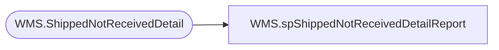

# WMS.spShippedNotReceivedDetailReport

**Database:** IntegrationStaging  
**Server:** STL-SSIS-P-01  

## Architecture Diagram



## Table Dependencies

| Referenced Table |
|---|
| WMS.ShippedNotReceivedDetail |

## Stored Procedure Code

```sql
CREATE proc [WMS].[spShippedNotReceivedDetailReport]
@district integer

WITH RECOMPILE 

as 

set nocount on 


----------------------------------------------------------------------------------------------------
--//       	                                                                    //--
----------------------------------------------------------------------------------------------------

if @district = 0
BEGIN
select * from [WMS].[ShippedNotReceivedDetail] where  DmId is not null
order by ToWarehouse, [Receipt Date], OrderNumber asc 
END
ELSE 
BEGIN
select * from [WMS].[ShippedNotReceivedDetail] where DmId = @district
order by ToWarehouse, [Receipt Date], OrderNumber asc 
END
```

