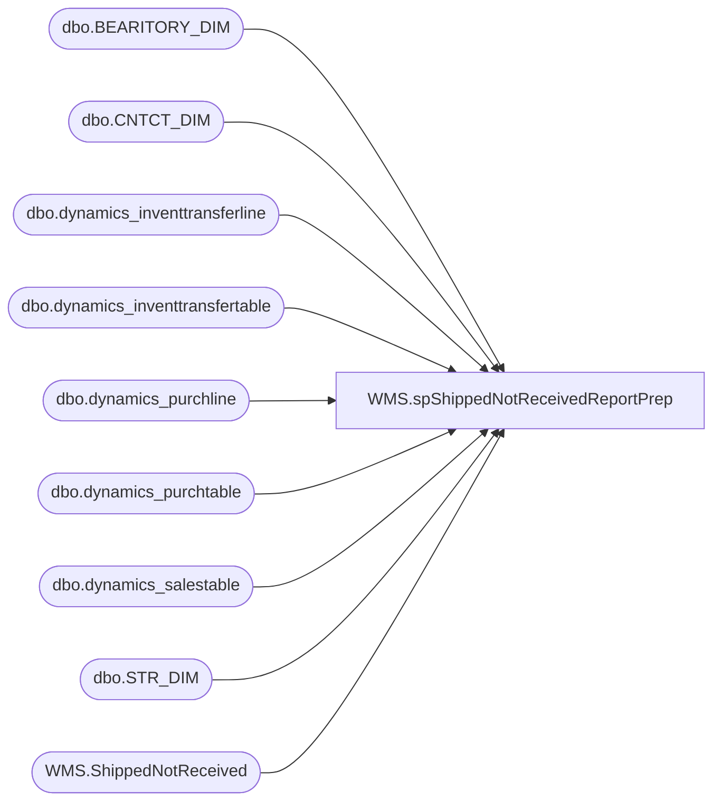

# WMS.spShippedNotReceivedReportPrep

**Database:** IntegrationStaging  
**Server:** STL-SSIS-P-01  

## Architecture Diagram



## Table Dependencies

| Referenced Table |
|---|
| dbo.BEARITORY_DIM |
| dbo.CNTCT_DIM |
| dbo.dynamics_inventtransferline |
| dbo.dynamics_inventtransfertable |
| dbo.dynamics_purchline |
| dbo.dynamics_purchtable |
| dbo.dynamics_salestable |
| dbo.STR_DIM |
| WMS.ShippedNotReceived |

## Stored Procedure Code

```sql
CREATE proc [WMS].[spShippedNotReceivedReportPrep]
--@district varchar(150)

WITH RECOMPILE 

as 

set nocount on 


----------------------------------------------------------------------------------------------------
--//       	                                                                    //--
----------------------------------------------------------------------------------------------------


truncate table [WMS].[ShippedNotReceived]

 insert into [WMS].[ShippedNotReceived]  ([OrderNumber],[OrderStatus],[FromWarehouse],[ToWarehouse],[Receipt Date],[ModeOfDelivery],[AptosShipmentNumber]
 ,[QuantityShipped],[QuantityReceived],[QuantityNotReceived],[DistrictName],[DistrictManager],[DmId],[DMfirstName],[DMlastName])

select p.PurchId as 'OrderNumber', 'Open Order' as 'OrderStatus' , s.InventLocationId as 'From Warehouse',  p.InventLocationId as 'To Warehouse',
p.DeliveryDate as 'Receipt Date', isnull(p.DlvMode,'') as 'ModeOfDelivery', isnull(p.BABAptosPOShipmentNum,'') as 'AptosShipmentNumber'
,isnull(sum(PurchQty),0) as 'Quantity Shipped',  isnull(sum(PurchQty) - sum(RemainInventPhysical),0) as 'Quantity Received', isnull(sum(RemainInventPhysical),0) as 'Quantity Not Received'
,sd.NM as 'District Name', sd.EMAIL as 'District Manager' -- sd.FRST_NM, sd.LAST_NM
,sd.BEARITORY_ID, sd.FRST_NM as 'DMfirstName', sd.LAST_NM as 'DMlastName'
from SilverDeltaLake.SilverDeltaLake.dbo.dynamics_purchtable p
left join SilverDeltaLake.SilverDeltaLake.dbo.dynamics_salestable s on p.PurchId = s.InterCompanyPurchId --and p.DataAreaId = s.DataAreaId --  p.InterCompanySalesId = s.SalesId and p.DataAreaId = s.DataAreaId
inner join SilverDeltaLake.SilverDeltaLake.dbo.dynamics_purchline pl on p.PurchId = pl.PurchId
left join (
select case when s.STR_NUM < 1000 then 1000 + s.STR_NUM else s.STR_NUM end as STR_NUM,s.BEARITORY_ID ,BD.BEARITORY_NUM, BD.NM, CD.FRST_NM, CD.LAST_NM, CD.EMAIL
FROM KODIAK.babwmstrdata.dbo.STR_DIM s
left join KODIAK.babwmstrdata.dbo.BEARITORY_DIM BD on S.BEARITORY_ID = BD.BEARITORY_ID
join KODIAK.babwmstrdata.dbo.CNTCT_DIM CD WITH (NOLOCK) ON BD.CNTCT_ID = CD.CNTCT_ID
) as sd on p.InventLocationId = cast(sd.STR_NUM as varchar)
where 1=1 
--and p.PurchId in ('PO170008374')
--and p.PurchId in ('PO170007735','PO170007738','PO170007864')
and p.PurchStatus = 1
and p.OrderAccount = '99001'
and cast(p.DeliveryDate as date) < cast(getdate() as date) 
--and  p.InventLocationId < 3333
--and ISNUMERIC(p.InventLocationId) = 1
--and p.InventLocationId not like '8%'
--and p.InventLocationId not like '9%'
group by p.PurchId ,p.PurchStatus ,  s.InventLocationId,  p.InventLocationId, p.DeliveryDate, p.DlvMode,
p.BABAptosPOShipmentNum,sd.NM, sd.FRST_NM, sd.LAST_NM, sd.EMAIL,sd.BEARITORY_ID, sd.FRST_NM, sd.LAST_NM

union

select itt.TransferId as 'OrderNumber', 'Shipped' as 'OrderStatus',  --itt.ReceiveDate as 'ReceiptDate',
 itt.InventLocationIdFrom as 'From Warehouse'  , itt.InventLocationIdTo as 'To Warehouse' , itt.ReceiveDate as 'Receipt Date',
isnull(itt.DlvModeId,'') as 'ModeOfDelivery', isnull(itt.BABAptosShipmentNumber,'')  as 'AptosShipmentNumber'
,isnull(sum(itl.QtyShipped),0) as 'Quantity Shipped', isnull(sum(itl.QtyReceived),0) as 'Quantity Received', isnull(sum(itl.QtyRemainReceive),0) as 'Quantity Not Received'
,sd.NM as 'District Name', sd.EMAIL as 'District Manager' -- sd.FRST_NM, sd.LAST_NM
,sd.BEARITORY_ID, sd.FRST_NM as 'DMfirstName', sd.LAST_NM as 'DMlastName'
from SilverDeltaLake.SilverDeltaLake.dbo.dynamics_inventtransfertable itt
join SilverDeltaLake.SilverDeltaLake.dbo.dynamics_inventtransferline itl on itt.TransferId = itl.TransferId
left join (
select case when s.STR_NUM < 1000 then 1000 + s.STR_NUM else s.STR_NUM end as STR_NUM,s.BEARITORY_ID ,BD.BEARITORY_NUM, BD.NM, CD.FRST_NM, CD.LAST_NM, CD.EMAIL
FROM KODIAK.babwmstrdata.dbo.STR_DIM s
left join KODIAK.babwmstrdata.dbo.BEARITORY_DIM BD on S.BEARITORY_ID = BD.BEARITORY_ID
join KODIAK.babwmstrdata.dbo.CNTCT_DIM CD WITH (NOLOCK) ON BD.CNTCT_ID = CD.CNTCT_ID
) as sd on itt.InventLocationIdTo = cast(sd.STR_NUM as varchar)
where 1=1
and itt.TransferStatus = 1
--and ISNUMERIC(itt.InventLocationIdTo) = 1
--and  itt.InventLocationIdTo < 3333
--and itt.InventLocationIdTo not like '8%'
--and itt.InventLocationIdTo not like '9%'
--and itt.TransferID = 'TO0000023056'
and cast(itt.ReceiveDate as date) < cast(getdate() as date) 
group by itt.TransferId , itt.TransferStatus,   itt.ReceiveDate, itt.DlvModeId , itt.BABAptosShipmentNumber , itt.InventLocationIdTo,
itt.InventLocationIdFrom ,sd.NM, sd.FRST_NM, sd.LAST_NM, sd.EMAIL,sd.BEARITORY_ID, sd.FRST_NM, sd.LAST_NM
--order by itt.InventLocationIdTo asc 


--if @district = 'All'
--BEGIN
--select * from [WMS].[ShippedNotReceived]
--END
--ELSE 
--BEGIN
--select * from [WMS].[ShippedNotReceived] where DistrictName = @district
--END
```

