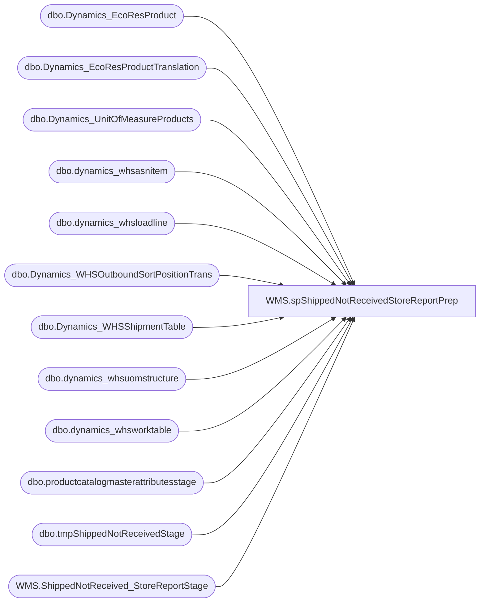

# WMS.spShippedNotReceivedStoreReportPrep

**Database:** IntegrationStaging  
**Server:** STL-SSIS-P-01  

## Architecture Diagram



## Table Dependencies

| Referenced Table |
|---|
| dbo.Dynamics_EcoResProduct |
| dbo.Dynamics_EcoResProductTranslation |
| dbo.Dynamics_UnitOfMeasureProducts |
| dbo.dynamics_whsasnitem |
| dbo.dynamics_whsloadline |
| dbo.Dynamics_WHSOutboundSortPositionTrans |
| dbo.Dynamics_WHSShipmentTable |
| dbo.dynamics_whsuomstructure |
| dbo.dynamics_whsworktable |
| dbo.productcatalogmasterattributesstage |
| dbo.tmpShippedNotReceivedStage |
| WMS.ShippedNotReceived_StoreReportStage |

## Stored Procedure Code

```sql
CREATE PROC [WMS].[spShippedNotReceivedStoreReportPrep] 

as 
  

truncate table [WMS].[ShippedNotReceived_StoreReportStage]


IF (Object_ID('IntegrationStaging..tmpShippedNotReceivedStage') IS NOT NULL) DROP TABLE IntegrationStaging.dbo.tmpShippedNotReceivedStage

;
with 
ActivePickCartons as
(
select distinct ai.LicensePlateId
from [SILVERDELTALAKE].[silverdeltalake].dbo.dynamics_whsloadline ll
--join (select LoadShipConfirmUTCDateTime, LoadDirection, DataAreaId, OrderNum from [SILVERDELTALAKE].[silverdeltalake].dbo.dynamics_whsloadtable) lt on lt.OrderNum = ll.OrderNum and lt.DataAreaId = ll.DataAreaId
join (select ShipConfirmUTCDateTime, LoadDirection, DataAreaId, OrderNum, InventSiteId from [SILVERDELTALAKE].[silverdeltalake].dbo.Dynamics_WHSShipmentTable) lt on lt.OrderNum = ll.OrderNum and lt.DataAreaId = ll.DataAreaId
left join  [SILVERDELTALAKE].[silverdeltalake].dbo.dynamics_whsuomstructure us on ll.ShipmentId = us.ShipmentId and  ll.DataAreaId = us.DataAreaId and ll.ItemId = us.ItemId
join [SILVERDELTALAKE].[silverdeltalake].dbo.dynamics_whsasnitem  ai on ll.ShipmentId = ai.ShipmentId and  ll.DataAreaId = ai.DataAreaId and ll.ItemId = ai.ItemId
--join (select InventLocationIdFrom, InventLocationIdTo, TransferId, DataAreaId from [SILVERDELTALAKE].[silverdeltalake].dbo.dynamics_inventtransfertable) itt on itt.TransferId = ll.OrderNum and ll.DataAreaId = itt.DataAreaId
join [SILVERDELTALAKE].[silverdeltalake].dbo.Dynamics_EcoResProduct ep on ll.ItemId = ep.DisplayProductNumber
join [SILVERDELTALAKE].[silverdeltalake].dbo.Dynamics_EcoResProductTranslation ept on ep.RECID = ept.Product
left join [SILVERDELTALAKE].[silverdeltalake].dbo.dynamics_whsworktable wt on ai.LicensePlateId = wt.TargetLicensePlateId 
join [SILVERDELTALAKE].[silverdeltalake].[dbo].[Dynamics_WHSOutboundSortPositionTrans] spt on ai.LicensePlateId = spt.SortIdentifier and ll.ItemId = spt.ItemId
where 1=1 
and lt.LoadDirection = 1
and ll.LoadDirection = 1
--and itt.InventLocationIdTo = '1332'
and us.ItemId is null
--and cast(lt.LoadShipConfirmUTCDateTime as date) >= cast(getdate()-30 as date) 
and cast(lt.ShipConfirmUTCDateTime as date) >= cast(getdate()-30 as date) 
),
receivedLPN as
(
select TargetLicensePLateId from [SILVERDELTALAKE].[silverdeltalake].dbo.dynamics_whsworktable where DataLakeModified_DateTime > getdate()-30 and WorkTemplateCode = 'Transfer receipt'  --and WorkTransType = 7
)
select ll.OrderNum as OrderNumber, ai.LicensePlateId as LicensePlate, ll.ItemId as ItemNumber, ept.Name as Name
--,itt.InventLocationIdFrom as FromWarehouse 
--,itt.InventLocationTo as ToWarehouse
--,lt2.InventSiteId as FromWarehouse 
,case when lt2.InventSiteId is null then '9960' else lt2.InventSiteId end as FromWarehouse 
,lt.InventSiteId as ToWarehouse
, isnull(p.SubClass, 'Supply item') as ProductHierarchy 
--,lt.LoadShipConfirmUTCDateTime as ShipDate
,lt.ShipConfirmUTCDateTime as ShipDate
--,lt.ShipConfirmUTCDateTime as ShipConfirmUTCDateTime
,ai.Qty as ItemQty, count(distinct ai.LicensePlateId) as 'CartonQty',case when apc.LicensePlateId is null then 0 else 1 end as isMiscCarton
,case when apc.LicensePlateId is not null and spt.UnitSymbol = 'ip'
       then cast(cast(ai.Qty/isnull(u.Factor,1) as int) as varchar) + ' : Inner Packs'
	when apc.LicensePlateId is not null and spt.UnitSymbol = 'ea'
	   then cast(cast(ai.Qty/isnull(u.Factor,1) as int) as varchar) + ' : Eaches'
	when apc.LicensePlateId is not null and spt.UnitSymbol = 'cs'
		then cast(cast(ai.Qty/isnull(u.Factor,1) as int) as varchar) + ' : Cases'
	when apc.LicensePlateId is not null and spt.UnitSymbol not in ('ip','ea','cs')
		then cast(cast(ai.Qty as int) as varchar) + ' : ' + spt.UnitSymbol
	when spt.UnitSymbol = 'BALE'
		then cast(cast(ai.Qty as int) as varchar) + ' : Bale'
	else 'N\A' 
End as MiscCartonDetails
into IntegrationStaging.dbo.tmpShippedNotReceivedStage
from [SILVERDELTALAKE].[silverdeltalake].dbo.dynamics_whsloadline ll
--join (select LoadShipConfirmUTCDateTime, LoadDirection, DataAreaId, OrderNum from [SILVERDELTALAKE].[silverdeltalake].dbo.dynamics_whsloadtable) lt on lt.OrderNum = ll.OrderNum and lt.DataAreaId = ll.DataAreaId
--join (select ShipConfirmUTCDateTime, LoadDirection, DataAreaId, OrderNum, InventSiteId from [SILVERDELTALAKE].[silverdeltalake].dbo.Dynamics_WHSShipmentTable) lt on lt.OrderNum = ll.OrderNum and lt.DataAreaId = ll.DataAreaId
join (select ShipConfirmUTCDateTime, LoadDirection, DataAreaId, OrderNum, ShipmentId, InventSiteId from [SILVERDELTALAKE].[silverdeltalake].dbo.Dynamics_WHSShipmentTable) lt on ll.ShipmentId = lt.ShipmentId and lt.DataAreaId = ll.DataAreaId
--left join (select ShipConfirmUTCDateTime, LoadDirection, DataAreaId, OrderNum, InventSiteId from [SILVERDELTALAKE].[silverdeltalake].dbo.Dynamics_WHSShipmentTable) lt2 on lt2.OrderNum = ll.OrderNum and lt2.DataAreaId = ll.DataAreaId and lt2.LoadDirection = 2
left join (select ShipConfirmUTCDateTime, LoadDirection, DataAreaId, OrderNum,  ShipmentId, InventSiteId from [SILVERDELTALAKE].[silverdeltalake].dbo.Dynamics_WHSShipmentTable) lt2 on ll.ShipmentId = lt2.ShipmentId and lt2.DataAreaId = ll.DataAreaId and lt2.LoadDirection = 2
join [SILVERDELTALAKE].[silverdeltalake].dbo.dynamics_whsasnitem  ai on ll.ShipmentId = ai.ShipmentId and  ll.DataAreaId = ai.DataAreaId and ll.ItemId = ai.ItemId
--join (select InventLocationIdFrom, InventLocationIdTo, TransferId, DataAreaId from [SILVERDELTALAKE].[silverdeltalake].dbo.dynamics_inventtransfertable) itt on itt.TransferId = ll.OrderNum and ll.DataAreaId = itt.DataAreaId
join [SILVERDELTALAKE].[silverdeltalake].dbo.Dynamics_EcoResProduct ep on ll.ItemId = ep.DisplayProductNumber
join [SILVERDELTALAKE].[silverdeltalake].dbo.Dynamics_EcoResProductTranslation ept on ep.RECID = ept.Product
--left join [SILVERDELTALAKE].[silverdeltalake].dbo.dynamics_whsworktable wt on ai.LicensePlateId = wt.TargetLicensePlateId 
left join receivedLPN r on r.TargetLicensePlateId = ai.LicensePlateId
left join [SILVERDELTALAKE].[silverdeltalake].[dbo].[Dynamics_WHSOutboundSortPositionTrans] spt on ai.LicensePlateId = spt.SortIdentifier and ll.ItemId = spt.ItemId
left join ActivePickCartons apc on apc.LicensePlateId = ai.LicensePlateId
left join [SILVERDELTALAKE].[silverdeltalake].[dbo].[Dynamics_UnitOfMeasureProducts] u on ll.ItemId = u.ItemId and lt.DataAreaId = u.DataAreaId and spt.UnitSymbol = u.FromUnit
left join [SILVERDELTALAKE].[silverdeltalake].[dbo].[productcatalogmasterattributesstage] p on ll.ItemId = p.[ProductNumber]
where 1=1 
and lt.LoadDirection = 1
--and lt2.LoadDirection = 2
and ll.LoadDirection = 1
--and cast(lt.LoadShipConfirmUTCDateTime as date) >= cast(getdate()-30 as date) 
and cast(lt.ShipConfirmUTCDateTime as date) >= cast(getdate()-30 as date) 
--and  ll.OrderNum = 'TO0000320948'
--and lt.InventSiteId = '1214'
--and wt.WorkStatus is null  -- if this WorkStatus is null then it means the shipment has NOT been received in D365, so we do want to still see it on the report 
and r.TargetLicensePlateId is null 
and lt.InventSiteId < 3000
group by ll.OrderNum, ai.LicensePlateId, ll.ItemId, ept.Name
--,itt.InventLocationIdFrom, itt.InventLocationIdTo,
,lt2.InventSiteId  ,lt.InventSiteId
,p.subclass
--,lt.LoadShipConfirmUTCDateTime
,lt.ShipConfirmUTCDateTime
,ai.Qty
,spt.UnitSymbol
,apc.LicensePlateId
,u.Factor
--order by itt.InventLocationIdTo, lt.LoadShipConfirmUTCDateTime, ll.OrderNum,  ll.ItemId asc 
order by 
--itt.InventLocationIdTo, 
lt.ShipConfirmUTCDateTime
,lt2.InventSiteId  ,lt.InventSiteId
, ll.OrderNum,  ll.ItemId asc 


  insert into [WMS].[ShippedNotReceived_StoreReportStage]
(	   [OrderNumber]
      ,[LicensePlate]
      ,[ItemNumber]
	  ,[Name]
      ,[FromWarehouse]
      ,[ToWarehouse]
      ,[ProductHierarchy]
      ,[ShipDate]
	  ,[ShipConfirmUTCDateTime]
      ,[ItemQty]
      ,[CartonQty]
	  ,[isMiscCarton]
      ,[MiscCartonDetails])
select [OrderNumber]
      ,[LicensePlate]
      ,[ItemNumber]
	  ,[Name]
      ,[FromWarehouse]
      ,[ToWarehouse]
      ,[ProductHierarchy]
      ,[ShipDate]
	  ,[ShipDate]
      ,[ItemQty]
      ,[CartonQty]
	  ,[isMiscCarton]
      ,[MiscCartonDetails] 
	  from IntegrationStaging.dbo.tmpShippedNotReceivedStage
```

