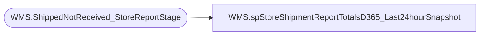

# WMS.spStoreShipmentReportTotalsD365_Last24hourSnapshot

**Database:** IntegrationStaging  
**Server:** STL-SSIS-P-01  

## Architecture Diagram



## Table Dependencies

| Referenced Table |
|---|
| WMS.ShippedNotReceived_StoreReportStage |

## Stored Procedure Code

```sql
CREATE proc [WMS].[spStoreShipmentReportTotalsD365_Last24hourSnapshot]
@DateDiff integer, @storeNumber varchar(50)

as 
set nocount on

;
with totals1 as
(
select ToWarehouse, sum(ItemQty) as 'ItemTotal',
count(distinct(LicensePlate)) as 'CartonTotal'
from [WMS].[ShippedNotReceived_StoreReportStage] 
where ToWarehouse = @storeNumber
--and datediff(dd, ShipDate, getdate()) <= @DateDiff
-- and  DATEDIFF(hh, [ShipDate], getdate()) <= 24 
  and datediff(dd, ShipConfirmUTCDateTime, getdate()) <= @DateDiff
   and DATEDIFF(hh, ShipConfirmUTCDateTime, getdate()) <= 32 
group by ToWarehouse
),
totals2 as
(
select ToWarehouse, count(distinct(LicensePlate)) as 'MiscCartonTotal'
from [WMS].[ShippedNotReceived_StoreReportStage] 
where isMiscCarton = 1
and ToWarehouse = @storeNumber
--and datediff(dd, ShipDate, getdate()) <= @DateDiff
 --and  DATEDIFF(hh, [ShipDate], getdate()) <= 24 
  and datediff(dd, ShipConfirmUTCDateTime, getdate()) <= @DateDiff
   and DATEDIFF(hh, ShipConfirmUTCDateTime, getdate()) <= 32 
group by ToWarehouse
)
select t1.ItemTotal, t1.CartonTotal, t2.MiscCartonTotal 
from totals1 t1 
join totals2 t2 on t1.ToWarehouse = t2.ToWarehouse
```

