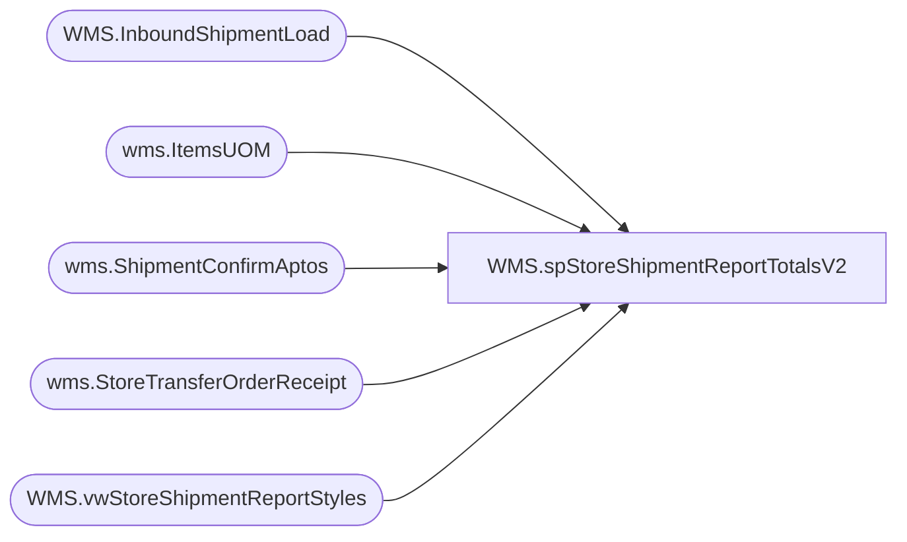

# WMS.spStoreShipmentReportTotalsV2

**Database:** IntegrationStaging  
**Server:** STL-SSIS-P-01  

## Architecture Diagram



## Table Dependencies

| Referenced Table |
|---|
| WMS.InboundShipmentLoad |
| wms.ItemsUOM |
| wms.ShipmentConfirmAptos |
| wms.StoreTransferOrderReceipt |
| WMS.vwStoreShipmentReportStyles |

## Stored Procedure Code

```sql
-- inner carton count

CREATE proc [WMS].[spStoreShipmentReportTotalsV2]
@DateDiff integer, @storeNumber varchar(50)

as 
set nocount on

		select s.ToLocation as 'ReceivingLocation',
		sum((isnull(uom.Factor,1) * s.ContainerUnitsShipped)) as 'QtyOfItemsBeingShipped', 
		count(distinct(s.ContainerID)) as 'QtyOfCartonsInShipment' 
		from wms.ShipmentConfirmAptos s
		--join papamart.dw.Azure.vwProducts p on s.ItemNumber = p.Style
		join [WMS].[vwStoreShipmentReportStyles] p on p.ProductNumber=s.ItemNumber
		left join wms.ItemsUOM uom  on s.ItemNumber=uom.ProductNumber and s.ContainerUnitOfMeasure=uom.FromUnitSymbol and uom.ToUnitSymbol='ea' and uom.entity=1100
		 where 1=1 
		and  cast(s.ShipConfirmDateTime as date) >= '04/01/2023'
		and datediff(dd, s.ShipConfirmDateTime, getdate()) <= @DateDiff
		and s.ToLocation = @storeNumber
		and NOT EXISTS (
				select SourceOrderNumber, Entity 
				from IntegrationStaging.wms.StoreTransferOrderReceipt  r
				where r.SourceOrderNumber = s.OrderNumber
				group by SourceOrderNumber, Entity
				) 
		 group by s.ToLocation

		 	 union

		 -- 3PL orders not received 
		 select i.ToWarehouse as 'ReceivingLocation',
		  sum(i.TransferQuantity) as 'QtyOfItemsBeingShipped', 
		  count(distinct i.LicensePlate) as 'QtyOfCartonsInShipment' 
		 from  [WMS].[InboundShipmentLoad] i
		 --join papamart.dw.Azure.vwProducts p on i.ItemNumber = p.Style
		 join [WMS].[vwStoreShipmentReportStyles] p  on p.ProductNumber=i.ItemNumber

		 where 1=1
		 and i.BatchID <> 'Shipped Prior to Pilot Begin'
		 and datediff(dd, i.ShipDate, getdate()) <= @DateDiff
		 and i.ToWarehouse = @storeNumber
		 and NOT EXISTS (
							select SourceOrderNumber, Entity 
							from IntegrationStaging.wms.StoreTransferOrderReceipt  r
							where r.SourceOrderNumber = i.OrderId --and r.Entity=i.Entity -- Entity Hurt Performance May Need to revisit
							group by SourceOrderNumber, Entity
						) 
		 group by i.ToWarehouse
```

