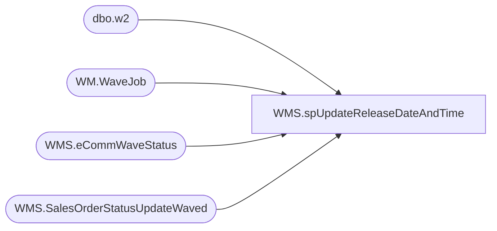

# WMS.spUpdateReleaseDateAndTime

**Database:** IntegrationStaging  
**Server:** STL-SSIS-P-01  

## Architecture Diagram



## Table Dependencies

| Referenced Table |
|---|
| dbo.w2 |
| WM.WaveJob |
| WMS.eCommWaveStatus |
| WMS.SalesOrderStatusUpdateWaved |

## Stored Procedure Code

```sql
CREATE PROCEDURE WMS.spUpdateReleaseDateAndTime 

-- =============================================================================================================
-- Name: WMS.spUpdateReleaseDateAndTime 
--
-- Description:	UpdateReleaseDateAndTime on waved Web Orders.  Temporary fix for broken D365 waves.
--
-- Output: 
--	
-- Dependencies: 
--
-- Revision History
--		Name:			Date:			Comments:
--		Ben Barud		05/17/2021		Initial Creation
-- =============================================================================================================

AS
BEGIN
	-- SET NOCOUNT ON added to prevent extra result sets from
	-- interfering with SELECT statements.
	SET NOCOUNT ON;

WITH eCommWaveStatus_work([WaveID]
      ,[isWaved]
      ,[MessageCount])
  AS
  (
	  SELECT CAST(SUBSTRING(WaveID,4,9) AS BIGINT) AS 'WaveID'
		  ,[isWaved]
		  ,[MessageCount]
	  FROM [IntegrationStaging].[WMS].[eCommWaveStatus]
	  WHERE isWaved = 1
  )
  SELECT wrk.WaveID
  INTO ##tmpWavesToUpdte
  FROM eCommWaveStatus_work wrk
  LEFT JOIN [BEARCLUSTER01.SQL.BUILDABEAR.COM].[WebOrderProcessing].[WM].[WaveJob] wjb ON wrk.WaveID = wjb.WaveNum
  WHERE wjb.WaveNum IS NULL;
  ----WHERE WaveID > 'WAV000013756' AND SUBSTRING(WaveID,4,9) NOT IN (SELECT WaveNum FROM [BEARCLUSTER01.SQL.BUILDABEAR.COM].[WebOrderProcessing].[WM].[WaveJob])
  --WHERE WaveID NOT IN (SELECT WaveNum FROM [BEARCLUSTER01.SQL.BUILDABEAR.COM].[WebOrderProcessing].[WM].[WaveJob])

  --WAV000150682

  WITH wavesToUpdate(WaveId)
  AS
  (
  SELECT 'WAV' + RIGHT('000000000' + CAST(WaveId AS VARCHAR(9)), 9) AS WaveId
  FROM ##tmpWavesToUpdte
  )
  UPDATE w2
  SET w2.ReleasedDateAndTime = GETUTCDATE()
  FROM wavesToUpdate w1
  INNER JOIN [IntegrationStaging].[WMS].[SalesOrderStatusUpdateWaved] w2 ON w1.WaveId = w2.WaveId
  WHERE ReleasedDateAndTime = '1900-01-01 00:00:00.000'

END
```

