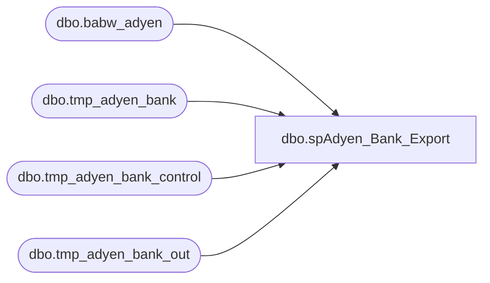

# dbo.spAdyen_Bank_Export

**Database:** IntegrationStaging  
**Server:** STL-SSIS-P-01  

## Architecture Diagram



## Table Dependencies

| Referenced Table |
|---|
| dbo.babw_adyen |
| dbo.tmp_adyen_bank |
| dbo.tmp_adyen_bank_control |
| dbo.tmp_adyen_bank_out |

## Stored Procedure Code

```sql
CREATE PROCEDURE [dbo].[spAdyen_Bank_Export] 
@merchant varchar(80)
	

AS
-- =============================================================================================================
--      Ian Wallace		20230519		bank case statement export for Dynamics
-- =============================================================================================================


--####################################
-- Temp Tables
--####################################

truncate table [dbo].[tmp_adyen_bank]
truncate table [dbo].[tmp_adyen_bank_out]


--####################################
-- Declare script variables
--####################################

--DECLARE @SQL VARCHAR(8000)
--DECLARE @CMD VARCHAR(4000)
DECLARE @FileDate VARCHAR(14)
--DECLARE @FileName VARCHAR(40)
--DECLARE @FilePath VARCHAR(90)
DECLARE @ERPFilePath VARCHAR(90)
DECLARE @BackupFilePath VARCHAR(90)
DECLARE @TempFilePath VARCHAR(90)
DECLARE @TransactionStartDate AS INT
DECLARE @TransactionEndDate AS INT

DECLARE @ChkFileDrive VARCHAR(5)  
DECLARE @ChkFileCMD VARCHAR(200)
DECLARE @ChkFileCount VARCHAR(5)

DECLARE @Recipients VARCHAR(4000)
DECLARE @Copy_Recipients VARCHAR(4000)
DECLARE @Subject VARCHAR(80)
DECLARE @Query VARCHAR(8000)
DECLARE @Text nvarchar(max)


DECLARE @SQL VARCHAR(8000)
DECLARE @CMD VARCHAR(8000)
DECLARE @FilePath VARCHAR(250)
--DECLARE @DayString varchar(10)
--DECLARE @TimeString varchar(10)
DECLARE @DayStringGroup1 varchar(10)
DECLARE @DayStringGroup2 varchar(10)
DECLARE @DayStringLine2 varchar(10)
DECLARE @UniqueSeq varchar(10)
DECLARE @RowCountTrans integer
DECLARE @RowCountGroup integer
DECLARE @RowCountTotal integer
DECLARE @RowCountTransString varchar(20)
DECLARE @RowCountGroupString varchar(20)
DECLARE @RowCountTotalString varchar(20)

DECLARE @DayString varchar(10)
DECLARE @TimeString varchar(10)

--####################################
-- Set variables
--####################################

SET @FileDate = (SELECT CONVERT(VARCHAR(8), GETDATE(), 112) + REPLACE(CONVERT(VARCHAR(8),GETDATE(), 108),':',''))


if @merchant = 'BABCANPOS'
BEGIN
select getdate()
END


if @merchant = 'BABGBRPOS'
BEGIN
select getdate()
END


if @merchant = 'BABGBRWEB'
BEGIN
select getdate()
END

--=====================================================================================================================================================================================


IF @merchant = 'BABUSAPOS'  
BEGIN

INSERT INTO [dbo].[tmp_adyen_bank] ([As Of],[Currency],[BankID Type],[BankID],[Account],[Data Type],[BAI Code],
[Description],[Amount],[Balance/Value Date],[Customer Reference],[Immediate Availability],[1 Day Float],[2+ DayFloat],[Bank Reference],[# of Items],[Text])
select (select distinct convert(varchar(10), cast(Creation_Date as date), 101)  from [dbo].[babw_adyen] where Type = 'MerchantPayout') as 'As Of'
,(select distinct [Gross_Currency] from [dbo].[babw_adyen] where [Gross_Currency] is not null) as 'Currency'
, 'ABA' as 'BankID Type','123456789' as 'BankID', '1100MCVCLEAR' as 'Account'
-- 'Account' = CASE WHEN Payment_Method in ('visa','mc') THEN '1100MCVCLEAR' WHEN  Payment_Method in ('discover') THEN '1100DISCVCLEAR' WHEN Payment_Method in ('dinersr') THEN '1100DINRSCLEAR' END
 ,'Credits' as 'Data Type','399' as 'BAI Code','Deposit' as 'Description', sum(Gross_Credit_GC) as 'Amount' ,
 '' as 'Balance/Value Date', Store as 'Customer Reference','' as 'Immediate Availability', '' as '1 Day Float',
'' as '2 + DayFloat'
,(select distinct convert(varchar(10), cast(Creation_Date as date), 112)  from [dbo].[babw_adyen] where Type = 'MerchantPayout') + Store as 'Bank Reference'
,'' as '# of Items',(select distinct convert(varchar(10), cast(Creation_Date as date), 112)  from [dbo].[babw_adyen] where Type = 'MerchantPayout') + Store as 'Text'
from [dbo].[babw_adyen] where Type in ('Settled','Refunded','Chargeback','Chargebacks','Fee') 
group by Store, Payment_Method having sum(Gross_Credit_GC) <> 0
union all
select (select distinct convert(varchar(10), cast(Creation_Date as date), 101)  from [dbo].[babw_adyen] where Type = 'MerchantPayout') as 'As Of'
,(select distinct [Gross_Currency] from [dbo].[babw_adyen] where [Gross_Currency] is not null) as 'Currency'
, 'ABA' as 'BankID Type','123456789' as 'BankID',  '1100MCVCLEAR' as 'Account'
--  'Account' = CASE WHEN ( select top 1 Payment_Method  from [dbo].[babw_adyen] )  in ('visa','mc') THEN '1100MCVCLEAR' 
-- WHEN  ( select top 1 Payment_Method  from [dbo].[babw_adyen] )  in ('discover') THEN '1100DISCVCLEAR' 
-- WHEN ( select top 1 Payment_Method  from [dbo].[babw_adyen] )  in ('dinersr') THEN '1100DINRSCLEAR' END
 ,'Debits' as 'Data Type','699' as 'BAI Code','Disbursement' as 'Description', sum(Gross_Credit_GC) as 'Amount' ,
 '' as 'Balance/Value Date', '9999' as 'Customer Reference','' as 'Immediate Availability', '' as '1 Day Float',
'' as '2 + DayFloat'
,(select distinct convert(varchar(10), cast(Creation_Date as date), 112)  from [dbo].[babw_adyen] where Type = 'MerchantPayout') + '9999' as 'Bank Reference'
,'' as '# of Items',(select distinct convert(varchar(10), cast(Creation_Date as date), 112)  from [dbo].[babw_adyen] where Type = 'MerchantPayout') + '9999' as 'Text'
from [dbo].[babw_adyen]

update  [dbo].[tmp_adyen_bank]  set [rowNumNew] = [rowNum] + 3

set @TimeString = (SELECT REPLACE(CONVERT(varchar(5), GETDATE(), 108), ':', ''))
set @DayString = (SELECT FORMAT(GETDATE(), 'yy') +  RIGHT('00' + CONVERT(NVARCHAR(2), DATEPART(MONTH, GETDATE())), 2) + RIGHT('00' + CONVERT(NVARCHAR(2), DATEPART(DAY, GETDATE())), 2))
--=============

 IF NOT EXISTS (SELECT * FROM [dbo].[tmp_adyen_bank_control] WHERE merchantAccount = @merchant and CreatedDate = cast(getdate() as date))
		INSERT INTO [dbo].[tmp_adyen_bank_control] ([merchantAccount],[CreatedDate],[lastBatchNum],[DayString],[TimeString])  
		VALUES (@merchant, cast(getdate() as date), '01',@DayString, @TimeString)
    ELSE
       UPDATE [dbo].[tmp_adyen_bank_control] SET lastBatchNum = FORMAT(lastBatchNum + 1,'00'), DayString = @DayString, TimeString = @TimeString WHERE merchantAccount = @merchant and CreatedDate = cast(getdate() as date)

SET @FilePath = '\\stl-dynsnc-p-01\oData\AdyenBankStatement'
set @TimeString = (SELECT REPLACE(CONVERT(varchar(5), GETDATE(), 108), ':', ''))
set @DayString = (SELECT FORMAT(GETDATE(), 'yy') +  RIGHT('00' + CONVERT(NVARCHAR(2), DATEPART(MONTH, GETDATE())), 2) + RIGHT('00' + CONVERT(NVARCHAR(2), DATEPART(DAY, GETDATE())), 2))


set @DayStringGroup1 = (select min(LEFT([Bank Reference], 8)) from  [dbo].[tmp_adyen_bank])
set @DayStringLine2 = RIGHT(@DayStringGroup1, 6)
set @DayStringGroup2 = (select max(LEFT([Bank Reference], 8)) from  [dbo].[tmp_adyen_bank])
set @UniqueSeq = (select DayString + lastBatchNum from [dbo].[tmp_adyen_bank_control] where merchantAccount = 'BABUSAPOS' and CreatedDate = cast(getdate() as date))
set @RowCountTrans = (select count(*)+2 from [dbo].[tmp_adyen_bank])
set @RowCountGroup = (select count(*)+4 from [dbo].[tmp_adyen_bank])
set @RowCountTotal = (select count(*)+6 from [dbo].[tmp_adyen_bank])
set @RowCountTransString =  CAST(@RowCountTrans as varchar(20))
set @RowCountGroupString = CAST(@RowCountGroup as varchar(20))
set @RowCountTotalString = CAST(@RowCountTotal as varchar(20))


insert [dbo].[tmp_adyen_bank_out] (rowNum, col1) select 1,  '01,MCVCLEAR,,' + '' + @DayString + '' +  ',' + '' + @TimeString + '' + ',' + '' + @UniqueSeq + '' +  ',,,2' 
insert [dbo].[tmp_adyen_bank_out] (rowNum, col1) select 2,  '02,,MCVCLEAR,1,' + '' + @DayStringLine2 + '' +  ',' + '' + @TimeString + '' + ',' + 'USD,1'
insert [dbo].[tmp_adyen_bank_out] (rowNum, col1) select 3,  '03,1100MCVCLEAR,,010,0,,,015,0,,,045,0,,,040,0,,,072,0,,,074,0,,,075,0,,'
insert [dbo].[tmp_adyen_bank_out] (rowNum, col1)
select  rowNumNew, '16,' + [BAI Code] + ',' +  replace(cast([Amount] as varchar),'.','') + ',' + [Description] + ',' + [Bank Reference] + ',' + [Customer Reference] + ',' + [Bank Reference]
from  [dbo].[tmp_adyen_bank] where left([Bank Reference],8) = @DayStringGroup1 and Description = 'Deposit' 
insert [dbo].[tmp_adyen_bank_out] (rowNum, col1)
select rowNumNew, '16,' + [BAI Code] + ',' +  replace(cast([Amount] as varchar),'.','') + ',' + [Description] + ',' + [Bank Reference] + ',' + [Customer Reference] + ',' + [Bank Reference] 
from  [dbo].[tmp_adyen_bank] where left([Bank Reference],8) = @DayStringGroup1  and Description = 'Disbursement'
insert [dbo].[tmp_adyen_bank_out] (rowNum, col1) select 99997,  '49,0,' + '' + @RowCountTransString + '' 
insert [dbo].[tmp_adyen_bank_out] (rowNum, col1) select 99998,  '98,0,1,' + '' + @RowCountGroupString + '' 
insert [dbo].[tmp_adyen_bank_out] (rowNum, col1) select 99999,  '99,0,1,' + '' + @RowCountTotalString + ''

SET @SQL = 'SELECT col1 FROM [stl-ssis-p-01].IntegrationStaging.dbo.tmp_adyen_bank_out order by rowNum asc'

--SELECT  @CMD = 'bcp "' + @SQL + '" queryout "' + @FilePath + '\SA_ERP_BANK_RESULTS_IRL_' + @FileDate + '.txt" -T -c -t,'
SELECT  @CMD = 'bcp "' + @SQL + '" queryout "' + @FilePath + '\bankAdyen.csv" -T -c -t,'
exec master..xp_cmdshell @CMD

END


--=====================================================================================================================================================================================


if @merchant = 'BABUSAWEB'
BEGIN

INSERT INTO [dbo].[tmp_adyen_bank] ([As Of],[Currency],[BankID Type],[BankID],[Account],[Data Type],[BAI Code],
[Description],[Amount],[Balance/Value Date],[Customer Reference],[Immediate Availability],[1 Day Float],[2+ DayFloat],[Bank Reference],[# of Items],[Text])
select (select distinct convert(varchar(10), cast(Creation_Date as date), 101)  from [dbo].[babw_adyen] where Type = 'MerchantPayout') as 'As Of'
,(select distinct [Gross_Currency] from [dbo].[babw_adyen] where [Gross_Currency] is not null) as 'Currency'
, 'ABA' as 'BankID Type','123456789' as 'BankID', '1100MCVCLEAR' as 'Account'
-- 'Account' = CASE WHEN Payment_Method in ('visa','mc') THEN '1100MCVCLEAR' WHEN  Payment_Method in ('discover') THEN '1100DISCVCLEAR' WHEN Payment_Method in ('dinersr') THEN '1100DINRSCLEAR' END
 ,'Credits' as 'Data Type','399' as 'BAI Code','Deposit' as 'Description', sum(Gross_Credit_GC) as 'Amount' ,
 '' as 'Balance/Value Date', Store as 'Customer Reference','' as 'Immediate Availability', '' as '1 Day Float',
'' as '2 + DayFloat'
,(select distinct convert(varchar(10), cast(Creation_Date as date), 112)  from [dbo].[babw_adyen] where Type = 'MerchantPayout') + Store as 'Bank Reference'
,'' as '# of Items',(select distinct convert(varchar(10), cast(Creation_Date as date), 112)  from [dbo].[babw_adyen] where Type = 'MerchantPayout') + Store as 'Text'
from [dbo].[babw_adyen] where Type in ('Settled','Refunded','Chargeback','Chargebacks','Fee') 
group by Store, Payment_Method having sum(Gross_Credit_GC) <> 0
union all
select (select distinct convert(varchar(10), cast(Creation_Date as date), 101)  from [dbo].[babw_adyen] where Type = 'MerchantPayout') as 'As Of'
,(select distinct [Gross_Currency] from [dbo].[babw_adyen] where [Gross_Currency] is not null) as 'Currency'
, 'ABA' as 'BankID Type','123456789' as 'BankID',  '1100MCVCLEAR' as 'Account'
--  'Account' = CASE WHEN ( select top 1 Payment_Method  from [dbo].[babw_adyen] )  in ('visa','mc') THEN '1100MCVCLEAR' 
-- WHEN  ( select top 1 Payment_Method  from [dbo].[babw_adyen] )  in ('discover') THEN '1100DISCVCLEAR' 
-- WHEN ( select top 1 Payment_Method  from [dbo].[babw_adyen] )  in ('dinersr') THEN '1100DINRSCLEAR' END
 ,'Debits' as 'Data Type','699' as 'BAI Code','Disbursement' as 'Description', sum(Gross_Credit_GC) as 'Amount' ,
 '' as 'Balance/Value Date', '9999' as 'Customer Reference','' as 'Immediate Availability', '' as '1 Day Float',
'' as '2 + DayFloat'
,(select distinct convert(varchar(10), cast(Creation_Date as date), 112)  from [dbo].[babw_adyen] where Type = 'MerchantPayout') + '9999' as 'Bank Reference'
,'' as '# of Items',(select distinct convert(varchar(10), cast(Creation_Date as date), 112)  from [dbo].[babw_adyen] where Type = 'MerchantPayout') + '9999' as 'Text'
from [dbo].[babw_adyen]

update  [dbo].[tmp_adyen_bank]  set [rowNumNew] = [rowNum] + 3

set @TimeString = (SELECT REPLACE(CONVERT(varchar(5), GETDATE(), 108), ':', ''))
set @DayString = (SELECT FORMAT(GETDATE(), 'yy') +  RIGHT('00' + CONVERT(NVARCHAR(2), DATEPART(MONTH, GETDATE())), 2) + RIGHT('00' + CONVERT(NVARCHAR(2), DATEPART(DAY, GETDATE())), 2))

 IF NOT EXISTS (SELECT * FROM [dbo].[tmp_adyen_bank_control] WHERE merchantAccount = @merchant and CreatedDate = cast(getdate() as date))
		INSERT INTO [dbo].[tmp_adyen_bank_control] ([merchantAccount],[CreatedDate],[lastBatchNum],[DayString],[TimeString])  
		VALUES (@merchant, cast(getdate() as date), '01',@DayString, @TimeString)
    ELSE
       UPDATE [dbo].[tmp_adyen_bank_control] SET lastBatchNum = FORMAT(lastBatchNum + 1,'00'), DayString = @DayString, TimeString = @TimeString WHERE merchantAccount = @merchant and CreatedDate = cast(getdate() as date)

SET @FilePath = '\\stl-dynsnc-p-01\oData\AdyenBankStatement'
set @TimeString = (SELECT REPLACE(CONVERT(varchar(5), GETDATE(), 108), ':', ''))
set @DayString = (SELECT FORMAT(GETDATE(), 'yy') +  RIGHT('00' + CONVERT(NVARCHAR(2), DATEPART(MONTH, GETDATE())), 2) + RIGHT('00' + CONVERT(NVARCHAR(2), DATEPART(DAY, GETDATE())), 2))

set @DayStringGroup1 = (select min(LEFT([Bank Reference], 8)) from  [dbo].[tmp_adyen_bank])
set @DayStringLine2 = RIGHT(@DayStringGroup1, 6)
set @DayStringGroup2 = (select max(LEFT([Bank Reference], 8)) from  [dbo].[tmp_adyen_bank])
set @UniqueSeq = (select DayString + lastBatchNum from [dbo].[tmp_adyen_bank_control] where merchantAccount = 'BABUSAWEB' and CreatedDate = cast(getdate() as date))
set @RowCountTrans = (select count(*)+2 from [dbo].[tmp_adyen_bank])
set @RowCountGroup = (select count(*)+4 from [dbo].[tmp_adyen_bank])
set @RowCountTotal = (select count(*)+6 from [dbo].[tmp_adyen_bank])
set @RowCountTransString =  CAST(@RowCountTrans as varchar(20))
set @RowCountGroupString = CAST(@RowCountGroup as varchar(20))
set @RowCountTotalString = CAST(@RowCountTotal as varchar(20))

insert [dbo].[tmp_adyen_bank_out] (rowNum, col1) select 1,  '01,MCVCLEAR,,' + '' + @DayString + '' +  ',' + '' + @TimeString + '' + ',' + '' + @UniqueSeq + '' +  ',,,2' 
insert [dbo].[tmp_adyen_bank_out] (rowNum, col1) select 2,  '02,,MCVCLEAR,1,' + '' + @DayStringLine2 + '' +  ',' + '' + @TimeString + '' + ',' + 'USD,1'
insert [dbo].[tmp_adyen_bank_out] (rowNum, col1) select 3,  '03,1100MCVCLEAR,,010,0,,,015,0,,,045,0,,,040,0,,,072,0,,,074,0,,,075,0,,'
insert [dbo].[tmp_adyen_bank_out] (rowNum, col1)
select  rowNumNew, '16,' + [BAI Code] + ',' +  replace(cast([Amount] as varchar),'.','') + ',' + [Description] + ',' + [Bank Reference] + ',' + [Customer Reference] + ',' + [Bank Reference]
from  [dbo].[tmp_adyen_bank] where left([Bank Reference],8) = @DayStringGroup1 and Description = 'Deposit' 
insert [dbo].[tmp_adyen_bank_out] (rowNum, col1)
select rowNumNew, '16,' + [BAI Code] + ',' +  replace(cast([Amount] as varchar),'.','') + ',' + [Description] + ',' + [Bank Reference] + ',' + [Customer Reference] + ',' + [Bank Reference] 
from  [dbo].[tmp_adyen_bank] where left([Bank Reference],8) = @DayStringGroup1  and Description = 'Disbursement'
insert [dbo].[tmp_adyen_bank_out] (rowNum, col1) select 99997,  '49,0,' + '' + @RowCountTransString + '' 
insert [dbo].[tmp_adyen_bank_out] (rowNum, col1) select 99998,  '98,0,1,' + '' + @RowCountGroupString + '' 
insert [dbo].[tmp_adyen_bank_out] (rowNum, col1) select 99999,  '99,0,1,' + '' + @RowCountTotalString + ''

SET @SQL = 'SELECT col1 FROM [stl-ssis-p-01].IntegrationStaging.dbo.tmp_adyen_bank_out order by rowNum asc'

--SELECT  @CMD = 'bcp "' + @SQL + '" queryout "' + @FilePath + '\SA_ERP_BANK_RESULTS_IRL_' + @FileDate + '.txt" -T -c -t,'
SELECT  @CMD = 'bcp "' + @SQL + '" queryout "' + @FilePath + '\bankAdyen.csv" -T -c -t,'
exec master..xp_cmdshell @CMD

END


	
--=====================================================================================================================================================================================
```

